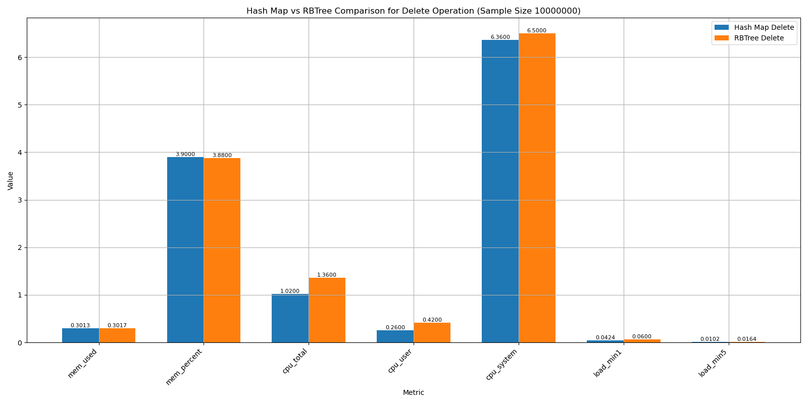

# diagnose性能优化 MEM方面：

在初次对diagnose工具进行真实环境下的高负载测试时，发现diagnose-tools对系统内存的消耗为4%左右，当海量数据需要处理时，diagnose工具对内存的需求会激增，并存在使系统崩溃的可能，故对diagnose的性能提升（尤其是内存消耗方面）显的格外重要。

在工具开发过程中发现，diagnose-tools采用hashmap、rbtree、percpu map、radix-tree等方法进行数据的存储与查找。radix-tree在前缀匹配操作上有优势，而在精确查找方面不如hashmap、rbtree，我们的工具大部分会涉及数据的插入和查找，所以使用hashmap和rbtree的频率更高，我们的内存消耗性能分析主要围绕hashmap和rbtree。

接下来我将从原理分析、实验设计、性能对比分析等步骤对hashmap、rbtree在空间复杂度（内存资源消耗）以及时间复杂度（增删改查速率）进行测试分析；

## 一、原理分析

在Linux内核中，哈希表（Hash Map）、红黑树（RBTree）和基数树（Radix Tree）是三种常用的数据结构，它们在不同的应用场景中各有优势。以下是它们的原理以及结合部分内核源码的分析。

### 1.1 Hashmap

哈希表（Hash Map）在Linux内核中是实现高效查找和插入操作的重要数据结构。哈希表的核心思想是通过哈希函数将键映射到数组中的某个位置，这样可以快速定位存储的位置。哈希表的查找、插入和删除操作的时间复杂度为O(1)，但在发生哈希冲突时需要额外处理。常见的哈希冲突解决方法有链地址法（使用链表解决冲突）和开放地址法（使用探查方法解决冲突）。

本小节将通过源码分析在内核中hash map 增删改查的具体步骤，以及hash map在内存管理方面的细节，从原理与源码层面对hash map进行性能分析；

#### 1.1.1hash内核中的实现

在Linux内核中，哈希表的实现主要体现在以下几个宏和函数中：

* **定义和初始化哈希表**： 使用宏`DEFINE_HASHTABLE`和`hash_init`定义和初始化哈希表。

```c
#define DEFINE_HASHTABLE(name, bits) \
    struct hlist_head name[1 << (bits)] = { [0 ... ((1 << (bits)) - 1)] = HLIST_HEAD_INIT }

static inline void __hash_init(struct hlist_head *ht, unsigned int sz) {
    unsigned int i;
    for (i = 0; i < sz; i++)
        INIT_HLIST_HEAD(&ht[i]);
}

#define hash_init(hashtable) __hash_init(hashtable, HASH_SIZE(hashtable))
```

* **添加元素到哈希表**： 使用宏`hash_add`将元素添加到哈希表中，其中会使用`hash_min`宏用于计算哈希值并确定元素存储的位置，这里着重分析以下`hash_min`、`hash_32`和`hash_long`，三者都是用于生成哈希值的宏/函数，但二者的实现方式与效果完全不同；
	* ``hash_min` 是一个宏，用于根据给定的键和值的大小来选择合适的哈希函数。它会根据键的大小选择使用 `hash_32` 还是 `hash_long`，以确保在 32 位和 64 位系统上都能高效地生成哈希值。
	* `hash_long` 首先将 `val` 乘以一个常量 `GOLDEN_RATIO_PRIME`，然后将结果右移以获得哈希值。这个常量和位旋转技术有助于生成均匀分布的哈希值，减少哈希冲突。
	* `hash_32` 是用于生成 32 位哈希值的函数。它在 32 位和 64 位系统上都可以使用，用于处理大小不超过 4 字节的键。

```c
#define GOLDEN_RATIO_PRIME 0x9e37fffffffc0001UL
static inline unsigned long hash_long(unsigned long val, unsigned int bits)
{
    unsigned long hash = val;

    hash *= GOLDEN_RATIO_PRIME;
    return hash >> (BITS_PER_LONG - bits);
}

#define GOLDEN_RATIO_32 0x61C88647
static inline u32 hash_32(u32 val, unsigned int bits)
{
    u32 hash = val;

    hash *= GOLDEN_RATIO_32;
    return hash >> (32 - bits);
}

#define hash_min(val, bits) \
    (sizeof(val) <= 4 ? hash_32(val, bits) : hash_long(val, bits))

#define hash_add(hashtable, node, key) \
    hlist_add_head(node, &hashtable[hash_min(key, HASH_BITS(hashtable))])
```

- **删除元素**： 使用`hash_del`从哈希表中删除元素。

```c
static inline void hash_del(struct hlist_node *node) {
    hlist_del_init(node);
}
```

- **遍历哈希表**： 内核提供了一系列宏用于遍历哈希表，如`hash_for_each`、`hash_for_each_possible`等。

```c
#define hash_for_each(name, bkt, obj, member) \
    for ((bkt) = 0, obj = NULL; obj == NULL && (bkt) < HASH_SIZE(name); (bkt)++) \
        hlist_for_each_entry(obj, &name[bkt], member)

#define hash_for_each_possible(name, obj, member, key) \
    hlist_for_each_entry(obj, &name[hash_min(key, HASH_BITS(name))], member)
```

#### 1.1.2 hash map 在内存管理方面的分析

哈希表在内存管理方面需要考虑以下几个方面：

- **哈希表的存储结构**： 哈希表通常由一个数组和多个链表组成。数组中的每个元素称为桶（bucket），每个桶是一个链表的头节点。当多个元素的哈希值冲突时，这些元素会被插入到相同桶对应的链表中。

- **内存分配**： 哈希表的数组部分在初始化时分配内存，并且其大小通常是2的幂，以便通过位运算快速计算哈希值。链表中的每个节点在插入元素时动态分配内存。

- **内存释放**： 在删除哈希表时，需要遍历每个桶的链表，释放所有节点的内存，最后释放数组的内存。

在Linux内核中，哈希表的内存管理主要涉及数组的初始化、节点的分配和释放。这里将从源码实现层面分析hash map是如何管理使用内存的。

1. **数组的初始化**： 使用`DEFINE_HASHTABLE`宏定义哈希表数组时，数组的大小是2的幂，通过`__hash_init`函数初始化数组中的每个链表头节点。

```c
#define DEFINE_HASHTABLE(name, bits) \
    struct hlist_head name[1 << (bits)] = { [0 ... ((1 << (bits)) - 1)] = HLIST_HEAD_INIT }

static inline void __hash_init(struct hlist_head *ht, unsigned int sz) {
    unsigned int i;
    for (i = 0; i < sz; i++)
        INIT_HLIST_HEAD(&ht[i]);
}

#define hash_init(hashtable) __hash_init(hashtable, HASH_SIZE(hashtable))
```

- **节点的分配**： 在插入元素时，通过`kmalloc`、`kmem_cache_alloc`函数动态分配节点的内存。`hash_add`宏将节点插入到相应的桶中。

```c
#define hash_add(hashtable, node, key) \
    hlist_add_head(node, &hashtable[hash_min(key, HASH_BITS(hashtable))])
```

- **节点的释放**： 在删除元素时，通过`kfree`、`kmem_cache_free`函数释放节点的内存。使用`hash_del`宏从链表中删除节点。

```c
static inline void hash_del(struct hlist_node *node) {
    hlist_del_init(node);
}
```

- **遍历和释放哈希表**： 使用`hash_for_each_safe`宏遍历哈希表，并在遍历过程中释放每个节点的内存。

```c
#define hash_for_each_safe(name, bkt, tmp, obj, member) \
    for ((bkt) = 0, obj = NULL; obj == NULL && (bkt) < HASH_SIZE(name); (bkt)++) \
        hlist_for_each_entry_safe(obj, tmp, &name[bkt], member)

static void __exit my_module_exit(void) {
    struct my_struct *entry;
    struct hlist_node *tmp;
    int bkt;

    hash_for_each_safe(my_hashtable, bkt, tmp, entry, hnode) {
        hash_del(&entry->hnode);
        kfree(entry);
    }
}
```


### 1.2 rbtree

红黑树（Red-Black Tree）是一种自平衡二叉搜索树，它在插入和删除操作后通过重新着色和旋转来保持平衡，从而保证了二叉树的高度始终为 O(logn)，其中 n 是节点数。红黑树的实现和维护规则确保了查找、插入和删除操作的时间复杂度都为 O(logn)。在 Linux 内核中，红黑树常用于各种需要高效动态数据结构的场景，比如内存管理、进程调度等。

#### 1.2.1 rbtree 内核中实现

红黑树在 Linux 内核中的部分实现和解释：

-  **结构体定义**

```c
struct rb_node {
    unsigned long __rb_parent_color;
    struct rb_node *rb_right;
    struct rb_node *rb_left;
} __attribute__((aligned(sizeof(long))));

struct rb_root {
    struct rb_node *rb_node;
};
```

-  **插入节点**

```c
static inline void rb_link_node(struct rb_node *node, struct rb_node *parent,
                                struct rb_node **rb_link)
{
    node->__rb_parent_color = (unsigned long)parent;
    node->rb_left = node->rb_right = NULL;
    *rb_link = node;
}
```

`rb_link_node` 函数将新节点链接到树中。它设置新节点的父节点指针，并将新节点的左右子节点指针初始化为 NULL。

插入新节点后，需要调用 `rb_insert_color` 函数进行重新平衡：

```c
extern void rb_insert_color(struct rb_node *, struct rb_root *);
```

- **重新平衡**

`rb_insert_color` 函数在插入新节点后，调整树的颜色和结构以保持红黑树的性质。该函数涉及多种情况的处理，包括节点的颜色调整和树的旋转操作。

- **删除节点extern void rb_erase(struct rb_node *, struct rb_root *);**

```c
extern void rb_erase(struct rb_node *, struct rb_root *);
```

`rb_erase` 函数用于从红黑树中删除节点。删除节点后，同样需要进行重新平衡以保持树的性质。

* **查找节点**

```c
static __always_inline struct rb_node *
rb_find(const void *key, const struct rb_root *tree,
        int (*cmp)(const void *key, const struct rb_node *))
{
    struct rb_node *node = tree->rb_node;

    while (node) {
        int c = cmp(key, node);

        if (c < 0)
            node = node->rb_left;
        else if (c > 0)
            node = node->rb_right;
        else
            return node;
    }

    return NULL;
}
```

`rb_find` 函数在红黑树中查找与给定键匹配的节点。该函数通过比较键值在树中进行二分查找。

#### 1.2.2 rbtree 在内存管理方面的分析：

rbtree在内存消耗方面，主要牵扯到以下几个方面：

* **节点结构的内存开销**：每个节点所需的内存
	* 红黑树的每个节点包含：一个指向左子节点的指针、一个指向右子节点的指针、一个指向父节点的指针、一个颜色标志（红色或黑色）；
* **树的高度对内存的影响**：树的高度会影响存储和访问的效率；
	* 红黑树的高度是 O(log⁡n)，其中 n 是节点数量。尽管红黑树比平衡二叉搜索树（如 AVL 树）的高度略高，但它依然保持了对数级别的高度，这使得在大规模数据集上，红黑树能够有效地管理内存。
* **额外的指针和颜色标志**：红黑树中额外的指针和颜色标志的内存开销;
	* 红黑树需要额外的指针和颜色标志来维护平衡性。每个节点包含**三个指针和一个颜色标志**，==这些额外的字段相对于仅存储键值对的数据结构来说增加了内存消耗==。然而，这些额外的开销是为了保证在插入和删除操作后的平衡性，从而提高查找、插入和删除操作的效率。

从原理及源码上分析,rbtree所消耗内存是略高于hash map,然而，红黑树的优势在于其在最坏情况下仍然保持良好的查找、插入和删除性能，而散列表的性能在冲突较多的情况下可能会退化。

### 1.3 hash map与rbtree对比

#### 1.3.1 时间复杂度

如同前面原理部分所说，在时间复杂度上hash map 理想情况下插入、查找、删除都有是O(1) 复杂度，可以完成快速查找；rbtree的实现和维护规则确保了查找、插入和删除操作的时间复杂度都为 O(logn)；所以hash map在时间复杂度方面更优；

#### 1.3.2 空间复杂度（占用内存资源）

空间复杂度层面（占用内存方面），除了数据结构最基本的开销，还涉及到存储元素的额外开销，内存分配和管理策略以及负载因子和存储效率方面的对比；

**空间复杂度分析**：

* **RBtree**：空间复杂度为O(n)，每个节点都需要存储关键字、指向左右子节点的指针以及一个颜色标记，RBtree的空间复杂度主要由节点的数量决定，因此总体空间复杂度是 O(n)；
* **Hash map**：空间复杂度: O(n + k)，哈希表的空间复杂度取决于两个因素；
	* 存储的元素数量；
	* 哈希表的桶数或槽数，为了保证哈希表的操作效率，通常会设置桶数为大于或等于元素数量的某个值，这样可以减少哈希冲突。由于哈希表在负载因子较低时会分配更多的桶，以确保性能，因此空间复杂度为 O(n + k)。

哈希表的空间复杂度可能会由于桶的数量而稍微增加，因此通常会有一个额外的常数项。红黑树的内存消耗主要取决于节点的数量，而哈希表的内存消耗则会受到桶数量和负载因子的影响。

**存储元素的额外开销**：

* **hash map**：散列表的开销主要在于冲突解决和负载因子管理。理想情况下，每个桶只有一个元素，内存消耗较小；但在冲突严重的情况下，每个桶可能存储多个元素，导致内存消耗增加。
* **RBtree**: 由于红黑树保持平衡，每个节点除了存储数据之外，还需要存储额外的指针和颜色信息。这些额外的信息有助于维持树的平衡性，使得查找、插入和删除操作在最坏情况下都是 O(log⁡n)。

**内存分配和管理**：

* **RBtree**：红黑树节点的内存通常是动态分配的，每次插入操作可能导致新的内存分配。内存碎片化可能会影响红黑树的整体内存效率。
* **Hash map**：散列表的内存通常在初始化时分配桶数组，后续元素插入时只需要在桶内链表（或其他结构）中插入元素。这种方式减少了频繁的内存分配操作，提高了内存利用效率，但也可能导致初始内存分配较大。

**负载因子和存储效率**：

* **RBtree**：红黑树的内存效率较高，因为每个节点直接存储数据，并且只需要额外的三个指针和一个颜色标志。
* **Hash map**：散列表的内存效率受到负载因子的影响。较高的负载因子可以提高内存利用效率，但也会增加冲突率，导致查找、插入和删除操作的性能下降。较低的负载因子则减少冲突，但会增加内存消耗。

综合分析一下，rbtree在增删改查复杂度方面不如hash map快，但对内存消耗偏低，节点结构简单，且内存效率较高，适合频繁的插入和删除操作，但需要保持平衡。


## 二、实验设计：

本实验主要围绕rbtree、hashmap在增删改查效率方面以及内存消耗方面进行实验设计，通过一组测试用例来对比两种方式的性能，测试用例涵盖了一下几个方面：

1. **插入性能**：测量大量键值对的插入时间。
2. **查找性能**：测量大量键值对的查找时间。
3. **删除性能**：测量大量键值对的删除时间。
4. **内存使用情况**：比较两种数据结构的内存使用情况。

### 2.1 测试环境与配置

**测试机器**：

* 处理器：AMD Ryzen 7 5800H with Radeon Graphics  3.20 GHz 16核；
* 内存：16 G；

**测试环境**：

* 操作系统：vmware虚拟机下的Ubuntu 23.10；
* 内核：Linux5.19版本；

### 2.2 实验设计方法

**测试方案**：

1.分别针对hash map 及rbtree 进行性能测试，测试的详细细节包括：

* 在数据集大小为10万、100万、1000万、1亿时，分别执行base（什么都不执行的对比操作）、插入节点操作、查找操作、删除操作；
* 通过性能监测工具glances监测以上操作对系统的影响；
* 绘制图表进行分析；

2.为完成以上操作，需要做以下的准备：

- **测试用例**：在diagnose-tools框架下设计测试用例，实现根据不同的参数，控制rbtree/hashmap，针对不同大小的样本进行增删改查，并且能及时反馈每一步操作所消耗时间、内存大小；

- **性能监测工具**：使用glances工具监控整个系统在运行测试用例时的性能情况，包括CPU利用率、内存使用率、负载等数据；

- **测试脚本**：通过测试脚本，对测试用例在不同参数时进行测试，并及时使用glances进行性能指标采集，将采集到的数据输出到文件中；

- **对比与分析**：通过python对测试产生的数据进行细致的分析，并绘制图表便于比较rbtree与hashmap的性能；

#### 2.2.1 测试用例设计：

* 1.测试环境准备
	* 确保已安装diagnose-tools，glances，python。
	* 编写内核模块：可以分别使用hashmap 、rbtree，在不同数据集下，进行增删改查操作；
	* 在模块中实现插入、查找和删除操作。

* 2.测试数据准备
	* 生成一组随机键值对，例如，键为随机整数，值为字符串或整数。
	* 选择合适的数据集大小进行测试，本次实验选择数据集大小为：10万、100万、1000万、1亿；
	* 测试用例代码:

测试用例中采用`kmem_cache`进行内存管理,便于统计rbtree与hashmap消耗内存的大小;采用`ktime_to_ns(ktime_get())`来计算执行增删改查的耗时;

* 采用`kmem_cache`进行内存管理;

```c
// 自定义缓存分配函数
void *cache_alloc(struct kmem_cache *cachep, unsigned int *memory_usage) {
    void *ptr = kmem_cache_alloc(cachep, GFP_KERNEL);
    if (ptr) {
        spin_lock(&memory_lock);
        *memory_usage += kmem_cache_size(cachep);
        spin_unlock(&memory_lock);
    }
    return ptr;
}

// 自定义缓存释放函数
void cache_free(struct kmem_cache *cachep, void *ptr, unsigned int *memory_usage) {
    if (ptr) {
        kmem_cache_free(cachep, ptr);
        spin_lock(&memory_lock);
        *memory_usage -= kmem_cache_size(cachep);
        spin_unlock(&memory_lock);
    }
}

// 宏定义
#define alloc_hash_map() cache_alloc(hash_map_cache, &hash_map_memory_usage)
#define free_hash_map(ptr) cache_free(hash_map_cache, ptr, &hash_map_memory_usage)
#define alloc_rbtree() cache_alloc(rbtree_cache, &rbtree_memory_usage)
#define free_rbtree(ptr) cache_free(rbtree_cache, ptr, &rbtree_memory_usage)
```

* 采用`ktime_to_ns(ktime_get())`计算具体操作的用时,以hashmap的插入操作为例:

```c
static void test_hash_map(struct test_map_detail *detail){
	u64 start, end;
    int num_elements = test_map_settings.num_elements;  // 测试插入 100 万个元素
    int i;

	/*插入测试*/
	if(test_map_settings.which_index!=-2){
    	printk("hash map 插入性能测试...\n");
    	start = ktime_to_ns(ktime_get());
    	for (i = 0; i < num_elements; ++i) {
    	    struct value val = { .test = i };  // 假设结构体 value 中有数据域 data
    	    if(!update_hash(i, &val)) {
				printk("hashmap %d 个节点申请空间失败\n",i);
				continue;
    	}
    	end = ktime_to_ns(ktime_get());
    	printk("Hash map 插入%d个元素 消耗%llu ns 消耗内存: %zu bytes\n", num_elements,
    	       end-start,hash_map_memory_usage);
		detail->hash_insert_delay = end-start;
		detail->hash_map_insert_memory_usage = hash_map_memory_usage;
	}
	...
}
```

**具体的测试用例代码可由次进入查看**: [map测试用例代码](../diagnose-tools/SOURCE/module/kernel/test_map.c)

#### 2.2.2 测试脚本：

测试脚本的主要目的是：循环实现hash map与rbtree在不同样本大小下的增删改查操作，并及时的将数据记录到相应的文件中。

**具体的测试脚本代码可由次进入查看**: [map测试脚本代码test_diagnose_map.sh](diagnose_performance_analysis/map_analysis/test_diagnose_map.sh)

#### 2.2.3 绘制图表

根据采集到的数据文件，可以通过python进行数据处理并绘图。

**具体的代码可由次进入查看**: 

* [数据分析与数据整理]( ./diagnose_performance_analysis/map_analysis/process_csv.py)

* [数据处理与图表绘制]( ./diagnose_performance_analysis/map_analysis/draw.py)

## 三、性能对比分析

经过前面的数据采集，已经将原始数据文件保存在本地，可在以下几个目录下寻找到：

* [hash_map data](diagnose_performance_analysis/map_analysis/hash_map) 、[rbtree](diagnose_performance_analysis/map_analysis/rbtree)、[combined_map](diagnose_performance_analysis/map_analysis/combined_map)

在对数据进行梳理、比对、并绘制图标后，可以进行如下性能分析：

### 3.1 rbtree和Hash map 进行增删改查时所占用内存情况

我们对样本为10万、100万、1000万以及1亿时，两个map在分别进行插入操作时内存使用情况(insert/mem_used)进行分析：

| 样本大小 | hash map  | rbtree    |
| -------- | --------- | --------- |
| 10万     | 0.05156M  | 0.02969M  |
| 100万    | 0.05547M  | 0.05390M  |
| 1000万   | 167.625M  | 118.000M  |
| 10000万  | 2850.768M | 2902.757M |

从数据中可以看出，当样本小于等于1000万个节点时，rbtree对内存的消耗显然小于hash map，当样本大小等于1亿时，系统会出现非常严重的卡顿情况，这是由于样本大小过大导致的，此时rbtree相对于hashmap更消耗内存。下面几张图可以明显的看出当数据小于等于1000万时，hash map消耗内存更少一些；


当研究样本大小聚焦在1000万~1亿之间时，可以通过如下数据得出结论：在向hash map以及rbtree插入节点时，当插入的样本节点小于8000万时，hash map比rbtree更消耗内存资源，这也符合前面的理论分析；

| 样本大小 | hash map | rbtree |
| -------- | -------- | ------ |
| 1000万   | 0.1152   | 0.1637 |
| 2000万   | 0.3826   | 0.4290 |
| 5000万   | 1.3945   | 1.4234 |
| 8000万   | 2.2453   | 2.2382 |


当两个map执行find和delete操作时，hash map相较于rbtree占用的内存资源稍高，下面图表可以清晰的看出hash map以及rbtree在执行find、delete时占用内存资源情况：


### 3.2 rbtree和Hash map对系统的整体影响

通过实验所得的数据以及下面的图表，可以得到结论：

* **insert操作**：hash map相较于rbtree会消耗更多的内存资源、cpu资源，两种map对系统负载影响不会太高，但hash map 对系统的负载略高于rbtree；下图是样本大小为1000万时，插入操作对比图：


* **find操作**：hash map相较于rbtree会消耗更多的内存资源、cpu资源，并会对系统带来更高的负载；下图是样本大小为1000万时，find操作对比图：


* **delete操作**：进行查找操作时，hash map和rbtree对内存资源的占用情况基本相同，但rbtree对cpu资源的使用情况会略高于hash map，负载方面rbtree也较hashmap较高。这是由于rbtree在执行delete操作时，会先通过`rb_erase`将数据擦除，再将数据节点加入新的list中统一删除，而非一次性删除。



