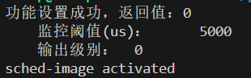
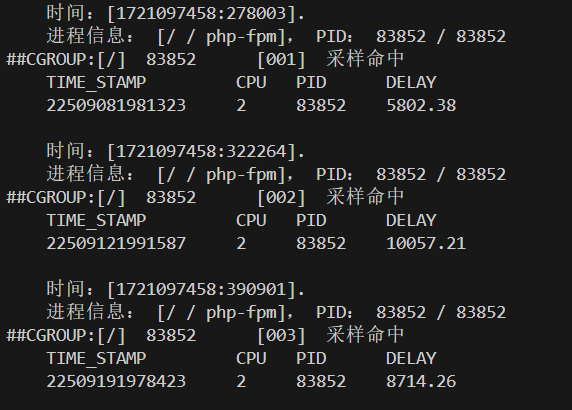
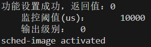
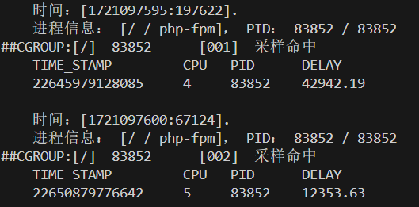
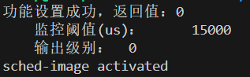
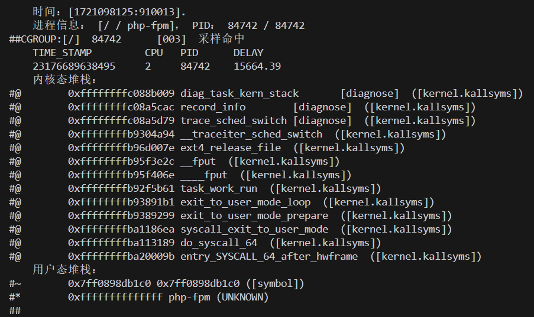
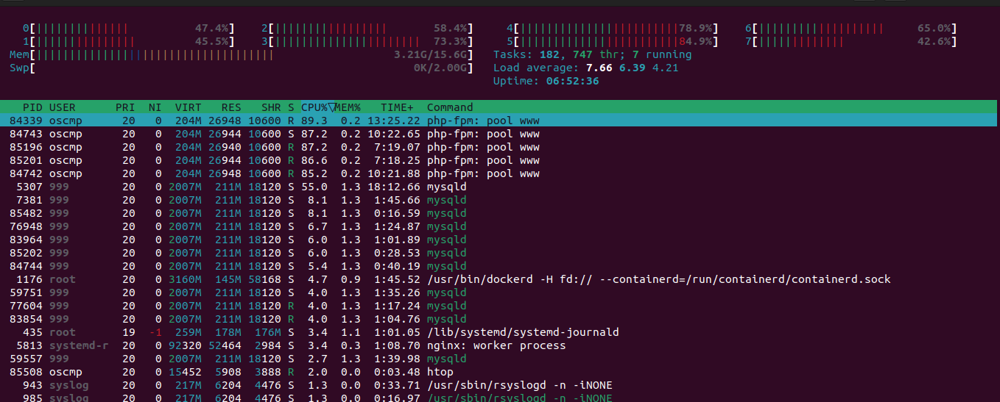
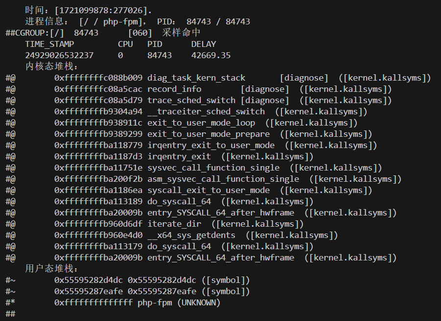
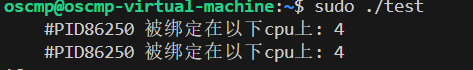
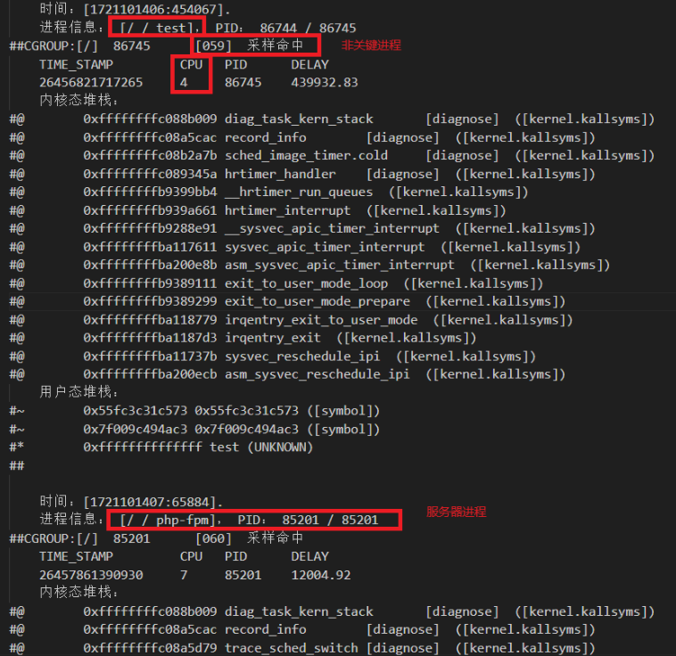

# sched_image功能测试

## 一、功能介绍：

​	在高负载的电商项目环境中，识别和优化影响业务性能的长时间运行进程是一个关键挑战。`sched_image`是一款专为系统性能优化而设计的工具，旨在帮助用户监测和分析长时间运行在系统上的进程。通过设置阈值，`sched_image`能够识别出超过该阈值的进程，并打印出这些进程的名称及其调用栈信息。这对需要优化系统性能、排查系统瓶颈和提高关键业务进程效率的用户尤其有用。

#### 1.主要功能

1. **实时监测**：
   - `sched_image`能够实时监测系统上的所有进程，捕捉每个进程在CPU上运行的时间。
2. **阈值设置**：
   - 用户可以根据需求设置阈值（例如10ms, 100ms, 500ms等），以确定哪些进程的运行时间超过了该阈值。
3. **进程识别与分析**：
   - 对于超过设定阈值的进程，`sched_image`不仅能打印出进程的名称，还能提供详细的调用栈信息，帮助用户深入分析进程行为。
4. **业务进程优化**：
   - 对于运行电商项目Fecshop的用户（包括nginx服务器、MySQL、Redis和MongoDB），`sched_image`特别适合识别那些影响业务进程性能的长时间运行的非关键进程，从而帮助用户进行进一步的操作，如优化、调度或终止这些不必要的进程。
5. **系统瓶颈排查**：
   - 通过详细的调用栈信息和进程运行时间报告，用户可以迅速找出系统瓶颈，制定相应的优化措施。

#### 2.适用场景

- **服务器性能调优**：识别并处理长时间占用CPU的进程，提高服务器响应速度和处理能力。
- **开发与测试环境**：在开发和测试阶段，通过`sched_image`监测进程性能，优化代码和系统配置。
- **生产环境监控**：在生产环境中实时监控系统进程，确保关键业务进程的稳定运行。

​	`sched_image`为系统管理员、开发人员和运维工程师提供了一个强大的工具，帮助他们深入了解系统运行状态，优化系统性能，确保业务流程的高效运行。

## 二、测试目的和环境：

#### 1.测试目的

​	测试的主要目的是确保`sched_image`工具的功能性和稳定性，从而验证其在实际使用中的可靠性和有效性。具体而言，测试旨在：

1. **验证工具的功能完整性**：
   - 确认`sched_image`能够正确识别并打印出超过设定阈值的进程及其调用栈信息。
2. **评估工具的性能表现**：
   - 评估工具在不同负载和阈值条件下的性能，确保其在高压环境下仍能稳定运行。
3. **检验工具的健壮性**：
   - 测试工具在各种异常和极端情况下的表现，确保其能够正确处理无效输入并提供适当的错误信息。
4. **优化业务流程**：
   - 确认工具能够有效识别并报告影响业务进程的非关键进程，从而帮助用户优化系统资源分配，提升业务流程效率。

​	通过这些测试，我们能够保证`sched_image`在生产环境中的可靠性，为用户提供准确的系统性能监测和分析，支持其系统优化和性能调优的需求。

#### 2.测试环境

##### 2.1**测试平台**

- **操作系统**：Ubuntu 22.04
- **内核版本**：5.19
- **内存**：16GB
- **硬盘**：100GB
- **CPU**：8核

##### 2.2测试应用

- 电商项目：Fecshop
  - **nginx服务器**：处理HTTP请求和静态资源。
  - **MySQL**：用于存储和管理电商项目的数据库。
  - **Redis**：用于缓存，以提高系统响应速度。
  - **MongoDB**：用于存储非结构化数据，如商品信息和用户行为数据。

## 三、测试过程及结果：

#### **1. 测试工具的功能完整性和健壮性：**

​	确认`sched_image`能够正确识别并打印出超过设定阈值的进程及其调用栈信息。在这里分别设置阈值为（5000us、10000us、15000us），并且本工具有两种输出格式，第一种verbose=0（默认），只输出进程基本信息，设置verbose=1时会输出详细的进程调用栈信息，我会在阈值为15000us的时候展示verbose=1时的输出内容。

结果：

**1.1阈值为5000us**

```c
sudo diagnose-tools sched-image --activate="threshold=5000"
```



```c
sudo diagnose-tools sched-image --report
```



**1.2阈值为10000us**

```c
sudo diagnose-tools sched-image --activate="threshold=10000"
```



```c
sudo diagnose-tools sched-image --report
```



**1.3阈值为15ms**

```c
sudo diagnose-tools sched-image --activate="threshold=15000 verbose=1"
```



```c
sudo diagnose-tools sched-image --report
```



​	通过以上的分析，我们可以发现，本工具的监测内容是正确的，它不仅可以输出进程的基本信息，包括进程名、进程号、CGROUP信息，采样名词次数，被调度时间等信息，还可以打印出该进程的用户态和内核态的堆栈信息。它可以正确通过我们设置的阈值来过滤出那些长时间占用cpu的进程，并且通过采样命中次数可以来判断这个进程是否是长时间占用CPU，以此就可以找出哪些影响业务进程的非关键进程，由此来提高整个服务的性能。

#### 2.测试在高负载情况下的稳定性：

​	首先，我们的服务器端搭建了一个完整的电商项目，我们在另外几个主机上采用Apache Bench测试工具来向服务器端发送Http请求，模拟多用户高并发请求，让服务器端处在一个高负载的情况下。

​	这里我们使用了三台主机，每台主机每次发送的请求数为1000，总共发送50000条请求，相当于服务器每次会收到3000次请求，总共收到并处理150000条请求。

```shell
sudo ab -c 1000 -n 50000 -k  http://appfront.fecshoptest.com/
```

​	我们在这种情况下来测试该工具是否可行，验证在高并发的情况下，该工具是否会出错。

​	在模拟高负载前，我们加载好工具，并设置阈值为15000us，接下来我们对服务器发送高并发请求，先看一下服务器端的整体性能（通过htop工具查看）：



​	通过上图我们可以发现，目前load值已经接近8了（服务器的CPU有8个核心），说明此时CPU几乎已经满载了。这时我们来查看该工具是否正常运行：



​	我们来打印信息，可以成功输出，并且输出的内容正是业务进程，这是因为业务进程一直在处理请求，并且采样次数也非常高，这说明该工具有较强健壮性和正确性，在高负载情况下是稳定的。

#### 3.测试是否可以找到非关键进程：

​	首先，我们不改变测试环境，在系统高负载的情况下，我们模拟一个非关键进程，来查看该工具是否可以找出这个非关键进程，非关键进程的创建代码如下所示：

```c
#define _GNU_SOURCE
#include <stdio.h>
#include <unistd.h>
#include <pthread.h>
#include <stdlib.h>
#include <sched.h>
#include <sys/syscall.h>
#include <errno.h>
#include <sys/mman.h>

int set_cpu_and_policy(int pid, int cpu_id) {
    cpu_set_t mask;
    CPU_ZERO(&mask);
    CPU_SET(cpu_id, &mask);

    if (sched_setaffinity(pid, sizeof(mask), &mask) != 0) {
        perror("Failed to set CPU affinity");
        return -1;
    }

    struct sched_param param;
    param.sched_priority = sched_get_priority_max(SCHED_FIFO);
    if (sched_setscheduler(pid, SCHED_FIFO, &param) != 0) {
        perror("Failed to set scheduler policy");
        return -1;
    }

    cpu_set_t get_mask;
    CPU_ZERO(&get_mask);
    if (sched_getaffinity(pid, sizeof(get_mask), &get_mask) == -1) {
        perror("Error retrieving CPU affinity");
        return -1;
    }

    int num_cores = sysconf(_SC_NPROCESSORS_ONLN);
    printf("    #PID%d 被绑定在以下cpu上: ", pid);
    for (int i = 0; i < num_cores; i++) {
        if (CPU_ISSET(i, &get_mask)) {
            printf("%d ", i);
        }
    }
    printf("\n");

    return cpu_id;
}

void *busy_loop(void *arg) {
    while (1) {
        // 无限循环，模拟高CPU占用
    }
    return NULL;
}

int main() {
    // 锁定内存，防止内存分页导致的调度延迟
    if (mlockall(MCL_CURRENT | MCL_FUTURE) != 0) {
        perror("Failed to lock memory");
        return 1;
    }

    pthread_t thread;
    int pid = getpid();
    int cpu_id = 4; // 固定到CPU 4

    // 将主线程绑定到4号CPU并设置调度策略
    if (set_cpu_and_policy(pid, cpu_id) == -1) {
        return 1;
    }

    // 创建一个线程
    if (pthread_create(&thread, NULL, busy_loop, NULL) != 0) {
        perror("Failed to create thread");
        return 1;
    }

    // 获取线程ID
    pid_t tid = syscall(SYS_gettid);

    // 等待线程绑定到4号CPU并设置调度策略
    if (set_cpu_and_policy(tid, cpu_id) == -1) {
        return 1;
    }

    // 等待线程结束
    pthread_join(thread, NULL);

    return 0;
}
```



​	运行的非关键进程名为test，且它被绑定在了4号cpu核心上，接下来我们观察该工具是否可以找出这个非关键进程：



​	通过上图可以发现该工具在高负载的情况下，找到了非关键进程，并且正确的打印出了用户态和内核态的调用栈信息，因此，该工具在高负载情况下是可行的，且输出内容也是可信的。
