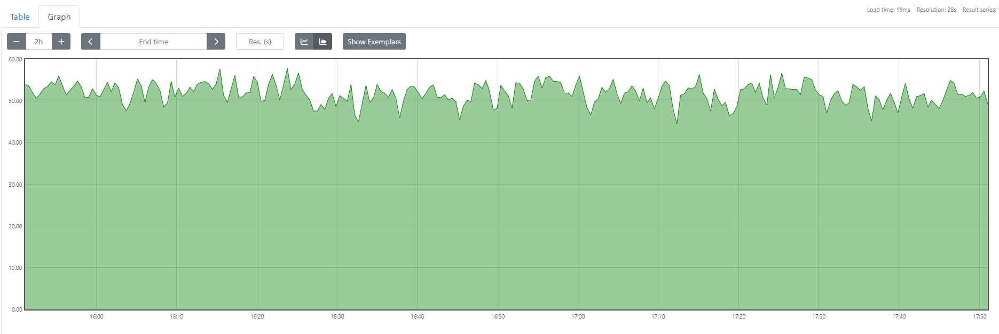
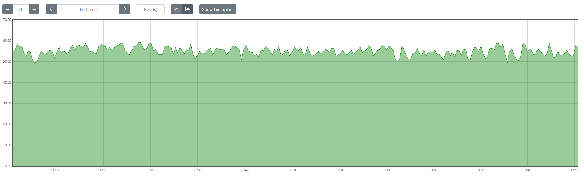
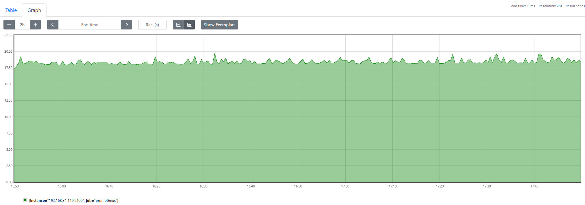
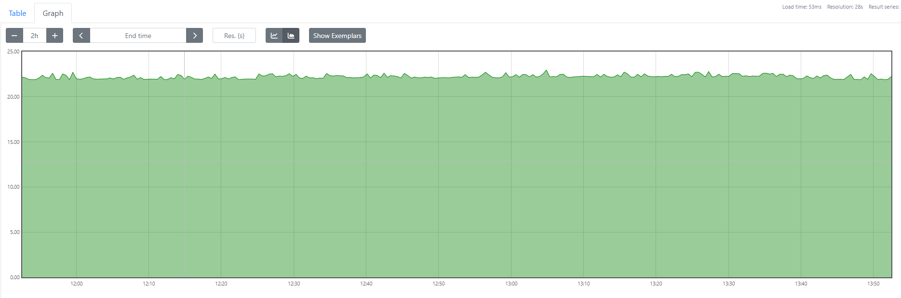

# diagnose-tools 对系统整体影响分析

在本次分析中，我们评估了 diagnose-tools 对系统资源（包括 CPU 和内存）的影响。

## 一、环境介绍：

​	首先，我们团队模拟了一个服务器主机，在这个主机上用docker工具轻量且完整地搭建了一个开源的电商项目Fecshop，该项目用PHP、Mysql、Redis等成熟的技术进行编写，有完整的前后端代码和功能，用户端可以实现登录注册、商品的查询、加入购物车、购买商品等基本的电商项目的功能，管理员端可以进行商品的管理、用户的管理等一系列管理操作，该项目比较完整且全面地模拟了企业级的电商平台。通过这种方式，我们团队来模拟高负载环境下的用户并发请求。

## 二、测试工具

​	在本次系统资源消耗评测中，我们采用了 node_exporter 和 Prometheus 这两种工具，以确保数据的准确性和全面性。

#### 1.node_exporter：

node_exporter 是一个高效的开源工具，用于从系统中收集硬件和操作系统的各种指标。它能够提供详细的 CPU、内存、磁盘 I/O 和网络流量等数据。node_exporter 的优势在于其轻量级和高性能，对被监测系统的负担极小，同时能提供全面的系统状态信息。

#### 2.Prometheus：

Prometheus 是一个强大的开源监控和告警系统，专门设计用于高动态环境。它能够存储时序数据，并且提供强大的查询语言 PromQL 来分析和处理这些数据。Prometheus 可以与 node_exporter 无缝集成，通过拉取 node_exporter 提供的数据，进行实时监控和历史数据分析。

##### 使用 node_exporter 和 Prometheus 进行评测的原因：

1. 数据准确性高：node_exporter 能够精确地捕捉系统各个方面的资源消耗情况，Prometheus 则能够以高分辨率存储和处理这些数据，确保评测结果的精确性。
2. 实时监控能力：结合 Prometheus 的实时数据采集和告警功能，能够快速响应系统资源使用的异常变化，及时发现和处理潜在问题。
3. 历史数据分析：Prometheus 提供了强大的数据查询和分析功能，可以回溯和分析系统在不同时间段的性能表现，为长期的性能优化和资源规划提供数据支持。
4. 可扩展性：这两种工具都具备很强的可扩展性，可以根据需要轻松扩展监控指标的种类和数量，适应不同规模和复杂度的系统环境。
5. 开源社区支持：node_exporter 和 Prometheus 均属于活跃的开源项目，拥有广泛的社区支持和丰富的文档资源，用户可以方便地获取帮助和更新。

通过使用 node_exporter 和 Prometheus 进行系统资源消耗的评测，我们能够获得详细且可靠的数据，从而对 diagnose-tools 的性能影响进行全面和深入的分析。这种评测方法不仅提高了数据的可信度，也为系统优化和性能提升提供了坚实的依据。

#### 3.使用 ApacheBench (ab) 进行并发测试

在本次系统性能评测中，我们采用了 ApacheBench (ab) 工具来进行并发测试，以评估系统在高并发条件下的性能表现。

ApacheBench，简称 ab，是一个用于测试 HTTP 服务器性能的命令行工具，最初由 Apache HTTP Server 项目开发。它能够模拟大量并发请求，从而帮助评估 Web 服务器在高负载条件下的响应能力和稳定性。通过生成大量并发请求，ab 可以提供详细的统计数据，如每秒请求数、请求处理时间分布和失败请求数等。

##### 结合 ApacheBench (ab) 进行性能评测

通过使用 ApacheBench (ab) 工具，我们能够对 diagnose-tools 在不同并发条件下的性能表现进行详细分析。具体来说：

- 并发处理能力：评估 diagnose-tools 在处理大量并发请求时的稳定性和效率，识别潜在的瓶颈和优化点。
- 响应时间分析：分析 diagnose-tools 在高并发条件下的响应时间分布，确保在不同负载下能够保持合理的响应速度。
- 系统资源利用率：结合 node_exporter 和 Prometheus，监测并分析 diagnose-tools 在高并发测试期间的 CPU 和内存使用情况，全面了解其资源消耗特性。

使用 ApacheBench (ab) 进行并发测试，不仅能够快速评估 diagnose-tools 的性能，还能通过详细的数据报告，为系统优化和性能提升提供重要参考依据。

## 三、测试过程：

在本次测试中，我们在一台虚拟机上部署了 Prometheus 以进行数据采集和监控，并在目标服务器上安装了 node_exporter 以收集系统指标。随后，使用 ApacheBench (ab) 工具对服务器进行并发测试，以评估系统在高负载条件下的 CPU 和内存使用情况。

#### 环境配置

1. **虚拟机 A：Prometheus**
   - 操作系统：Ubuntu 22.04
   - 安装 Prometheus 用于监控和存储节点数据
   - 使用 ApacheBench (ab) 进行并发测试
2. **服务器主机：node_exporter**
   - 操作系统：Ubuntu 22.04（内核版本为5.19）
   - 安装 node_exporter 以收集系统指标（CPU、内存等）
   - 安装 diagnose-tools 进行性能评测

#### 步骤详解

##### 1. 安装并配置 node_exporter

在服务器主机上，执行以下步骤安装 node_exporter：

```shell
# 下载 node_exporter 最新版本
wget https://github.com/prometheus/node_exporter/releases/download/v*/node_exporter-*.linux-amd64.tar.gz

# 解压文件
tar -xvf node_exporter-*.linux-amd64.tar.gz

# 进入解压目录
cd node_exporter-*.linux-amd64

# 运行 node_exporter
./node_exporter &
```

确认 node_exporter 在默认端口 `9100` 上运行，并且可以通过浏览器访问 `http://<服务器IP>:9100/metrics` 查看指标。

##### 2. 安装并配置 Prometheus

在虚拟机 A 上，执行以下步骤安装 Prometheus：

```shell
# 下载 Prometheus 最新版本
wget https://github.com/prometheus/prometheus/releases/download/v*/prometheus-*.linux-amd64.tar.gz

# 解压文件
tar -xvf prometheus-*.linux-amd64.tar.gz

# 进入解压目录
cd prometheus.linux-amd64
```

创建 Prometheus 配置文件 `prometheus.yml`，添加 node_exporter 作为抓取目标：

```shell
yaml复制代码global:
  scrape_interval: 15s

scrape_configs:
  - job_name: 'node_exporter'
    static_configs:
      - targets: ['<服务器IP>:9100']
```

运行 Prometheus：

```shell
./prometheus --config.file=prometheus.yml &
```

确认 Prometheus 在默认端口 `9090` 上运行，并且可以通过浏览器访问 `http://<虚拟机IP>:9090` 查看数据。

##### 3. 使用 ApacheBench (ab) 进行并发测试

在服务器主机上，使用 ApacheBench (ab) 对电商项目进行并发测试：

```
# 运行 ab 测试，假设目标 URL 是 http://IP:80/
ab -n 1000000 -c 100 -k http://IP:80/
```

参数解释：

- `-n 10000`：总共发送 10000 个请求
- `-c 100`：并发数为 100

##### 4. 数据采集与分析

在并发测试进行过程中，Prometheus 会不断从 node_exporter 收集服务器主机的 CPU 和内存使用数据。测试完成后，可以通过 Prometheus 查询和分析这些数据，生成相关的性能报告。

具体查询示例：

- CPU 使用率：

  ```
  ((1 - sum(increase(node_cpu_seconds_total{mode="idle"}[5m])) by (instance) / sum(increase(node_cpu_seconds_total[5m])) by (instance))*100)
  ```

- 内存使用率：

  ```
  (1-(node_memory_MemAvailable_bytes/node_memory_MemTotal_bytes))*100
  ```

通过这些查询，可以详细了解 diagnose-tools 在高并发负载下的资源消耗情况，并以图表形式展示 CPU 和内存使用的变化趋势。

## 四、测试结果

1.在高负载的情况下，diagnose-tools对系统**CPU**影响的分析如下：

首先，在未加载diagnose-tools时，系统的CPU使用率如下图所示：



在加载了diagnose-tools时，系统的CPU使用率如下图所示：



通过分析，在高负载的环境下，diagnose-tools对系统的CPU消耗为1.6%左右，这说明该工具对CPU的消耗非常小，不会因为加载了该性能分析工具而导致CPU的开销变大。

2.在高负载的情况下，diagnose-tools对系统**内存**影响的分析如下：

首先，在未加载diagnose-tools时，系统内存的使用率如下图所示：



在加载了diagnose-tools时，系统内存的使用率如下图所示：



接下来我们再查看一下ApacheBench工具输出的分析：

```shell
sudo ab -c 100 -n 2000000 -k  http://appfront.fecshoptest.com/
###负载情况下，未加载工具的环境下：
Server Software:        nginx
Server Hostname:        appfront.fecshoptest.com
Server Port:            80

Document Path:          /
Document Length:        29712 bytes

Concurrency Level:      100
Time taken for tests:   12307.187 seconds
Complete requests:      207346
Failed requests:        0
Keep-Alive requests:    0
Total transferred:      6231161992 bytes
HTML transferred:       6160664352 bytes
Requests per second:    16.85 [#/sec] (mean)
Time per request:       5935.580 [ms] (mean)
Time per request:       59.356 [ms] (mean, across all concurrent requests)
Transfer rate:          494.44 [Kbytes/sec] received

Connection Times (ms)
              min  mean[+/-sd] median   max
Connect:        2    5   8.0  

###负载情况下，并且加载工具的环境下：
Server Software:        nginx
Server Hostname:        appfront.fecshoptest.com
Server Port:            80

Document Path:          /
Document Length:        29712 bytes

Concurrency Level:      100
Time taken for tests:   12137.667 seconds
Complete requests:      178854
Failed requests:        0
Keep-Alive requests:    0
Total transferred:      5374920408 bytes
HTML transferred:       5314110048 bytes
Requests per second:    14.74 [#/sec] (mean)
Time per request:       6786.355 [ms] (mean)
Time per request:       67.864 [ms] (mean, across all concurrent requests)
Transfer rate:          432.45 [Kbytes/sec] received

Connection Times (ms)
              min  mean[+/-sd] median   max
Connect:        2    4   6.4      3    1018
Processing:  3671 6778 2106.6   5992   11316
Waiting:     3662 6767 2106.5   5981   11302
Total:       3674 6782 2106.5   5996   11319

Percentage of the requests served within a certain time (ms)
  50%   5996
  66%   8741
  75%   8920
  80%   9012
  90%   9221
  95%   9423
  98%   9689
  99%   9920
 100%  11319 (longest request)
```

通过对可视化图表和ApacheBench工具的结果输出进行综合分析，在高负载的环境下，diagnose-tools对系统内存的消耗为4%左右，而本次模拟服务器的内存为16GB，换算下来，相当于消耗了600MB左右的内存，这说明该工具对内存的消耗相比于CPU会高一些。通过阅读并分析该工具的源码，可以发现，本工具在加载监测功能以后，会申请一定的内存空间来进行内核空间和用户空间的数据交互。该工具申请的内存大小是相对比较固定的，由于企业级的服务器内存空间很大，若在其上加载diagnose-tools，其申请的内存空间的占比会更小。

总体而言，该工具在高负载的情况下，消耗系统的CPU和内存资源都比较低，可以作为开发人员日常使用或者企业级服务器性能监测的强有利工具。