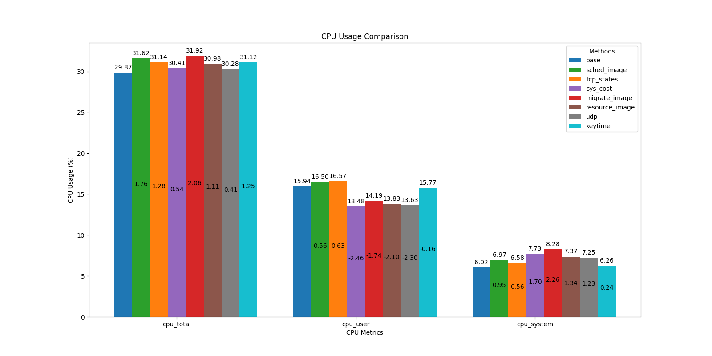

# 新增工具的性能分析报告

​	在本次大赛中，我们团队一共添加了七个工具，因此，分别对这七个工具进行了测试和分析，包括了每个工具对系统影响的诸多方面，例如：对CPU的影响，对内存占用的情况，对网络速率的影响等。通过分析这些工具对系统的资源占用情况，来分析这些工具是否可行，是否真正地具备在高负载的环境下可用。具体测试的工具介绍如下表所示：

| 工具名称       | 工具介绍                                                     |
| -------------- | ------------------------------------------------------------ |
| sys-cost       | 监控进程的系统调用信息，包括系统调用号，系统调用次数，系统调用耗时 |
| tcp-states     | 监控并输出系统中TCP连接的具体信息                            |
| udp-states     | 监控并输出系统中UDP连接具体信息                              |
| resource-image | 监控并输出进程对系统资源实时的使用情况                       |
| migrate-image  | 监控并输出进程的核间迁移过程中的具体信息                     |
| sched-image    | 监控并输出系统中长时间不被调度的进程相关信息                 |
| keytime-image  | 监控进程的关键信息，例如进程的上下CPU、创建子进程、执行exec等过程 |


## 一、测试环境：

测试机器：

1.处理器：3th Gen Intel(R) Core(TM) i9-13900HX   2.20 GHz 16核

2.内存：32 G

3.操作系统：Ubuntu 22.04

4.内核：Linux 5.19版本

## 二、测试工具：

1.使用glances工具来获取系统的性能指标：

​	Glances是一款功能强大、跨平台的系统监控工具，适用于Linux、Windows和macOS等多种操作系统。它能够监控CPU、内存、磁盘I/O、网络流量、系统负载、进程、文件系统等多种系统性能指标，提供全面的系统健康状况视图。Glances支持实时监控，让用户随时查看系统的运行状态和资源使用情况，有助于及时发现和处理性能问题。此外，它可以通过Web界面、命令行界面或API访问，使得监控方式更加灵活。Glances还支持多种输出格式，如CSV、JSON等，便于与其他工具集成和进一步分析。其安装和配置相对简单，适合不同技术水平的用户使用。总的来说，Glances以其全面的监控能力、跨平台支持和灵活的访问方式成为许多系统管理员和开发者的首选工具。

2.使用python进行数据分析：

​	使用了Python对从Glances采集的数据进行了详细分析，充分利用了pandas和matplotlib库的强大功能。通过pandas库，能够方便地对数据进行清洗、转换和操作。例如，可以轻松地读取Glances生成的CSV文件，将数据整理成适合分析的格式，并进行各种统计计算和数据聚合。pandas强大的数据操作能力，使得处理大规模数据集变得高效且简单。

​	在数据可视化方面，matplotlib库提供了丰富的绘图功能。可以使用matplotlib生成各种类型的图表，如折线图、柱状图、饼图、散点图等，以直观地展示系统性能指标的变化趋势和分布情况。这些图表不仅可以快速理解数据，还能用于生成报告和展示结果，从而支持决策和优化工作。

​	此外，结合这两种工具，能够进行更深入的分析。例如，可以根据不同时间段的数据进行对比，识别出系统性能的波动规律；也可以结合多个指标进行多维分析，找到性能瓶颈和优化点。通过这种方式，能够全面、细致地监控和分析系统性能，为工具的性能分析提供有力的帮助。

3.使用 ApacheBench (ab) 进行并发测试

在本次工具性能评测中，采用 ApacheBench (ab) 工具来进行并发测试，向服务器中部署的电商项目进行压力测试，以评估系统在高并发条件下的性能表现。

ApacheBench，简称 ab，是一个用于测试 HTTP 服务器性能的命令行工具，最初由 Apache HTTP Server 项目开发。它能够模拟大量并发请求，从而帮助评估 Web 服务器在高负载条件下的响应能力和稳定性。通过生成大量并发请求，ab 可以提供详细的统计数据，如每秒请求数、请求处理时间分布和失败请求数等。

## 三、测试过程：

1.向部署了电商项目和diagnose工具的服务器发送高并发请求，这里每次发送并发请求1000次，总共发送150万次请求，具体的指令为：

```shell
sudo ab -c 1000 -n 1500000 -k  http://appfront.fecshoptest.com/off-the-shoulder-long-sleeve-high-low-day-dress
```

2.通过glances采集不加载diagnose-tools工具的系统各项指标，生成.csv文件作为基准数据。

3.接下来每次加载一种工具，然后通过glances去采集系统各项指标，并生成.csv文件作为加载某个工具后的系统指标文件。

4.使用python脚本来对这些采集的数据文件进行数据分析。

5.生成图表格式，来查看每个工具对系统的影响。

​	由于glances工具采集的系统指标十分丰富，我们这里目前分析了每种工具对系统CPU、内存、网络相关的消耗，后期可以修改python脚本来对感兴趣的指标进行分析。

## 四、分析结果：

1.每种工具对CPU的消耗情况：

	我们分析了系统CPU总利用率（cpu_total)，CPU在用户空间占用时间占比(cpu_user)和CPU在系统空间占用时间占比(cpu_system)。上图中的蓝色柱子为基准数据，每个柱子上的值为加载某个工具后相关指标的CPU利用率占比，柱子里的数据为加载某工具和未加载某工具前后的CPU指标消耗的差值。可以看出，在高负载的情况下，测试的这七种工具对CPU的消耗都比较低，基本都在百分之2以内。后期我们会再完善每个功能，让工具对CPU的消耗更小。

2.每种工具对内存的消耗情况：


​	我们分析了内存使用总量（mem_used）、活跃的内存空间大小（mem_active）以及buffers空间大小(mem_buffers)。通过上图可以发现，加载了工具后，确实会造成内存的消耗，这是因为在功能实现中，会申请内存缓冲区空间来存储采集的信息，以实现用户态和内核态之间的数据交互并将采集的信息进行输出。但是可以发现，每种工具对系统内存的消耗并不大，并且我们会在后期对工具申请内存空间的大小进行进一步优化。

3.每种工具对网络的消耗情况：


​	本次测试中，我们对网络的相关指标也进行了分析，包括每秒钟网卡接收包的速率（network_ens33_rx），网卡发送包的速率（network_ens33_tx），以及网卡的交换字节数（数据包的转发或处理速率network_ens33_cx）。通过上图可以发现，加载了工具后，并没有对系统的网络速率造成很大的影响。

​	因此，通过对所有工具的测试分析，发现每个工具并不会大量消耗系统的资源，而且也不会对系统的性能带来严重的影响。因此，在高负载环境下或者是生产环境中，这些工具是可行的，具有一定的健壮性和可行性。
