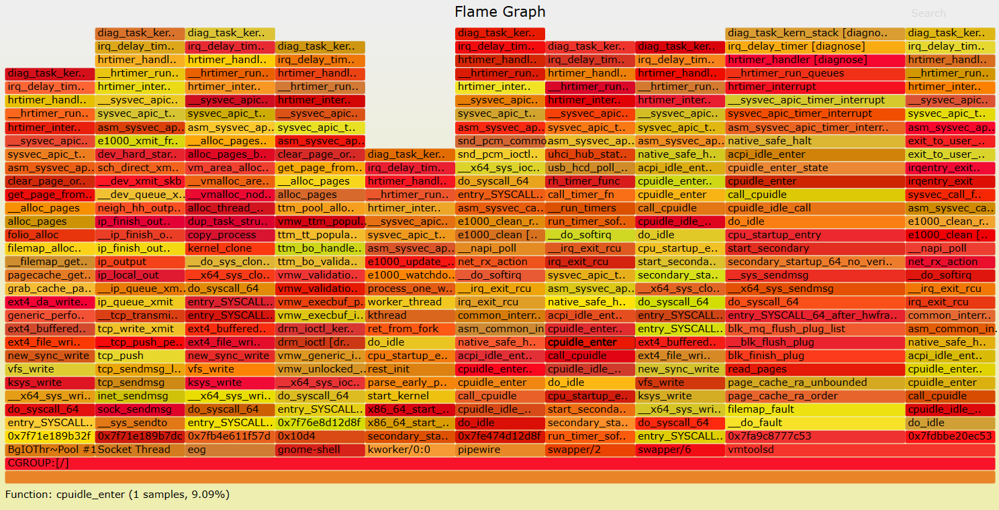

##  irq-delay

### 查看帮助信息

通过如下命令查看本功能的帮助信息：

```
diagnose-tools irq-delay --help
```

结果如下：

```
    irq-delay usage:
        --help irq-delay help info
        --activate
            verbose VERBOSE
            threshold threshold(ms)
        --deactivate
        --settings dump settings with text.
        --report dump log with text.
        --test testcase for irq-delay.
```

### 激活功能

激活本功能的命令是：

```
diagnose-tools irq-delay --activate
```

在激活本功能时，可用参数为：

* verbose：该参数控制输出的详细程度，可以是任意整数。当前未用。
* threshold：配置长时间关中断的阈值，超过该阈值将引起警告信息输出。时间单位是ms。
  例如，如下命令会将检测阈值设置为80ms。一旦系统有超过80ms的关中断代码，将输出其调用链：

```
diagnose-tools irq-delay --activate="threshold=80"
```

如果成功，将在控制台输出如下：

```
功能设置成功，返回值：0
    阈值(ms)：	80
    输出级别：	0
```

如果失败，将在控制台输出如下：

```
功能设置失败，返回值：-16
    阈值(ms)：	80
    输出级别：	0
```

### 查看设置参数

使用如下命令查看本功能的设置参数：

```
diagnose-tools irq-delay --settings
```

结果如下：

```
功能设置：
    是否激活：√
    阈值(ms)：80
    输出级别：0
```

### 查看结果

系统会记录一段时间内中断被延迟的调用链。执行如下命令查看本功能的输出结果：

```
diagnose-tools irq-delay --report
```

输出结果示例如下：

```
中断延迟，PID： 1665[vmtoolsd]， CPU：1, 116 ms, 时间：[1684392217:605473]
    时间：[1684392217:605473].
    进程信息： [/ / vmtoolsd]， PID： 1665 / 1665
##CGROUP:[/]  1665      [003]  采样命中
    内核态堆栈：
#@        0xffffffffc0cd8eb9 diag_task_kern_stack	[diagnose]  ([kernel.kallsyms])
#@        0xffffffffc0ce5303 irq_delay_timer	[diagnose]  ([kernel.kallsyms])
#@        0xffffffffc0ce0e12 hrtimer_handler	[diagnose]  ([kernel.kallsyms])
#@        0xffffffffba39c365 __hrtimer_run_queues  ([kernel.kallsyms])
#@        0xffffffffba39d196 hrtimer_interrupt  ([kernel.kallsyms])
#@        0xffffffffba289b0f __sysvec_apic_timer_interrupt  ([kernel.kallsyms])
#@        0xffffffffbb12061b sysvec_apic_timer_interrupt  ([kernel.kallsyms])
#@        0xffffffffbb200e8b asm_sysvec_apic_timer_interrupt  ([kernel.kallsyms])
#@        0xffffffffba992032 clear_page_orig  ([kernel.kallsyms])
#@        0xffffffffba571eb8 get_page_from_freelist  ([kernel.kallsyms])
#@        0xffffffffba573337 __alloc_pages  ([kernel.kallsyms])
#@        0xffffffffba59be00 alloc_pages  ([kernel.kallsyms])
#@        0xffffffffbae0053b alloc_skb_with_frags  ([kernel.kallsyms])
#@        0xffffffffbadf66fa sock_alloc_send_pskb  ([kernel.kallsyms])
#@        0xffffffffbaf89906 unix_stream_sendmsg  ([kernel.kallsyms])
#@        0xffffffffbadeeeea sock_sendmsg  ([kernel.kallsyms])
#@        0xffffffffbadef2a7 ____sys_sendmsg  ([kernel.kallsyms])
#@        0xffffffffbadf2666 ___sys_sendmsg  ([kernel.kallsyms])
#@        0xffffffffbadf2766 __sys_sendmsg  ([kernel.kallsyms])
#@        0xffffffffbadf27ed __x64_sys_sendmsg  ([kernel.kallsyms])
#@        0xffffffffbb11c168 do_syscall_64  ([kernel.kallsyms])
#@        0xffffffffbb20009b entry_SYSCALL_64_after_hwframe  ([kernel.kallsyms])
    用户态堆栈：
#~        0x7fdbbe20ec53 0x7fdbbe20ec53 ([symbol])
#*        0xffffffffffffff vmtoolsd (UNKNOWN)
##
```

每次输出结果后，历史数据将被清空。

### 生成火焰图

可以用如下命令获取结果并生成火焰图：

```
diagnose-tools irq-delay --report > irq-delay.log
diagnose-tools flame --input=irq-delay.log --output=irq-delay.svg
```

该命令将生成的火焰图保存到irq-delay.svg中，使用浏览器打开如下所示：



### 关闭功能

通过如下命令关闭本功能：

```
diagnose-tools irq-delay --deactivate
```

如果成功，控制台打印如下：

```
irq-delay is not activated
```

如果失败，控制台打印如下：

```
deactivate irq-delay fail, ret is -1
```

关闭功能后，本功能将不会对系统带来性能影响。


