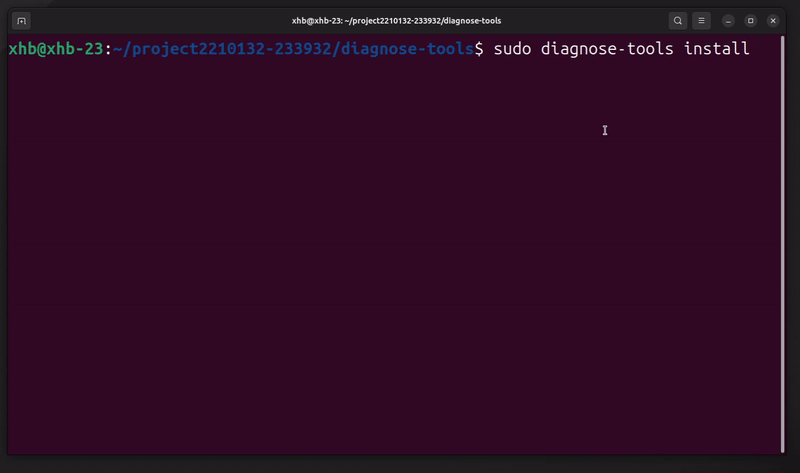

## keytime-image
本功能用于对不同类型的进程进行进程画像，聚焦于进程在生命周期内关键行为的跟踪，用于捕获进程关键时间点进程何时创建（fork，vfork, pthread_create）,何时上CPU，何时下CPU，何时执行execve等。

###  查看帮助信息
通过如下命令查看本功能的帮助信息：
```
diagnose-tools keytime-image --help
```
结果如下：
```
----------------------------------
    keytime_image usage:
        --help keytime_image help info
        --activate
          verbose VERBOSE
          tgid process group monitored
          pid thread id that monitored
          comm comm that monitored
        --deactivate
        --report dump log with text.
```
### 激活功能
激活本功能的命令是：
```
diagnose-tools keytime-image --activate='pid=<pid>'
diagnose-tools keytime-image --activate='tgid=<tgid>'
```
在激活本功能时，可用参数为：

- pid 跟踪线程
- tgid 跟踪进程

例如，下面的命令可以将跟踪进程7151的在生命周期内发生的行为：
`diagnose-tools keytime-image --activate="tgid=7151"`
```
功能设置成功，返回值：0
    进程ID：    7151
    线程ID：    0
    输出级别：  0
keytime-image activated
```
如果失败，将输出：
```
call cmd c0302e00 fail, ret is -1
功能设置失败，返回值：-1
    进程ID：    7151
    线程ID：    0
    输出级别：  0
```

###  查看设置参数
使用如下命令查看本功能的设置参数：

`diagnose-tools keytime-image --settings`
```
功能设置：
    是否激活：√
    进程ID：   7151
    线程ID：  0
    输出级别：0
```
### 查看结果
执行如下命令查看本功能的输出结果：
```
diagnose-tools keytime-image --report
```
结果示例如下：
```
PID:15534 进程名：test_proc_i-ust
  1.时间：18446744072269941158
    #进程退出
  2.时间：18446744072269978810
    #下CPU 3；

PID:15533 进程名：test_proc_i-ust
  1.时间：18446744072269940546
    #进程退出
  2.时间：18446744072269963139
    #下CPU 10；

PID:15532 进程名：test_proc_image
  1.时间：18446744072269886441
    #下CPU 4；
  2.时间：18446744072270347439
    #执行execve
    #详细信息：filename：/bin/ls
  3.时间：18446744072563719409
    #创建子进程
    #child_pid：15643，child_comm：test_proc_image，child_tgid：15532
```

### 关闭功能
通过如下命令关闭本功能：
```
diagnose-tools keytime-image --deactivate 
```
如果成功，将输出：
```
keytime-image is not activated
```
如果失败，将输出：
```
deactivate keytime-image fail, ret is -1
```
关闭功能后，本功能将不会对系统带来任何影响。
