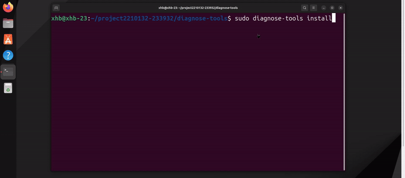

## sched-image
本功能用于识别长时间占用 CPU 而不被调度下去的进程的工具，它能够帮助系统管理员和开发者诊断内核中的其他进程为何得不到调度。


###  查看帮助信息
通过如下命令查看本功能的帮助信息：
```
diagnose-tools sched-image --help
```
结果如下：
```
----------------------------------
    sched_image usage:
        --help sched_image help info
        --activate
          verbose VERBOSE
          threshold THRESHOLD(MS)
          tgid process group monitored
          pid thread id that monitored
          comm comm that monitored
        --deactivate
        --report dump log with text.
```
### 激活功能
激活本功能的命令是：
`diagnose-tools sched-image --activate`,
在激活本功能时，可用参数为：
- `verbose` 输出级别
- `threshold` 阈值大小。

例如，下面的命令可以将阈值设置为100us,并且详细输出问题进程的信息:`diagnose-tools sched-image --activate="threshold=100,verbose=1"`

如果成功，将输出：
```
功能设置成功，返回值：0
    监控阈值(ms)：      100
    输出级别：  1
sched-image activated
```

如果失败，将输出：
```
call cmd c0342c00 fail, ret is -1
功能设置失败，返回值：-1
    监控阈值(ms)：      1000
    输出级别：  0
```

###  查看设置参数
使用如下命令查看本功能的设置参数：
`diagnose-tools sched-image --settings`
```
功能设置：
    是否激活：√
    阈值(ms)：  100
    进程名称：
    输出级别：1
```
### 查看结果
执行如下命令查看本功能的输出结果：
```
diagnose-tools sched-image --report
```
结果示例如下：
```
    时间：[1721707582:88145].
    进程信息： [/ / node]， PID： 154081 / 154081
##CGROUP:[/]  154081      [046]  采样命中
    TIME_STAMP         CPU   PID      DELAY     
    52483867388925     5     154081   298.49    
    内核态堆栈：
#@        0xffffffffc0a97a4c diag_task_kern_stack       [diagnose]  ([kernel.kallsyms])
#@        0xffffffffc0ab139f record_info        [diagnose]  ([kernel.kallsyms])
#@        0xffffffffc0ab1458 trace_sched_switch [diagnose]  ([kernel.kallsyms])
#@        0xffffffff8eef4367 __traceiter_sched_switch  ([kernel.kallsyms])
#@        0xffffffff8f21b782 ep_poll  ([kernel.kallsyms])
#@        0xffffffff8f21b892 do_epoll_wait  ([kernel.kallsyms])
#@        0xffffffff8f21b8c0 do_compat_epoll_pwait.part.0  ([kernel.kallsyms])
#@        0xffffffff8f21c3ff __x64_sys_epoll_pwait  ([kernel.kallsyms])
#@        0xffffffff8fc0716c do_syscall_64  ([kernel.kallsyms])
#@        0xffffffff8fe0009b entry_SYSCALL_64_after_hwframe  ([kernel.kallsyms])
    用户态堆栈：
#~        0x7fb89dd288a6 0x7fb89dd288a6 ([symbol])
#*        0xffffffffffffff node (UNKNOWN)
##
```


### 关闭功能
通过如下命令关闭本功能：
```
diagnose-tools sched-image --deactivate 
```
如果成功，将输出：
```
sched-image is not activated
```
如果失败，将输出：
```
deactivate sched-image fail, ret is -1
```
关闭功能后，本功能将不会对系统带来任何影响。
