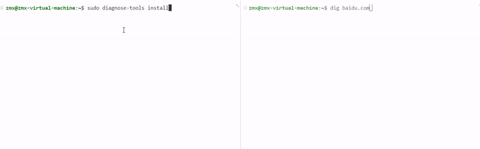
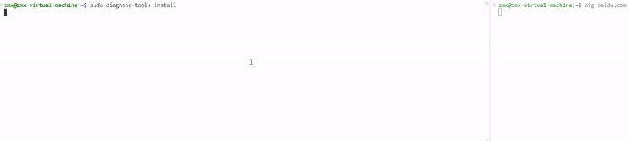

# UDP

本功能追踪UDP连接中各状态的切换

## 查看帮助信息

通过如下命令查看本功能的帮助信息：

```
diagnose-tools  udp --help
```

结果如下：

```
    udp usage:
        --help udp help info
        --activate
          verbose VERBOSE
          addr filtered ipv4 address.
        --deactivate
        --settings dump settings
        --report dump log with text.
```

## 激活功能

激活本功能的命令是：

```
diagnose-tools udp --activate
```

在激活时可以指定相应参数
verbose为1时可以对udp处理时延进行计算以及对异常数据进行输出,addr为某ip地址时可以仅输出当前地址的tcp报文信息

```
diagnose-tools udp --activate="addr=1.1.1.1"
diagnose-tools udp --activate="verbose=1"
```

如果成功，将输出：

功能设置成功，返回值：0

```
    输出级别：1
    过滤地址：0.0.0.0
```

如果失败，将输出：

```
功能设置失败，返回值：-16
    输出级别：1
    过滤地址：0.0.0.0
```

## 查看设置参数

使用如下命令查看本功能的设置参数：

```
diagnose-tools udp --settings
```

结果如下：

```
功能设置：
    是否激活：√
    过滤地址：0
    输出级别：0
```

## 查看结果

执行如下命令查看本功能的输出结果：
`diagnose-tools udp --report`

输出结果示例如下：
未设置verbose（默认为0）


```
udp跟踪,UDP_SEND:[1721740565:537926],源IP：192.168.239.136, 目的IP：192.168.239.2, 源端口：48364, 目的端口: 53,协议: DNS ,询问数量: 1 ,域名: connectivity-check.ubuntu.com
udp跟踪,UDP_RCV:[1721740565:544299],源IP：192.168.239.2, 目的IP：192.168.239.136, 源端口：53, 目的端口: 48364,协议: DNS ,询问数量: 1 ,回答数量: 12,域名: connectivity-check.ubuntu.com,IP:38.32.0.45
udp跟踪,UDP_SEND:[1721740588:898467],源IP：192.168.239.136, 目的IP：192.168.239.2, 源端口：42280, 目的端口: 53,协议: DNS ,询问数量: 1 ,域名: gitlab.eduxiji.net
udp跟踪,UDP_SEND:[1721740588:898719],源IP：192.168.239.136, 目的IP：192.168.239.2, 源端口：50356, 目的端口: 53,协议: DNS ,询问数量: 1 ,域名: gitlab.eduxiji.net
udp跟踪,UDP_RCV:[1721740588:903572],源IP：192.168.239.2, 目的IP：192.168.239.136, 源端口：53, 目的端口: 50356,协议: DNS ,询问数量: 1 ,回答数量: 1,域名: gitlab.eduxiji.net,IP:10.119.101.98
udp跟踪,UDP_SEND:[1721740588:903790],源IP：192.168.239.136, 目的IP：192.168.239.2, 源端口：49978, 目的端口: 53,协议: DNS ,询问数量: 1 ,域名: web-190-16.educg.com
udp跟踪,UDP_SEND:[1721740588:904875],源IP：192.168.239.136, 目的IP：192.168.239.2, 源端口：48768, 目的端口: 53,协议: DNS ,询问数量: 1 ,域名: github.com
udp跟踪,UDP_SEND:[1721740588:905108],源IP：192.168.239.136, 目的IP：192.168.239.2, 源端口：48842, 目的端口: 53,协议: DNS ,询问数量: 1 ,域名: github.com
udp跟踪,UDP_RCV:[1721740588:905314],源IP：192.168.239.2, 目的IP：192.168.239.136, 源端口：53, 目的端口: 42280,协议: DNS ,询问数量: 1 ,回答数量: 2,域名: gitlab.eduxiji.net,IP:10.119.101.98
udp跟踪,UDP_RCV:[1721740588:907794],源IP：192.168.239.2, 目的IP：192.168.239.136, 源端口：53, 目的端口: 48768,协议: DNS ,询问数量: 1 ,回答数量: 1,域名: github.com,IP:20.205.243.166
udp跟踪,UDP_SEND:[1721740588:911024],源IP：192.168.239.136, 目的IP：192.168.239.2, 源端口：33064, 目的端口: 53,协议: DNS ,询问数量: 1 ,域名: github.com
```

输出结果中包含udp报文基本四元组信息、上层协议类型、域名及respose IP（如DNS）。每次输出结果后，历史数据将被清空。

设置verbose为1时



```
Saddr                Daddr                Sprot                Dprot                udp_time/μs         RX/direction         len/byte                                                                          
192.168.239.136      192.168.239.2        60716                53                   5                    0                    44                  
192.168.239.136      192.168.239.2        48624                53                   4                    0                    44                  
192.168.239.2        192.168.239.136      53                   60716                6                    1                    94                  
192.168.239.136      192.168.239.2        48576                53                   5                    0                    36                  
192.168.239.136      192.168.239.2        55865                53                   5                    0                    36                  
192.168.239.2        192.168.239.136      53                   48624                5                    1                    139                 
192.168.239.136      192.168.239.2        46217                53                   5                    0                    46                  
192.168.239.2        192.168.239.136      53                   48576                5                    1                    52                  
192.168.239.2        192.168.239.136      53                   55865                3                    1                    120                 
192.168.239.2        192.168.239.136      53                   46217                3                    1                    107                 
192.168.239.136      192.168.239.2        38106                53                   18                   0                    36                  
192.168.239.2        192.168.239.136      53                   38106                4                    1                    120                 
192.168.239.136      192.168.239.2        49447                53                   3                    0                    36                  
192.168.239.2        192.168.239.136      53                   49447                2                    1                    120                 
192.168.239.136      192.168.239.2        36909                53                   7                    0                    36                  
192.168.239.136      192.168.239.2        39969                53                   189                  0                    36                  abnormal data  
192.168.239.2        192.168.239.136      53                   36909                8                    1                    515                 
192.168.239.2        192.168.239.136      53                   39969                2                    1                    120  
```

输出结果中包含基本四元组信息，内核中传输层处理时延，udp报文，如果是处理时延异常数据，则显示abnormal data


## 关闭功能

通过如下命令关闭本功能：

```
diagnose-tools udp --deactivate
```

关闭功能后，本功能将不会对系统带来性能影响。


