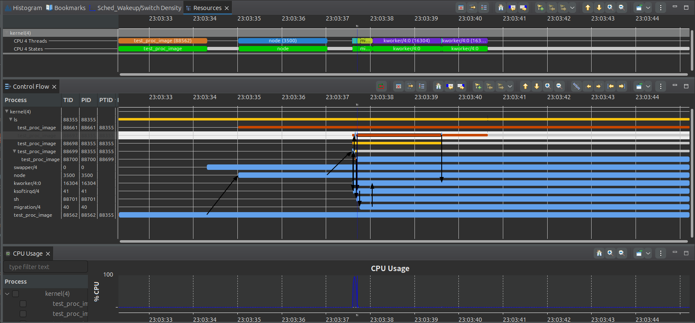

# migrate_image 正确性验证
## 0.准备工作：

学习使用LTTng 来监测数据;

学习将LTTng生成的文件在compass上跑出来,并分析;

### 0.1.LTTng学习使用:

[linux下 LTTng使用详细说明_no package 'liburcu' found-CSDN博客](https://blog.csdn.net/mao_hui_fei/article/details/120654095)

```c
lttng create my-session
lttng enable-event --kernel sched_switch
lttng add-context --kernel --type pid --type tid
lttng track --kernel --pid <pid>
lttng track --kernel --tid <tid>
lttng start
# 运行你想监控的进程或线程
lttng stop
lttng view
lttng destroy
```

### 0.2.trace compass
`
[Trace Compass User Guide - LTTng Kernel Analysis (eclipse.org)](https://archive.eclipse.org/tracecompass/doc/stable/org.eclipse.tracecompass.doc.user/LTTng-Kernel-Analysis.html#Control_Flow_View)




## 1.migrate_image

migrate_image是一款致力于研究进程在核间迁移时负载的监测工具，当进程由于负载均衡、调度策略发生变化、CPU资源使用情况以及节能等原因发生迁移，我们通过tracepoint挂载点`sched_migrate_task`来获取相关数据指标。

本次测试以及数据关联工作分为三部分：

- migrate_image工具逻辑正确性的测试；
- migrate_image工具数据正确性的测试；
- migrate_image工具数据的关联关系，以及原理梳理；

### 1.1 测试用例test_migrate
正在完善中...
