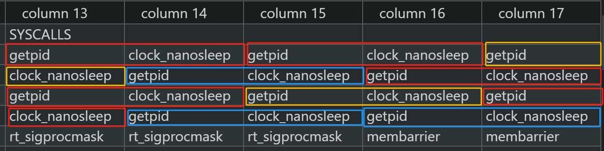
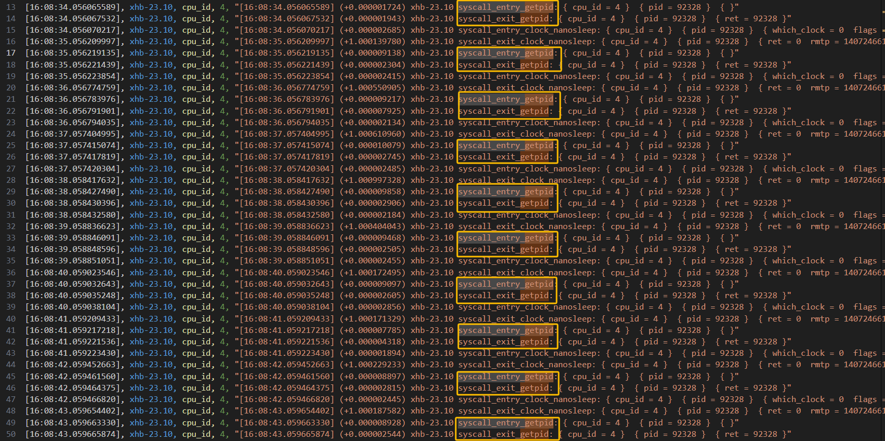
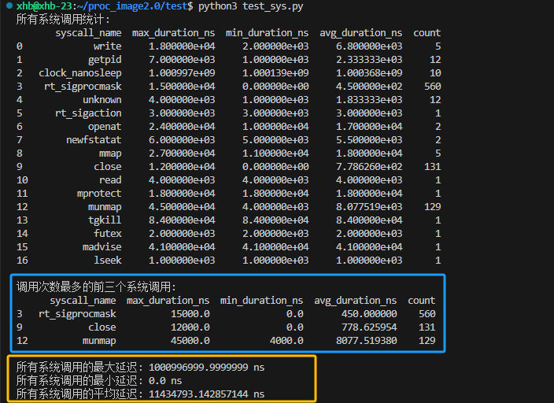

# syscall_image 正确性验证
## 0.准备工作：

学习使用LTTng 来监测数据;

学习将LTTng生成的文件在compass上跑出来,并分析;

### 0.1.LTTng学习使用:

[linux下 LTTng使用详细说明_no package 'liburcu' found-CSDN博客](https://blog.csdn.net/mao_hui_fei/article/details/120654095)

```c
lttng create my-session
lttng enable-event --kernel sched_switch
lttng add-context --kernel --type pid --type tid
lttng track --kernel --pid <pid>
lttng track --kernel --tid <tid>
lttng start
# 运行你想监控的进程或线程
lttng stop
lttng view
lttng destroy
```

### 0.2.trace compass

[Trace Compass User Guide - LTTng Kernel Analysis (eclipse.org)](https://archive.eclipse.org/tracecompass/doc/stable/org.eclipse.tracecompass.doc.user/LTTng-Kernel-Analysis.html#Control_Flow_View)


## 1.syscall_image

syscall_image 是一个用于捕获进程发生系统调用的时工具，他致力于发现系统中每一个线程/进程的系统调用行为，他通过将挂载点放在sys_enter，sys_exit来发现系统中产生的系统调用，并计算没每次系统调用的延迟时间，做到在宏观上对系统中产生系统调用进行分析；

本次测试以及数据关联工作分为三部分：

- syscall_image工具逻辑正确性的测试；
- syscall_image工具数据正确性的测试；
- syscall_image工具数据的关联关系，以及原理梳理；

### 1.1 测试用例test_sys

为了完成以上三步测试与数据关联工作，需要设计一个测试用例，使用该测试用例可以测试syscall_image工具的逻辑正确性，并通过和lttng工具测试的结果进行对比，判断syscall_image数据正确性；

syscall_image工具关注的是单个进程发生系统调用时的延迟以及其系统调用序列，为了比较数据的正确性，我们采用lttng，由于lttng没有像sys_enter,sys_exit对应的跟踪点，所以我们将和系统调用有关的全部跟踪点打开，便于捕获所有的系统调用；

#### 1.1.1 测试用例设计思路

测试用例主要思路是：参考 UnixBench 中的 syscall 测试，我们通过syscall(SYS_getpid);来不停地直接调用getpid系统调用，在经过多次调用后，便可以通过查看syscall_image工具监测的结果来验证其正确性。

测试用例主要思路

- 对测试进程进行绑核，绑定在cpu4上；
- 连续执行10次系统调用`syscall(SYS_getpid);`每执行一次休息1s

```c
   if(env.syscall_test){
      printf("SYSCALL_TEST----------------------------------------------\n");

      // 系统调用序列逻辑(参考 UnixBench 中的 syscall 测试)
      printf("系统调用序列逻辑:\n");
      printf("每调用一次 SYS_getpid 系统调用睡眠 1 s,循环 10 次\n");
      int count = 10;
      while(count){
         syscall(SYS_getpid);
         count--;
         sleep(1);
      }
   }
```

在执行我们指定的系统调用SYS_getpid的同时,一定会伴随着其他系统调用的使用,需要用syscall-image工具对结果进行进一步的分析;

#### 1.1.2 测试脚本:

在通过测试用例对syscall_image工具进行逻辑正确性的验证之后,需要验证syscall_image工具采集到的数据是否是可靠的;

这里通过一个测试脚本实现syscall_image工具和lttng同时监测测试用例的数据，并将数据导出；测试脚本主要完成的工作:

- 再打开测试用例之后,使用syscalll_image和lttng两种放法对其进行数据监测;
- 将采集到的数据输入进指定的文件中;
- 为了方便数据分析和结果对比,需要将syscall_image工具拿到的由系统调用号组成的系统调用序列转换为由系统调用名组成的序列;
- 将lttng采集到的数据进行逻辑计算,计算出每个系统调用的时延并作统计;

### 1.2 结果分析：

通过测试用例和测试脚本，已经将采集到的数据处理结束,接下来就需要对syscall_image工具进行逻辑正确性以及数据正确性的验证;

#### 1.2.1.逻辑正确性

由于syscall_image工具主要检测的是进程所产生的系统调用情况,所以在逻辑上我们需要进行一下对比:

- 测试用例所用到的系统调用,syscall_image工具是否全部监测到;
- syscall_image工具检测到的系统调用是否和ttng所检测到的一致;

通过脚本，可以获取到syscall_image监测测试用例进程所用到的系统调用,以及lttng所检测到的系统调用序列,由于本次测试仅关注单个进程或线程组的情况，忽略对整个系统当前的系统调用情况的验证；

**syscall_image 对比 测试用例**：

测试用例会连续10次调用SYS_getpid，每调用完一次就会睡眠1s；

我们可以在syscall_image工具的输出数据中看到如下信息：



正好是十次连续的系统调用，证明我们的工具是逻辑正确的；

**syscall_image 对比 lttng结果**：

lttng监测到的结果:



通过lttng以及syscall_image的对比，可以证明我们的syscall_image工具在逻辑上是正确无误的；


#### 1.2.2 数据正确性

前面我们已经对syscall-image工具进行了逻辑真确性验证，接下来我们通过对比一些数据来验证数据正确性，这些数据包括：

- 最大系统调用延迟
- 最小系统调用延迟
- 平均系统调用延迟；
- 被调用最多的系统调用;

通过下图我们可以看到lttng采集到的数据中，调用次数最多的前三个系统调用分别是：rt_sigprocmask、close 、 munmap，而这与我们在syscall-image中统计得到的数据一致；

```shell
SYSCALL ---------------------------------------------------------------------------------------------------------------------------------------------------------------------------
TIME      TGID    PID     1st/num         2nd/num         3nd/num         | P_AVG_DELAY(ns) S_AVG_DELAY(ns) | P_MAX_DELAY(ns) S_MAX_DELAY(ns) | P_MIN_DELAY(ns) S_MIN_DELAY(ns) |  SYSCALLS
...
16:08:44  92328   92328   14 /532         3  /131         11 /129         | 12054909        13682568        | 1000994442      10006484305     | 651             281             |  14,14,3,14,14
```



- 最大系统调用延迟：
	- syscall_image：1000994442ns
	- lttng：1000996999.999999ns
	- 差值：2558ns
- 最小系统调用延迟：
	- syscall_image：651ns
	- lttng：1000ns
	- 差值：349ns
- 平均系统调用延迟：
	- syscall_image：11982729ns
	- lttng：11434793.1428ns
	- 差值：547935ns

通过以上数据的对比,我们可以得出结论,syscall_image在数据层面是真实可靠的,他与lttng之间存在0.0000255%的误差,是可以忽略的。

### 1.3 关键数据点的关联关系

由于每秒钟产生系统调用十分繁多，我们可以将其作为分析进程行为非常细粒度的指标，将最大系统调用延迟、最小系统调用延迟以及平均系统调用延迟作为宏观分析指标；

数据关联关系：

- 进程的所有的系统调用信息可以通过以下的数据点进行关联：
	- 线程号/进程号；系统调用号；系统调用时延；进入系统调用时间点；
- 系统调用的总体统计数据可以在宏观层面对进程的行为进行指导判断：
	- 系统调用次数排名；
	- 最大系统调用延迟、平均系统调用延迟、最小系统调用延迟；