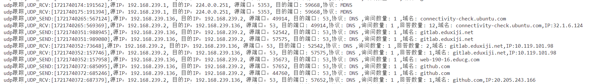
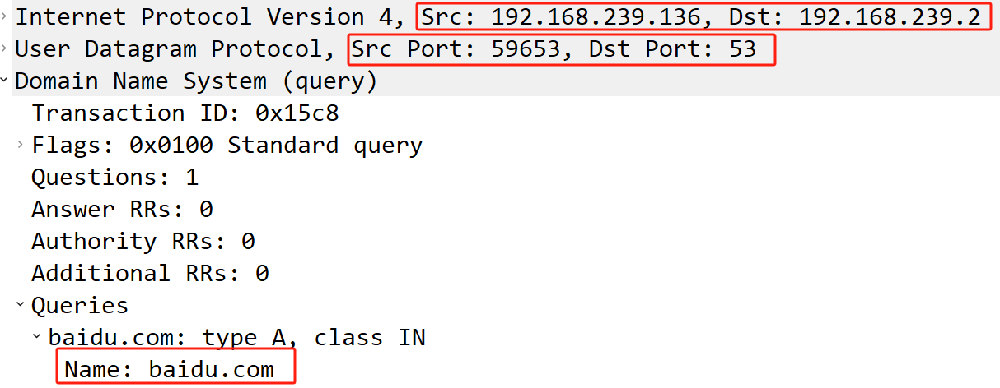
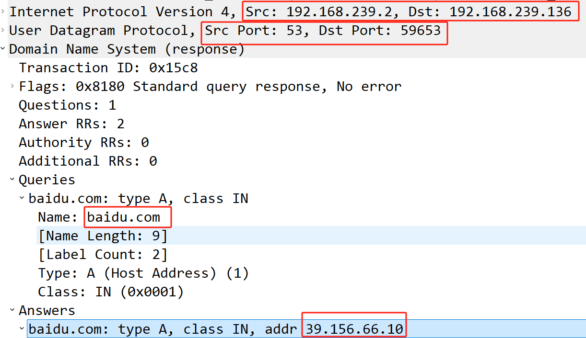
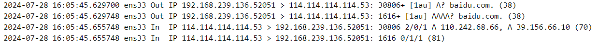

# UDP正确性验证

在测试过程中，我们同时使用了我们的工具和传统的网络监控工具（如Wireshark或tcpdump）进行并行捕获和分析。通过对比两个工具的输出结果，我们验证了网络流量和协议解析的正确性。我们的工具能够准确记录和解析UDP和IP的基本信息、应用层协议数据（如DNS查询和响应），以及内核处理延时等详细信息。这些数据与传统工具捕获和解析的数据一致，表明我们的工具在实际应用中的准确性和可靠性。

**wireshark**

从该工具获取的数据如下



以DNS报文为例

```bash
udp跟踪,UDP_SEND:[1721740485:978604],源IP：192.168.239.136, 目的IP：192.168.239.2, 源端口：59653, 目的端口: 53,协议: DNS ,询问数量: 1 ,域名: baidu.com
udp跟踪,UDP_RCV:[1721740485:982822],源IP：192.168.239.2, 目的IP：192.168.239.136, 源端口：53, 目的端口: 59653,协议: DNS ,询问数量: 1 ,回答数量: 2,域名: baidu.com,IP:39.156.66.10
```

从wireshark工具同时抓取的报文如下

**dns query**



**dns response**



数据与所解析的数据相同，保证了数据源的正确性。

**tcpdump**



我们的工具通过使用kprobe挂载相应函数，具备以下显著优势：

1. **实时和深入的网络分析**：我们的工具不仅能够捕获网络流量，还能深入解析上层协议，获取详细的应用层协议信息，如DNS协议中的域名和IP地址。这有助于诊断和解决应用层协议相关的问题，而传统工具主要侧重于捕获数据包，解析功能较为基础。
2. **性能监控和瓶颈识别**：我们的工具可以监测内核在UDP层面的处理延时，识别和解决网络性能瓶颈。这种实时的性能监控功能在传统工具中较为有限，而我们的工具能够提供更详细的性能数据，帮助快速定位和解决问题。
3. **动态阈值监测**：通过动态阈值监测，我们的工具能够及时检测内核处理延时过高和相同IP组瞬时报文过多等异常情况，从而预防网络拥塞和潜在的安全威胁。这一功能显著提高了网络的稳定性和安全性，而传统工具通常缺乏这种智能监测和预警能力。
4. **低开销和高效率**：我们的工具通过kprobe直接在内核层进行数据捕获和处理，具有较低的系统开销和高效的数据处理能力。

综上所述，我们的工具在网络流量监控、协议解析、性能监控和异常检测方面具有显著优势，提供了更详细、更实时的分析数据，具备更高的效率和更低的系统开销。这些优势使我们的工具在实际网络监控和分析应用中表现出色，能够更好地满足复杂网络环境中的需求。