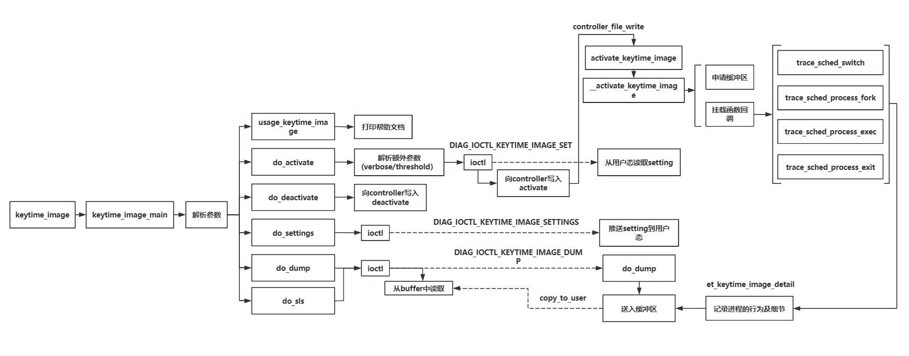

# keytime_image

## 功能描述

`keytime_image`是一款用于捕获进程关键时间点的工具，聚焦于进程何时创建子进程（fork，vfork, pthread_create）,何时上CPU，何时下CPU，何时执行execve、何时退出等。通过tracepoint将其挂载在特定的挂载点上，并在进程发生以上几种行为时进行数据收集，并对数据进行处理，可以通过数据描绘出进程在关键时间点上的行为；

## 主体框架

本功能实现的框架如下：

## 主要功能

- **进程行为画像**：实时监控系统中关键进程的行为，并按照时间对这些进程行为进行输出，实现对进程进行画像；

- **目前可监控到的行为**：通过sched_image工具找到问题进程，通过keytime_image工具对其进行进程画像：

	- 获取到当前进程/线程 创建子进程的时间；
	- 获取到当前进程/线程 上下CPU的时间；
	- 获取到当前进程/线程 执行execve的时间；
	- 获取到当前进程/线程  exit退出的时间；

- **目前正在增加功能**：

	- 获取到当前进程/线程 进行内存分配、内存释放、执行 `mmap` 系统调用、进程执行 `munmap` 系统调用的时间；

	- 获取到当前进程/线程 文件描述符被安装、文件被打开时、文件被读操作、文件被写操作的时间;

		

## 使用场景:

### **场景1：特定进程的故障排查**

**【场景描述】**：在生产环境中，某些次要进程会长期占用系统资源或出现性能问题，导致主要服务出现抖动、卡顿、甚至是死机现象。为了确保主要业务的主要进程流畅进行，必须迅速排查、分析、解决这些问题，并对次要进程进行性能优化。通过对进程关键行为进行记录分析,可以判定该进程的问题所在。

**【解决的问题】**

对目标进程的一些行为进行关键时间点的分析，快速定位并解决故障原因。通过记录和分析进程的关键行为（如创建子进程、上下 CPU、执行 `execve`、进程退出），可以回溯进程的操作历史，找出导致故障的具体操作，从而及时修复问题，保证系统稳定性。

**【案例】**：排查 Web 服务器进程的性能问题

某公司的 Web 服务器在高峰期经常出现性能下降的问题，导致用户访问速度变慢，影响用户体验和业务运营。需要对 Web 服务器进程行为进行跟踪，以找出性能问题的根源并进行优化。

- **定位 CPU 使用瓶颈**：通过 `keytime_image` 工具，发现 PID 5678 的进程频繁上下 CPU。结合其他监控工具，确认该进程在高峰期占用了大量 CPU 资源。
- **分析子进程创建**：在时间点 1627892234567890，进程 5678 创建了子进程 6789。这可能导致了系统资源的额外开销，需要进一步分析子进程的行为。
- **执行新程序**：在时间点 1627892234567891，进程 5678 执行了新程序 `/usr/bin/another_command`。新程序的执行可能带来了性能问题，需要分析其执行期间的系统资源占用情况。
- **进程退出**：在时间点 1627892234567894，进程 5678 退出。需要确认进程退出的原因，是否是由于资源耗尽或程序错误导致的崩溃。

