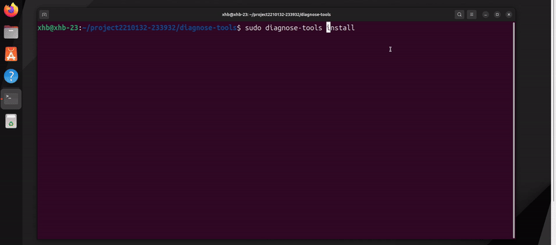
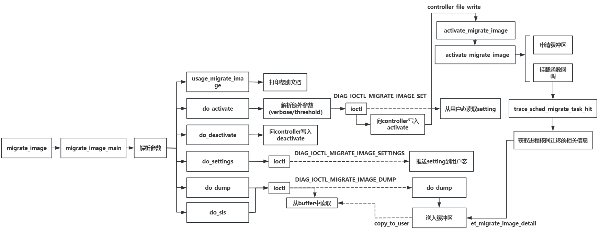

# migrate_image

## 功能描述

migrate_image是一款致力于研究进程在核间迁移时负载的监测工具，当进程由于负载均衡、调度策略发生变化、CPU资源使用情况以及节能等原因发生迁移，我们通过tracepoint挂载点`sched_migrate_task`来获取相关数据指标。

## 主体框架

本功能实现的框架如下：

## 主要功能

- **进程迁移时负载画像**：实时监控系统中关键进程发生核间迁移时，该进程的量化负载以及算力需求，；

- **实时监控任务迁移事件**：捕获任务在不同 CPU 核之间的迁移事件，记录详细的迁移信息；

- **负载和资源使用分析**：监控和记录被迁移任务的 CPU 负载、内存使用、I/O 活动和上下文切换次数，以及当前进程的优先级，提供全面的资源使用分析。

## 使用场景:

### **场景1：双十一促销期间电子商务平台的性能优化**

**【场景描述】**：在双十一促销期间，电子商务平台的 Web 服务器承受着巨大的流量压力，数百万用户同时访问网站进行购物。这种高并发环境对服务器的性能提出了严峻的挑战。为了确保用户能够顺畅地浏览商品、下单和支付，平台必须优化服务器的性能，特别是关键进程如订单处理和支付验证的性能。

**【解决的问题】**

解决高峰期，Web服务器出现的以下问你问题：

* **CPU 负载不均衡**：某些 CPU 核承载了过多的进程，导致关键进程运行缓慢，响应时间延长。；
* **资源争用**：内存和 I/O 资源争用严重，导致关键进程卡顿，影响用户体验；
* **频繁任务迁移和上下文切换**：调度策略不合理，频繁的任务迁移和上下文切换增加了系统开销，降低了整体性能；
* **性能瓶颈难以定位**：在高负载环境中，难以快速定位关键进程的性能瓶颈，影响了优化工作的效率；

**【案例】**：排查 Web 服务器进程的性能问题

某公司的 Web 服务器在高峰期经常出现性能下降的问题，导致用户访问速度变慢，影响用户体验和业务运营。

* **性能瓶颈识别**：详细记录迁移事件发生的时间、迁移前后的负载和资源使用情况。通过分析这些数据，识别出关键进程在迁移后负载显著上升的问题，采取措施将关键进程固定在特定的 CPU 核上，避免频繁迁移带来的性能下降。

- **负载均衡优化**：通过 `migrate_image` 工具，监控各个 CPU 核的负载情况，记录每个核上的任务数量、CPU 容量等数据；发现某些核负载过重后，及时调整任务分配，将任务重新分配到负载较轻的核上，优化负载均衡。
- **调度策略优化**：通过分析迁移事件的频率和上下文切换次数，评估调度策略的有效性。优化调度参数，减少不必要的任务迁移和上下文切换，降低系统开销，提高关键进程的稳定性。

	

