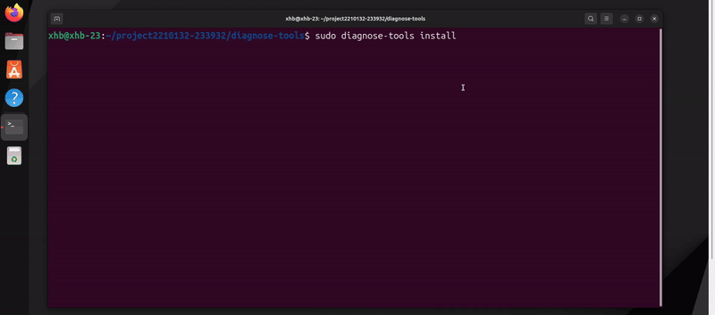
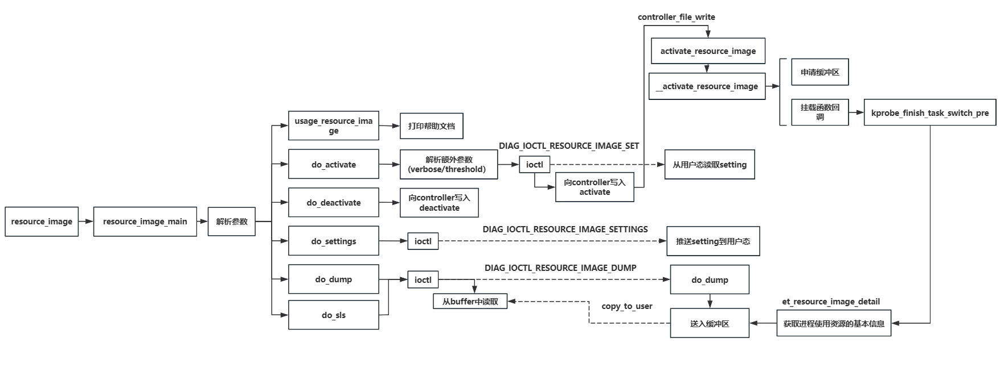

# resource_image

## 功能描述

resource_image:是一款致力于研究进程对试实时系统资源利用情况的监测工具，涉及到当前进程的cpu利用率、mem使用率、读写字节数等。该功能通过使用kprobe钩子函数挂载到`finish_task_switch`内核函数上，旨在追踪任务切换时的资源使用情况；

## 主体框架

本功能实现的框架如下：

## 主要功能

- **监控进程实时的资源使用情况**：实时监控系统中关键进程的资源使用情况，及时发现和处理性能瓶颈；
- **问题进程的细粒度分析**：通过sched_image工具找到问题进程，通过resource_image工具对其进行资源使用情况方面的细粒度分析：
	- 监测当前进程/线程在指定时间内占用cpu的时间，并计算cpu使用率；
	- 监测当前进程/线程在指定时间内占用内存资源情况；
	- 监测当前进程/线程在指定时间内执行读写操作的字节数；
- **辅助优化进程性能，提高系统整体性能**：通过resource_image工具，采集进程运行时对资源的占用详情，根据数据制定性能优化方法；

## 使用场景:

### **场景1：特定进程的故障排查**

**【场景描述】**：在生产环境中，某些次要进程会长期占用系统资源或出现性能问题，导致主要服务出现抖动、卡顿、甚至是死机现象。为了确保主要业务的主要进程流畅进行，必须迅速排查、分析、解决这些问题，并对次要进程进行性能优化。通过详细的资源使用监控和分析，可以有效识别问题根源，并提供解决方案。

**【解决的问题】**

- **定位性能瓶颈**：
	- 通过监控特定进程的资源使用情况，识别导致性能问题的瓶颈，如高 CPU 使用率、内存泄漏或 I/O 瓶颈。；

- **故障排查**：
	- 当特定进程出现故障时，通过详细的资源使用数据，分析和确定问题原因，如资源耗尽、死锁等。
- **优化资源使用**：
	- 通过分析资源使用数据，优化进程的资源管理，减少资源浪费，提升性能。

**【案例】**：排查 Web 服务器进程的性能问题

某公司的 Web 服务器在高峰期经常出现性能下降的问题，导致用户访问速度变慢，影响用户体验和业务运营。需要对 Web 服务器进程进行详细的资源使用监控和分析，以找出性能问题的根源并进行优化。

- **定位 CPU 使用瓶颈**：通过监控发现某些时间段内 Web 服务器的 CPU 使用率过高，经过分析发现是某些复杂的页面渲染导致的，通过优化页面渲染逻辑和缓存机制解决了这一问题。
- **解决内存泄漏问题**：通过监控发现 Web 服务器的内存使用量逐渐增加，经过分析发现是某些模块存在内存泄漏，通过修复代码解决了这一问题。
- **提高 I/O 性能**：通过分析资源使用数据，对 I/O 操作进行了优化，例如采用异步 I/O、优化文件读写操作等，提高了 Web 服务器的响应速度。
- **确保服务稳定运行**：通过及时识别和解决性能瓶颈和故障点，避免了 Web 服务器崩溃和用户体验下降，提高了服务的稳定性和系统的整体性能。

### **场景2：关键业务进程监控**

**【场景描述】**：在企业生产环境中，某些关键业务进程（如数据库服务器、Web服务器、应用服务器等）对系统性能和业务连续性至关重要。确保这些关键业务进程的资源使用情况在合理范围内，是保障系统稳定运行和业务正常开展的关键。

**【解决的问题】**

- **实时监控**：
	- 监控关键业务进程的 CPU 使用时间、内存使用量、I/O 操作等；
	- 及时发现资源消耗异常的情况，防止系统崩溃或业务中断；

- **性能优化**：

	- 分析资源使用数据，识别潜在的性能瓶颈。

	- 根据监控数据，进行针对性的性能调优，确保关键业务进程在高负载下仍能稳定运行。

- **故障预警**：

	- 通过资源使用数据，提前识别可能的故障点；
	- 实施预防性维护，减少系统故障和业务中断的风险；

**【案例】**：监控在线支付系统的数据库服务器

在线支付平台的数据库服务器是整个系统的核心组件，负责处理所有支付交易的数据存储和查询操作。通过部署和使用resource_image工具，该平台的运维团队能够实时掌握数据库服务器的资源使用情况，并进行针对性的优化和预防性维护。具体效果包括：

- **实时发现和解决资源消耗异常**：通过工具监控发现某在一段时间内数据库 CPU 使用率过高，可以使用本工具下的keytime_image功能分析进程执行的具体行为，发现具体是某些查询语句性能问题导致的，通过优化查询语句便可以解决这一问题。
- **提升数据库服务器性能**：通过resource_image工具分析资源使用数据，对数据库进行性能调优，例如调整内存分配、优化索引等，显著提高了数据库的查询和处理效率。
- **减少系统故障和业务中断**：通过提前识别和解决潜在的资源瓶颈和故障点，避免系统崩溃和业务中断，可以提高平台的稳定性和用户体验。

