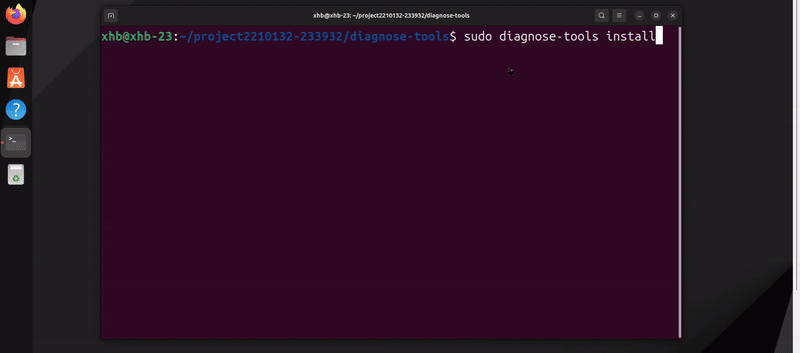

# sched_image:

## 功能描述

sched_image是一款设计用于识别长时间占用 CPU 而不被调度下去的进程的工具，它能够帮助系统管理员和开发者诊断内核中的其他进程为何得不到调度。通过跟踪和分析系统中CPU调度情况，sched_image提供了一种有效的方法来定位和解决系统性能瓶颈和任务抖动延迟高的情况。

## 主要功能

* **监控进程调度**：实时监控系统中所有进程的调度情况，及时识别长期占用CPU的进程；
* **通过动态阈值实时识别**：根据不同的运行环境以及需求，sched_image会动态的调整阈值大小，识别持续占用 CPU 超过这个动态阈值的进程；
* **问题进程的细粒度分析**：sched_image可以将长时间占用CPU的问题进程进行行为分析，并结合其他工具进行更细粒度的分析：
	* 调用栈的分析：拿到进程的函数调用栈，可以看到该进程在生命周期内所调用的函数；
	* 和其他工具的配合：可以通过keytime_image工具对进程关键时间点进行行为分析，查看该问题进程在哪些关键时间点发生了异常；结合lock_image、syscall_image工具，在问题时间点附近的查看该进程更细粒度的行为(包括系统调用、锁的使用情况等)，通过系统调用序列表，就可以还原该问题进程的问题行为，采取相应措施优化性能、对症下药，以提升系统整体性能。

## 使用场景:

 **场景1：高延迟问题排查**

* **问题描述：**在业务运行时，业务系统经常遇到延迟高的问题，如果某个进程陷入内核态执行时间过长，会导致调度延迟，影响其他希望在该核上运行的进程；
* **举例：**在618，双十一或限时购票高峰期的类似**高并发、高负载和海量数据处理**的活动场景中，服务器面临大量并发请求，部分请求响应变慢，会出现某一个或一组业务进程长期占用CPU而得不到调度，造成关键性进程无法及时上CPU去运行，导致系统相应慢甚至瘫痪；
* **解决方案：** 使用 sched_image工具专门跟踪陷入内核态长时间不调度的进程，帮助识别和分析这些进程对系统整体延迟的影响，通过keytime_image、syscall_image、resource_image等工具对该进程进行更细粒度的分析，找到该进程长时间占用CPU的原因，提供指导方向来排查和解决高延迟问题。

## 框架图

本功能实现的框架如下：

## 原理分析:

本工具主要采用tracepoint以及高精度定时器联合实现,当内核中发生调度切换时,意味着要有进程或线程进行上下CPU,内核中的调度器会通过`schedule()`实现真正地调度切换,我们把重点放在`__schedule()`中的一个静态挂载点：`sched_switch`，此时cpu知道了哪个进程下cpu; 再通过高精度定时器定时访问每个cpu上运行的进程或线程,查看其是否运行超时。

上下CPU是CPU调度时产生的进程行为，由于不同的调度策略会使不同的进程上下CPU，一般进程上下CPU是在linux内核函数中的`__schedule()`中实现的，具体是通过`__schedule()–>pick_next_task()`选择下一个要上CPU的进程，`__schedule()–>context_switch()`进行上下文切换，完成进程上下CPU操作；所以我们把关注点放在`pick_next_task()` 到`context_switch()`之间