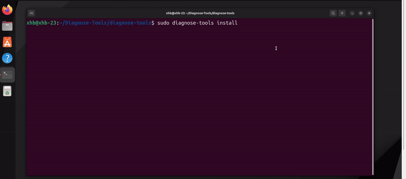

# syscall_image

## 功能描述

syscall_image是一款专门用于采集进程的系统调用序列。它可以帮助开发人员和系统管理员深入了解进程的系统调用行为，识别潜在的性能瓶颈和安全问题。该工具可以记录每个进程最近 产生的500 条系统调用序列，并输出详细的系统调用行为日志。

## 主体框架

本功能实现的框架如下：

## 主要功能

- **系统调用序列的采集**：捕获所有被监控进程的系统调用，包括系统调用号、参数和返回值；
- **系统调用序列记录**：记录最近的500条系统调用序列；

## 使用场景:

本工具可用于一下场景：

* 监控高负载环境下的关键进程，发现性能瓶颈，提升系统性能。
* **性能调优**：分析进程的系统调用行为，识别频繁调用的系统调用，优化代码逻辑，减少系统调用开销。
* **故障排查**：记录系统调用序列，帮助排查进程异常或崩溃的原因，分析系统调用失败的原因，定位系统级错误
* **安全审计**：分析进程的系统调用序列，识别异常或可疑行为，增强系统安全性

### 场景1：Web 服务器性能调优

**【场景描述】**：在大型电子商务平台的 Web 服务器中，长期占用 CPU 的野进程和安全隐患是常见的问题。野进程不仅会导致服务器资源被长时间占用，影响关键业务进程的正常运行，还可能带来安全风险，例如导致拒绝服务攻击或未经授权的系统操作。在高负载环境下，及时识别和处理这些问题至关重要

**【解决的问题】**

解决高峰期，Web服务器出现的以下问题：

- **响应时间延长**：系统调用频繁导致响应时间延长，影响用户体验；
- **野进程长期占用 CPU**：一些进程可能由于编程错误或恶意行为，导致 CPU 被长时间占用，影响其他进程的调度和执行。
- **安全隐患**：不明来源的系统调用频繁，可能是安全威胁的预警信号，例如恶意软件或潜在的攻击行为。
- **难以快速定位问题**: 在复杂的系统环境中，难以快速定位和识别问题进程及其行为。

**【案例】**：排查 Web 服务器中次要进程的安全隐患

某公司的 Web 服务器在高峰期经常出现性能下降的问题，导致用户访问速度变慢，影响用户体验和业务运营。

- **快速定位和分析野进程的行为**：实时捕获和分析系统调用行为，快速定位野进程的问题点，及时采取措施，释放系统资源。

- **增强系统安全性**：监控和分析异常系统调用行为，及时发现潜在的安全威胁，采取预防措施，提升系统安全性。
- **提升系统性能和稳定性**：优化关键进程的系统调用逻辑，减少不必要的系统调用，提升服务器的整体性能和稳定性。
- **提高问题排查效率**: 通过详细的系统调用日志和分析报告，快速定位问题进程，提升问题排查和解决效率。

`syscall_image` 工具在排查 Web 服务器中长期占用 CPU 的野进程和安全隐患方面，展示了其强大的系统调用监控和分析功能。通过实时捕获和记录系统调用序列，平台能够深入了解进程的系统交互行为，快速定位和解决性能问题，提升系统稳定性和安全性。在高负载环境下，这一工具帮助平台有效应对了长期占用 CPU 的野进程和潜在的安全威胁，确保了业务的顺利进行。

