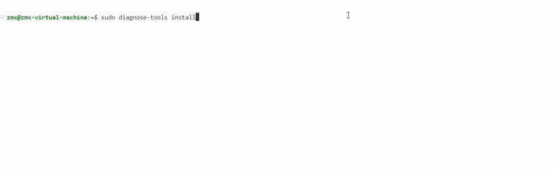
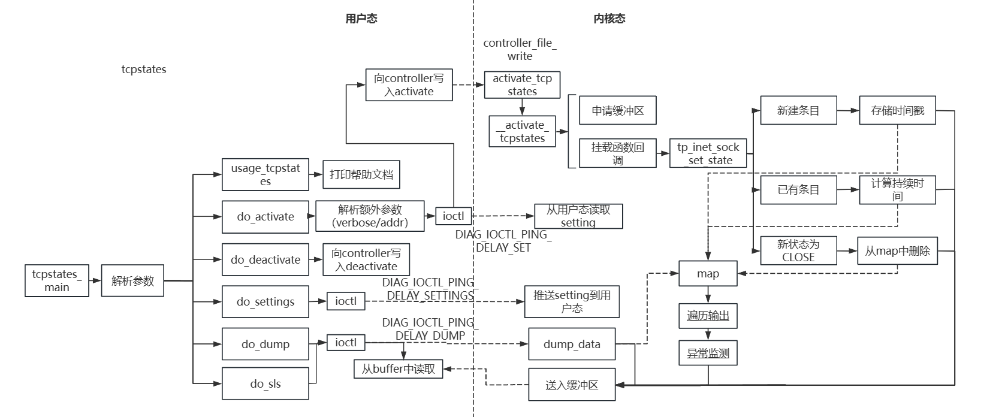
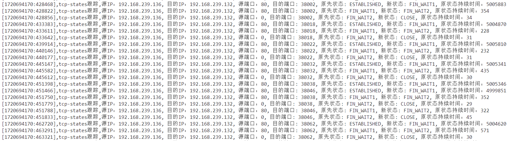
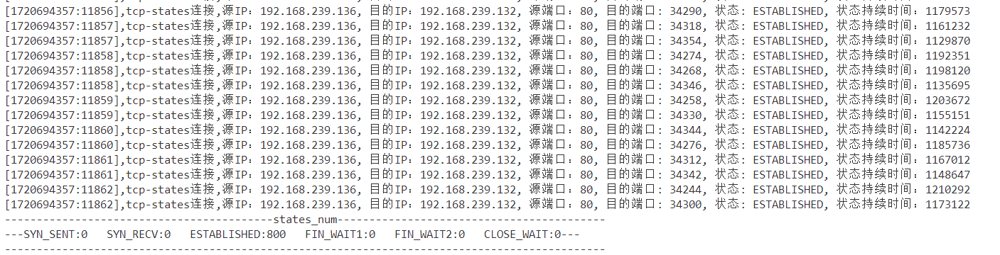

# TCP States

## 背景

​	在现代互联网环境中，网络性能和安全性面临着越来越多的挑战。除了常见的DDoS（分布式拒绝服务）和DoS（拒绝服务）攻击，网络管理员还需要应对各种网络故障、性能瓶颈和安全威胁，如未授权访问、数据泄露和恶意软件传播。为了保障网络的稳定运行和安全性，管理员需要一种高效、可靠的工具来实时监控和分析网络流量与连接状态。其中，Slow POST攻击是一种特殊的DoS攻击，它通过发送极慢的POST请求，占用服务器资源，使服务器无法响应其他正常请求，从而导致服务中断。为了保障网络的稳定运行和安全性，管理员需要一种高效、可靠的工具来实时监控和分析网络流量与连接状态。



## 解决问题

​	我们的工具通过提供详尽的TCP连接状态和实时统计数据，帮助网络管理员全面了解网络流量和连接状态，从而快速检测和响应异常活动。具体来说，工具可以记录和分析每个TCP连接的状态变化，包括源IP、目的IP、端口、状态变化、持续时间、发送和接收的字节数等。这些信息有助于快速检测异常流量，识别潜在的攻击源，之后可以采取相应的防御措施。此外，工具还可以帮助管理员进行网络故障排查，识别性能瓶颈，优化网络配置，确保网络的高效运行。通过这种实时监控和分析，管理员不仅可以提升网络的安全性，还能显著提高网络性能，保障业务的连续性和可靠性。

​	监控异常的网络行为，检测潜在的网络攻击和入侵行为。使用 tcpstates 功能监控系统中所有 TCP 连接的状态变化，识别异常的连接模式，例如大量的 SYN 请求（可能是 SYN Flood 攻击），及时发现并采取安全措施。

​	监控服务器的网络连接状态，确保服务正常运行。持续监控服务器的 TCP 连接状态变化，发现并警告可能影响服务可用性的异常连接状态，例如过多的 TIME_WAIT 状态连接，导致资源耗尽

## 框架图

本工具在diagnose-tools框架的基础上，在其中新建了tcpstates工具，其中主要为内核态代码、用户态代码、公用头文件等，其具体的框架架构如图



## 原理分析

​	该工具通过在内核中挂载kprobe，监控TCP连接状态转换时的关键函数调用，捕获包括四元组（源IP、源端口、目标IP、目标端口）、源状态、新状态、源状态的持续时间、tcp连接中各信息，如相应窗口大小，收发字节数，backlog及重传等信息。工具还会扫描系统中所有现存的TCP连接，记录每个连接的当前状态和该状态的持续时间。同时，工具会对各个状态的转换进行统计。

​	为了计算tcp连接各状态的持续时间，利用红黑树来存储相关的时间戳信息，并进行数据统计分析。通过这些统计数据，可以监测tcp连接状态转化层面上的相应信息，通过分析报文流量，可以检测相同IP地址在瞬时产生的大量报文，并根据预定的参数进行条目过多的异常检测。

总之，通过上述方法和技术手段，可以实现对TCP层面网络报文状态转化方面的高效监测和分析，确保系统在处理网络流量时的性能和稳定性。具体实现细节包括：

1. 选择合适的tracepoint挂载点，捕获并解析相应报文，获取相关源数据。
2. 利用红黑树记录并计算相应状态持续时延
3. 利用红黑树维护当前活跃连接的信息
4. 依据预定参数，检测瞬时大量报文，防止异常流量对系统造成影响。

通过此功能可以提高了内核态网络监测的准确性和实时性，也为网络性能优化和安全性提供了有力支持。

**在时延的获取上**

​	工具通过在内核中挂载`inet_sock_set_state`等关键函数，捕获TCP连接状态转换时的时间戳信息。这些时间戳被存储在内核的map中，当函数再次被触发时，通过计算当前时间戳与之前记录的时间戳之间的差值，精确测量TCP连接在原状态下的持续时延。工具实现了对TCP连接状态的全面监控和分析，提升了网络管理的精度和效率。

**在现有连接的统计上**

​	工具在第一次进入挂载函数时，通过将连接信息插入红黑树来记录当前活跃的连接。当连接的新状态为CLOSE时，从红黑树中删除相应的连接记录，从而维护一个动态更新的现有连接结构。在生成报告时，工具通过遍历红黑树，将所有现有连接的信息打印出来，展示每个连接当前所处的状态及该状态已持续的时间。此外，工具对不同状态的连接数进行统计并输出，提供有关连接分布和状态的全面数据。这种方法确保了对现有TCP连接的精准追踪和实时分析，极大地提高了网络管理和故障排查的效率。

**在处理条目过多的异常检测上**

​	工具通过在红黑树中维护当前活跃连接的信息，可以监测同一连接上的连接数量。在每次插入或删除连接记录时，工具会统计同一IP组上的连接数量。如果某一IP组的连接数量超过预设的阈值，工具会触发异常监测报警，标记该连接为可能存在异常情况，如同一连接条目过多。这种监测机制能够及时发现和预警网络中潜在的异常行为，帮助网络管理员快速定位和解决问题，确保网络运行的稳定和安全。

## 场景：DOS模拟

**Slowhttptest**工具，其用于执行慢速拒绝服务（DoS）攻击，通过四种方法消耗目标服务器的并发连接池，

大量消耗目标并发连接池，应用层的连接池一旦建立起来就不占用这个资源，若果许多连接都占在这里，不完全建立，就会占用着资源。缓慢发送不完整的http请求，服务器等待并保持连接

SlowPOST：content-length声明长度，但body部分缓慢发送

```c
slowhttptest -c 1000 -B -g -o my_body_stats -i 110 -r 200 -s 8192 -t FAKEVERB -u http://192.168.0.2 -x 10 -p 3
```

在DOS模拟中，verbose=0，并发数为800



当使用verbose=1时，并发数为800



