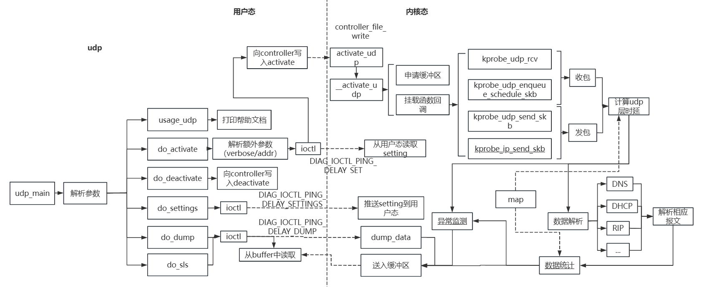

# udp

## 背景 

在现代网络环境中，网络报文的监测和分析是确保网络安全与性能的关键环节。现有的网络往往面临着处理延时过高、由于工具导致的瞬时流量激增及特定IP地址报文频繁等问题。这些问题可能导致网络拥塞、性能下降甚至是潜在的安全威胁。

## 解决问题

通过diagnose-tools的udp模块工具我们可以实现以下功能

1、可以获取UDP和IP的基本信息，解析具体上层协议如DNS

2、并监测内核在UDP层面的处理延时

3、根据延时和具体报文进行动态阈值监测

​	通过使用kprobe挂载相应函数，我们能够有效解决多种网络问题。首先，我们可以获取UDP和IP的基本信息，如IP地址和端口，从而监控网络流量的基本情况。其次，工具能够解析上层协议，识别具体的应用层协议，例如解析DNS协议中的域名和IP地址，帮助诊断和解决DNS相关问题。此外，我们可以监测内核在UDP层面的处理延时，识别和解决网络性能瓶颈。最重要的是，工具通过动态阈值监测，可以及时检测内核处理延时过高和相同IP组瞬时报文过多等异常情况，从而预防网络拥塞和潜在的安全威胁，提高网络的稳定性和安全性。

## 框架图

本工具在diagnose-tools框架的基础上，在其中新建了udp工具，其中主要为内核态代码、用户态代码、公用头文件等，其具体的框架架构如图

## 原理分析

在内核态中实现该功能的关键步骤包括选择适当的挂载函数，对原始网络报文进行解析，并根据不同的上层协议（如DNS）进行进一步解析。具体来说，通过kprobe挂载内核函数，可以捕获UDP和IP层的基本信息，如IP地址和端口号，并解析上层协议的具体字段。例如，在DNS协议中，解析域名和IP地址等字段。

为了计算内核层面上UDP处理的时延，利用红黑树来存储相关的时间戳信息，并进行数据统计分析。通过这些统计数据，可以监测内核在处理UDP报文时的延时情况，并通过预设的算法动态调整阈值，以便对处理时延的异常进行有效监测。此外，通过分析报文流量，可以检测相同IP地址在瞬时产生的大量报文，并根据预定的参数进行条目过多的异常检测。

总之，通过上述方法和技术手段，可以实现对UDP层面网络报文的高效监测和分析，确保系统在处理网络流量时的性能和稳定性。具体实现细节包括：

1. 选择合适的kprobe挂载点，捕获并解析UDP报文，获取相关源数据。
2. 根据端口号识别上层协议，并解析特定协议的字段。
3. 利用红黑树记录并计算处理时延，进行实时数据统计。
4. 通过动态调整的算法阈值，监测处理时延异常。
5. 依据预定参数，检测瞬时大量报文，防止异常流量对系统造成影响。

通过此功能可以提高了内核态网络监测的准确性和实时性，也为网络性能优化和安全性提供了有力支持。

**在DNS流量的解析上**

​	在解析DNS流量时，由于DNS域名的格式并非普通的字符串形式，因此必须按字节逐步读取和解析报文。具体来说，DNS域名在报文中以长度字节和标签的形式存储，而非以点分隔的字符串形式。每个标签的前一个字节表示该标签的长度，随后的字节则是标签的实际内容。解析过程中，需要首先读取表示长度的字节，然后根据该长度值读取相应数量的字节，并重复此过程直到遇到结束字节（通常为0）。

​	由于DNS报文的各字段偏移量并不固定，无法通过预先定义的结构来直接获取当前或之后的字段。因此，采用按字节读取和解析的方法，确保能够准确提取和处理DNS报文中的域名信息。这种逐字节解析方式，不仅能正确还原DNS域名，还能处理报文中其他变长字段，提供对DNS流量的精确分析和监控。此外，这种方法也增强了系统对不同类型DNS报文的适应性，提高了DNS解析的灵活性和准确性。

**在时延的获取上**

​	工具通过挂载`udp_rcv`、`udp_enqueue_schedule_skb`、`udp_send_skb`和`ip_send_skb`等函数，捕获报文在这些函数中的时间戳，并利用map记录这些时间戳信息。通过计算报文进入不同函数的时间差值，可以获得内核层面上UDP的处理时延。利用这些时间差值，工具能够精确监测内核中UDP报文处理的各个阶段时延，帮助识别和优化潜在的性能瓶颈。

**在处理时延的异常监测上**

​	工具通过使用指数加权移动平均（EWMA）算法来动态设定其阈值，从而实现对UDP处理时延的有效监测和异常检测。EWMA算法在处理时延监测中的优势包括其对历史数据的平滑处理能力和对最新数据的敏感性，使其在波动较大的网络环境中表现尤为出色。

​	具体来说，EWMA算法通过赋予最新数据更高的权重，可以快速响应网络时延的变化，而不会受到较早数据的干扰。这种平滑机制能够有效减小由于短期波动导致的误报警，同时保持对异常状况的敏感性，确保系统能够及时捕捉到实际的性能问题。利用EWMA算法计算的动态阈值，工具可以更准确地反映当前的网络状态，从而在检测内核处理时延过高和异常流量时提供更可靠的判断依据。同时，我们也可以按需通过setting来动态设定其阈值倍率。

**在处理条目过多的异常检测上**

​	工具通过记录同一IP组在一定时间门限内的UDP条目数量来实现。具体而言，通过kprobe挂载内核函数，捕获每个UDP报文的源IP地址、目的IP地址和时间戳等信息，并将报文归类到相应的IP组。在设定的时间窗口内，利用map实时统计每个IP组的报文数量，并根据预设定阈值。当某IP组在时间窗口内的报文数量超过设定阈值时，触发异常报警机制，记录并上报异常事件。这种方法能够有效检测潜在的网络攻击或异常流量，确保系统及时响应并处理异常情况，提高网络的稳定性和安全性。
