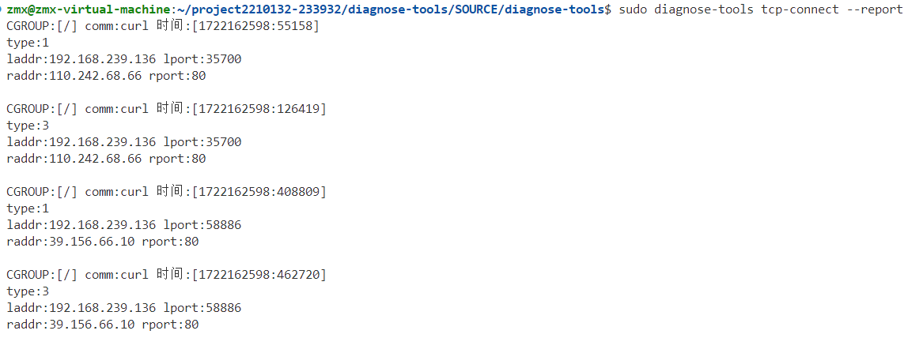
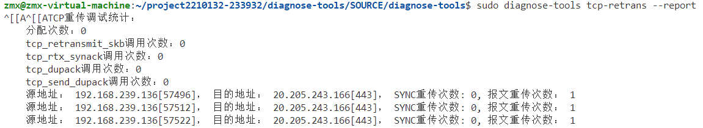
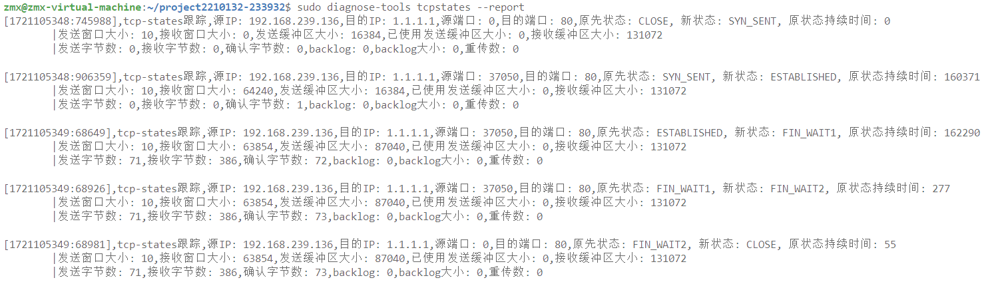

# 高负载场景下的TCP连接监测方案

​	通过组合使用`tcp-connect`、`tcp-retrans`和`tcp-states`三个工具，可以在高负载场景下有效监测和管理TCP连接。`tcp-connect`工具用于实时监测服务器上的TCP连接状态，捕捉每个新连接的相关信息，如源IP、目的IP、源端口、目的端口以及连接类型。`tcp-retrans`工具专注于监测TCP连接中的重传和丢包情况，提供详细的重传信息，帮助识别和解决网络异常行为。`tcp-states`工具则用于详细分析TCP连接的状态，获取连接状态的持续时间、窗口大小、重传次数等信息，帮助进一步定位和解决潜在问题。这种组合使用方法可以全面捕捉和分析TCP连接中的各种异常情况，在高负载环境下确保服务器的稳定性和性能。

## 场景描述

​	在高负载场景下，服务器可能会面临TCP连接过多、网络拥堵或潜在的攻击等问题。大量的TCP连接可能会导致服务器资源耗尽，影响正常业务的运行。网络拥堵可能引发数据包的丢失和重传，从而进一步增加网络负载。而潜在的攻击，如DDoS攻击，则会进一步加剧这些问题。因此，为了确保服务器的稳定性和性能，需要对TCP连接进行全面监测。

​	通过监测，可以捕捉到TCP连接中的异常情况，例如重传和丢包。当重传次数超过一定阈值时，表示网络可能存在问题，如带宽不足、网络延迟过高或服务器处理能力不足。这时，进一步查看TCP连接的详细信息是必要的，以确定问题的具体原因。详细信息包括连接的四元组（源IP、目的IP、源端口、目的端口）、连接状态的变化、重传次数、窗口大小等数据。通过这些信息，可以更准确地定位和解决问题，确保服务器在高负载下依然能够稳定、高效地运行。

## 具体步骤

​	在使用`tcp-connect`工具进行监测时，由于该工具的挂载函数与处理逻辑较为简单，其性能表现出色，不会占用大量的系统资源。因此，可以利用`tcp-connect`工具对服务器进行持续监测。`tcp-connect`工具能够对所有TCP报文进行全面监控，当检测到报文数量或特定条件超出预设规则时，可以触发进一步的处理步骤。

​	这种高效的监测方式不仅可以在高负载场景下保持工具的高性能，还能确保其对机器正常业务的影响降到最低。`tcp-connect`工具的设计初衷就是为了在保证高性能的同时，提供对TCP连接状态的实时监测。因此，在高负载情况下，依然可以依靠`tcp-connect`进行持续监控，确保服务器的稳定性和性能。

1. **启动TCP连接监测**：

   ​	使用`tcp-connect`工具实时监测服务器上的TCP连接状态。记录每个新连接的相关信息，如源IP、目的IP、源端口、目的端口以及其type类型，其可用来检测tcp状态的监测。

   

   **监测基础条目时可能出现的问题及进一步探测的原因**

   ​	在高负载场景下，初步的监测可能会发现以下问题，这些问题可能会触发进一步的探测：

   **同一IP地址的访问频率过高**：

   ​	当同一IP地址的访问频率超过设定的阈值时，可能表示该IP地址在进行攻击或异常流量。这种情况常见于DDoS攻击，当大量请求从单一IP地址涌入服务器时，服务器可能无法处理，从而导致服务中断或性能下降。为了防范这种情况，可以设置访问频率阈值，当达到或超过该阈值时，触发警报或进一步的防御措施，如暂时阻止该IP地址的访问。

   **TCP重传次数过多**：

   ​	当TCP重传次数超过设定的阈值时，可能表示网络状况不佳或服务器处理能力不足。TCP重传是为了确保数据可靠传输的机制，但过多的重传会增加网络负载，影响整体性能。重传次数的增加可能是由于网络拥堵、带宽不足或其他网络问题引起的。通过监测重传次数，可以及时发现并解决网络问题，确保数据传输的稳定性。

   **TCP连接状态异常**：

   ​	当某些TCP连接长时间处于异常状态（如SYN_SENT、CLOSE_WAIT等）时，可能表示存在连接问题或资源泄露。例如，SYN_SENT状态表示连接请求已发送但未收到确认，可能是因为目标主机无法响应；CLOSE_WAIT状态表示连接已关闭但未释放资源，可能导致资源泄露。通过监测这些异常状态，可以及时发现并修复连接问题，避免资源浪费。

   **连接超时或失败**：

   ​	当大量连接出现超时或连接失败时，可能表示网络拥堵或服务器负载过高。连接超时通常是由于网络延迟过高或服务器无法及时响应请求引起的。大量的连接失败可能是因为服务器资源耗尽，无法处理更多的请求。通过监测连接超时和失败情况，可以及时采取措施，优化网络和服务器性能，确保服务的可用性。

   **连接数过多**：

   ​	当服务器的TCP连接数超过预设的警戒值时，可能表示服务器正在承受过高的负载。过多的连接会消耗服务器资源，影响正常业务的运行。监测连接数可以帮助管理员及时发现并应对过高负载情况，例如通过负载均衡、增加服务器资源或优化应用程序等方法来缓解压力，确保服务器的稳定性和性能

   2、**监测TCP重传和丢包**：

   ​	使用`tcp-retrans`工具监测TCP连接中的重传和丢包情况

   

   ​	首先，其可以获取整体的TCP重传活动概况，帮助识别是否存在异常的重传行为。这些关键指标包括分配次数、`tcp_retransmit_skb`调用次数、`tcp_rtx_synack`调用次数、以及重复ACK相关的调用次数。

   ​	分配次数显示用于TCP重传数据结构分配的次数。如果这个值过高，可能表示系统资源紧张，需要优化或扩容。`tcp_retransmit_skb`调用次数显示调用该函数的次数，用于重新发送未确认的数据包。调用次数增加可能表示网络不稳定或拥堵。

   ​	`tcp_rtx_synack`调用次数显示重传SYN-ACK数据包的次数，通常在TCP连接建立过程中使用。调用次数增加可能表示连接建立过程中存在问题，如网络延迟。重复ACK相关的调用次数则显示检测到重复ACK和发送重复ACK的次数。重复ACK通常表示数据包未按预期顺序收到，需要重传。

   ​	当有具体重传条目或数据包丢失或确认超时时，系统会提供每个TCP连接的详细重传信息。这些信息包括连接的四元组基本信息、SYNC重传次数、报文重传次数等。通过这些数据，可以跟踪每个具体TCP连接的重传情况，分析出现问题的连接，并采取针对性措施，确保网络传输的稳定性和高效性。

   3、**tcp行为异常的详细分析**：

   ​	当TCP行为异常，符合预先定义的规则后，可以使用`tcp-states`工具查看具体的TCP连接条目。这可以帮助我们深入了解问题所在，并采取相应措施进行修复。

   ​	使用`tcp-states`工具，可以获取每个TCP连接的详细信息，包括连接状态的持续时间、窗口大小、重传次数等。这些详细信息对于进一步分析问题的根源非常重要。例如，连接状态的持续时间可以帮助我们判断连接是否异常长时间处于某一状态，窗口大小则可以反映网络带宽的使用情况，重传次数可以指示网络稳定性。

   ​	`tcp-states`工具的基础功能还可以细粒度地监测TCP报文。它能够监控TCP连接状态转换时的关键函数调用，捕获包括四元组（源IP、源端口、目标IP、目标端口）、源状态、新状态、源状态的持续时间等信息。此外，它还可以记录TCP连接中的各项信息，如窗口大小、收发字节数、backlog及重传等。

   ​	通过这些详细的监测数据，我们可以更准确地定位问题所在。例如，如果某个连接长时间处于CLOSE_WAIT状态，可能表示存在资源泄露；如果重传次数异常高，则可能需要检查网络状况或服务器处理能力。借助`tcp-states`工具的详细数据分析能力，可以帮助我们有效解决高负载场景下的TCP连接问题，确保服务器的稳定性和性能。

   

​	此外，`tcp-states`工具还提供统计功能，扫描系统中所有现存的TCP连接，记录每个连接的当前状态和该状态的持续时间。工具会对各个状态的转换进行统计，帮助全面了解TCP连接的动态变化。这些统计数据可以揭示系统在不同负载条件下的性能表现，帮助优化网络和服务器配置，确保高效稳定的运行。

​	如当系统在遭受Slowhttptest类似的DOS攻击时

​	其同一IP所占有的连接条目过多，且状态持续时间偏长，这通常表示异常行为，例如潜在的DDoS攻击或资源滥用。`tcp-states`工具可以实时监测到此类问题的发生，并触发相应的防护措施。

**总结**

通过结合`tcp-connect`、`tcp-retrans`和`tcp-states`三种工具，我们实现了一套高效、灵活的TCP连接监测和诊断方案。这种组合使用的方法不仅保证了系统的性能，还实现了全面的监测和预警机制。具体来说：

1. **保证了性能**：每个工具的设计都注重高性能和低资源占用。例如，`tcp-connect`工具可以高效地监测所有TCP报文，而不会对系统性能产生显著影响。
2. **实现了监测**：这三种工具各自侧重不同的监测维度。`tcp-connect`负责实时监测TCP连接的基本信息，`tcp-retrans`专注于监测重传和丢包情况，而`tcp-states`则提供详细的TCP连接状态和统计信息。通过这些工具的结合，我们可以全面监测TCP连接的各个方面，确保数据传输的可靠性和稳定性。
3. **实现了预警**：当检测到异常行为（如同一IP地址的访问频率过高、TCP重传次数过多、连接状态异常等）时，这些工具可以及时触发预警机制，帮助管理员快速响应和处理问题，防止潜在的攻击和资源滥用。
4. **工具可以自主选择组合使用**：这些工具可以根据实际需求灵活组合和集成。用户可以根据具体的应用场景，选择最合适的工具组合，形成定制化的诊断解决方案。这种模块化设计允许不同的模块之间进行无缝集成，适应各种复杂的应用场景。

通过这种模块化和灵活的设计，我们不仅可以满足高负载环境下对TCP连接监测和诊断的需求，还可以根据不同的网络环境和业务需求，灵活调整和优化监测方案，确保网络服务的高效、稳定运行。