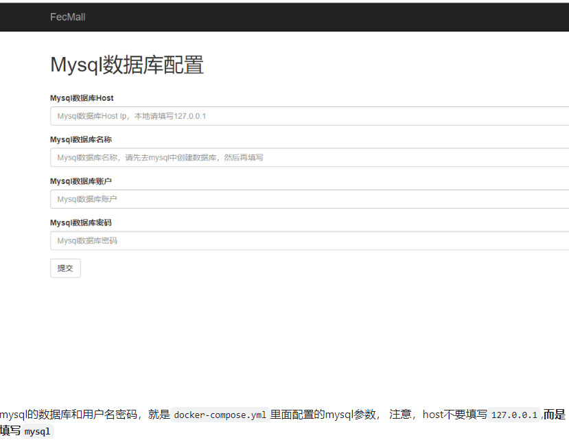
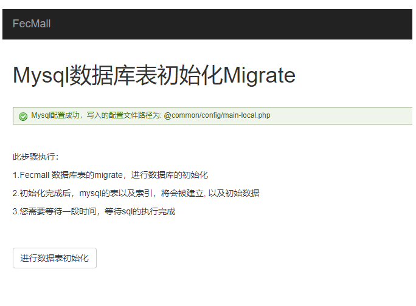
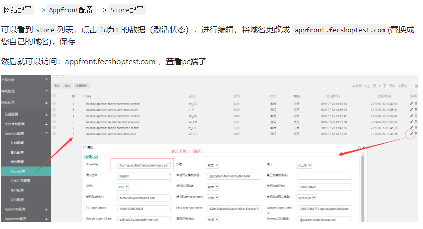
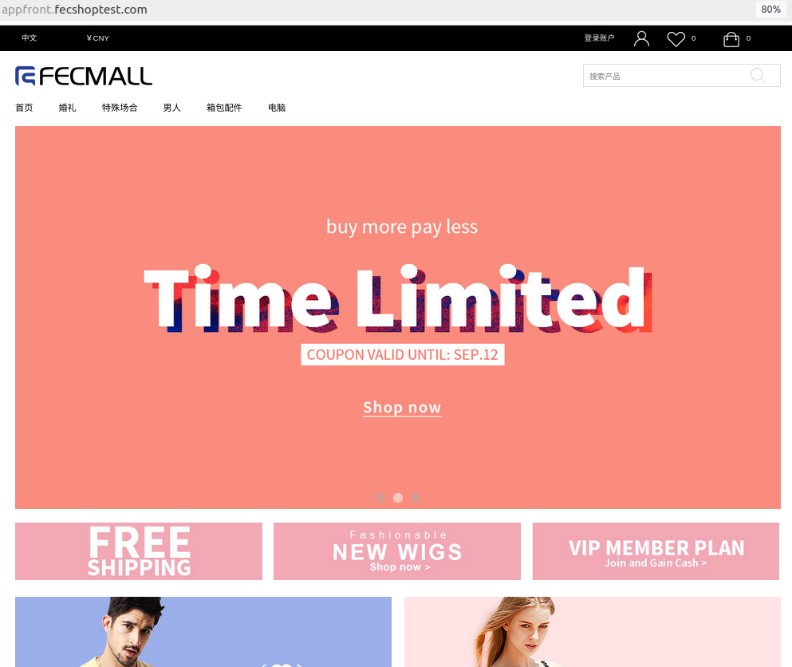
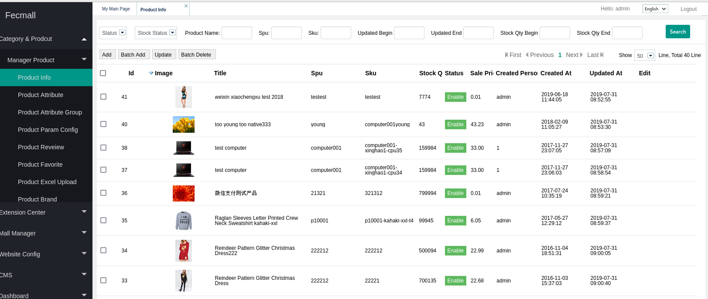

# 部署开源电商项目Fecshop

## **1.简介：**

​	Fecshop 全称为Fancy ECommerce Shop，是基于php Yii2框架之上开发的一款优秀的开源电商系统， Fecshop支持多语言，多货币，架构上支持pc，手机web，手机app，和erp对接等入口，您可以免费快速的定制和部署属于您的电商系统。

​	本次部署采用容器的方式进行部署，这里使用了docker和docker compose容器运行时和容器构建管理工具来高效且快速的搭建该电商项目。

## **2.部署流程：**

**1.安装docker和docker compose**

```shell
sudo yum install docker-ce -y
sudo curl -L "https://github.com/docker/compose/releases/download/v2.24.5/docker-compose-$(uname -s)-$(uname -m)" -o /usr/local/bin/docker-compose
```

**2.下载fecshop的库文件**

```shell
mkdir -p /www/web
cd /www/web
git clone https://github.com/fecshop/yii2_fecshop_docker.git
```

**3.配置mysql和redis**

```shell
//进入上面下载完成后的文件夹 yii2_fecshop_docker，打开 docker-compose.yml
//更改mysql的密码：
- MYSQL_ROOT_PASSWORD=fecshopxfd3ffaads123456
//更改redis的密码：
打开文件：`./db/redis/etc/redis-password`,更改里面的redis密码即可。
```

**4.构建镜像**

```shell
//启动docker
service docker start
//构建
chmod 755 /usr/local/bin/docker-compose
docker-compose build
```

**5.启动容器**

```shell
//进入yii2_fecshop_docker目录，执行
docker-compose up -d
```

**6.完成init初始化**

```shell
//进入到php容器
docker-compose exec php  bash

//进入fecshop根目录，执行init
cd /www/web/fecshop
./init

//完成init初始化后，退出php容器
exit
```

**7.配置fecshop**

7.1 准备域名

> Fecmall是一个多入口的电商系统，各个入口独立访问，对应独立的子域名如下：

Pc端：`appfront.fecshoptest.com`

后台：`appadmin.fecshoptest.com`

图片：`img.fecshoptest.com`

H5端: `apphtml5.fecshoptest.com`(如果不安装h5，vue等入口，可以不准备)

移动Api端：`appserver.fecshoptest.com` (如果不安装微信小程序，vue等入口，可以不准备)

第三方数据对接Api端：`appapi.fecshoptest.com` (如果不和第三方系统进行数据对接，可以不准备)

将上面的域名（替换成您自己的域名）解析到您的服务器， 如果您是在本地，可以在host文件中做虚拟域名指向127.0.0.1即可

nginx的配置文件为`./services/web/nginx/conf/conf.d/default.conf`

如果您使用自定义域名，将其配置域名替换即可


7.2 Fecshop界面安装

​	 打开安装地址： [fecshoptest](http://appfront.fecshoptest.com/install.php)



提交后，如图：




7.3Fecmall访问后台，进行后台配置

​	后台域名为：`appadmin.fecshoptest.com`，初始账户为：admin，密码为admin123。



**8.安装成功**

商品展示：



管理端：



​	至此，整个电商项目就搭建成功了。本团队将通过对这个电商项目发送大量并发请求，来模拟高负载环境。