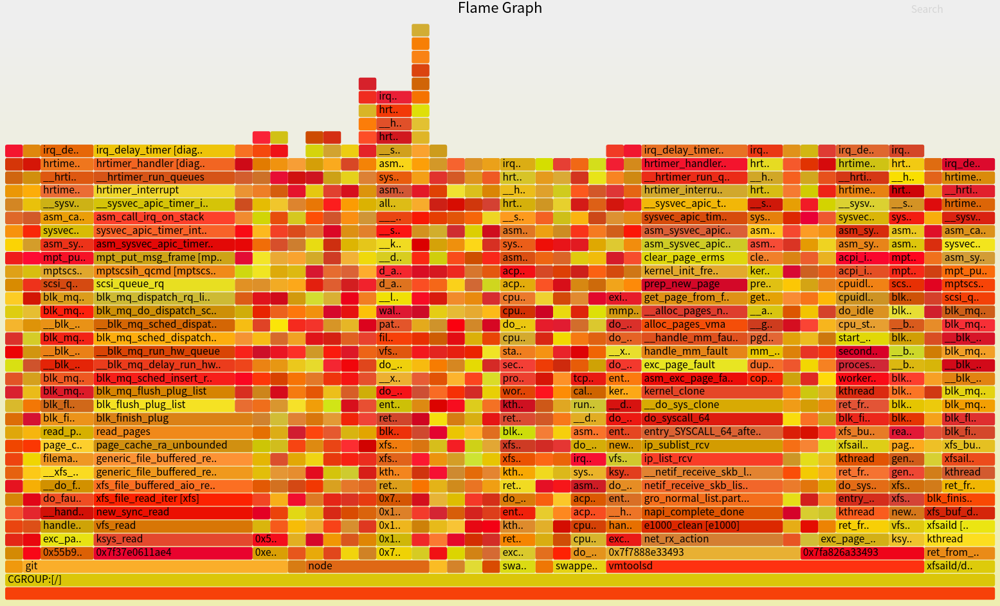

#  龙蜥操作系统异常检测案例分析

diagnose-tools目前已经成功部署在国产操作系统——龙蜥操作系统上，并可正常解决龙蜥操作系统上各个子系统的不同异常故障并做分析。本篇文章将通过一个案例分析，详细介绍diagnose-tools工具是如何诊断龙蜥操作系统重的异常故障的。

## 1.问题背景

正常的业务工作中，在高负载下（如大规模数据处理和云计算环境中），系统经常面临高频繁且多样的中断请求，包括网络中断请求、I/O中断请求、定时器中断请求、软中断请求等等，这些中断请求的频繁出现可能会影响系统的整体性能，尤其是在处理中断请求时占用大量CPU资源的情况下，可能会导致其他任务的调度延迟，进而影响系统的实时性和稳定性。

在双十一高峰期，电商平台的Web服务器承受着极高的访问量和处理需求，服务器会接收到大量的网络数据包（如HTTP请求），每次接收到网络数据包时，网络接口卡（NIC）都会触发中断请求，通知CPU进行数据处理；与此同时数据库查询、文件读取和写入操作也会显著增加，这些操作需要从存储设备（如HDD或SSD）读取或写入数据，而每次存储设备完成操作时，都会触发中断通知CPU处理I/O操作。这些高频率的中断请求就会造成业务抖动、卡顿甚至系统崩溃。

## 2.具体步骤

通过使用部署在龙蜥操作系统上的diagnose-tools工具，对系统环境进行故障诊断，我们使用到了irq-delay功能，他可以顺利找到关中断时延过长的异常进程，并通过调用栈来详细的定位问题的病因。

### 2.1 部署工具与使用

首先我们部署diagnose-tools工具中的irq-deay功能：

```shell
diagnose-tools install
diagnose-tools irq-delay --activate="threshold=30"
```

紧接着我们通过report功能输出检测到的故障信息

```shell
diagnose-tools irq-delay --report  > irq-delay.log
```

我们可以生成火焰图，便于查看异常

```shell
diagnose-tools flame --input=irq-delay.log --output=irq-delay.svg
```



### 2.2 故障诊断与分析

在故常信息中，我们可以找到7条异常信息，在这7条信息信息中有四条信息值得关注，我们将主要分析这四条故障信息：

#### 2.2.1 中断延迟分析（PID: 25319, 进程: insmod, CPU: 1, 延迟: 988 ms）

```
中断延迟，PID： 25319[insmod]， CPU：1, 988 ms, 时间：[1723475353:662573]
    时间：[1723475353:662573].
    进程信息： [/ / insmod]， PID： 25319 / 25319
##CGROUP:[/]  25319      [002]  采样命中
    内核态堆栈：
#@        0xffffffffc0c01a4c diag_task_kern_stack       [diagnose]  ([kernel.kallsyms])
#@        0xffffffffc0c0e119 irq_delay_timer    [diagnose]  ([kernel.kallsyms])
#@        0xffffffffc0c098bc hrtimer_handler    [diagnose]  ([kernel.kallsyms])
#@        0xffffffff885808d9 __hrtimer_run_queues  ([kernel.kallsyms])
#@        0xffffffff88581821 hrtimer_interrupt  ([kernel.kallsyms])
#@        0xffffffff8847f4b4 __sysvec_apic_timer_interrupt  ([kernel.kallsyms])
#@        0xffffffff8920b08b sysvec_apic_timer_interrupt  ([kernel.kallsyms])
#@        0xffffffff89400e8b asm_sysvec_apic_timer_interrupt  ([kernel.kallsyms])
#@        0xffffffffc0891044 nf_ct_frag6_expire.cold    [nf_defrag_ipv6]  ([kernel.kallsyms])
#@        0xffffffff884013d9 do_one_initcall  ([kernel.kallsyms])
#@        0xffffffff88574fa2 do_init_module  ([kernel.kallsyms])
#@        0xffffffff885766d2 load_module  ([kernel.kallsyms])
#@        0xffffffff88576b98 __do_sys_finit_module  ([kernel.kallsyms])
#@        0xffffffff88576c28 __x64_sys_finit_module  ([kernel.kallsyms])
#@        0xffffffff8920716c do_syscall_64  ([kernel.kallsyms])
#@        0xffffffff8940009b entry_SYSCALL_64_after_hwframe  ([kernel.kallsyms])
#@        0xffffffff8847d7e2 start_secondary  ([kernel.kallsyms])
#@        0xffffffff8840015a secondary_startup_64_no_verify  ([kernel.kallsyms])
    用户态堆栈：
#~        0x7f87e9b25cfd 0x7f87e9b25cfd ([symbol])
#*        0xffffffffffffff insmod (UNKNOWN)

```

我们可以在这条诊断信息中看到 进程insmod 关中断将近1s，调用栈显示了模块加载相关的操作(`load_module`)，以及一个可能与IPv6碎片处理有关的函数(`nf_ct_frag6_expire`)，这可能是由于内存分配或网络栈的瓶颈。

**分析**：`nf_ct_frag6_expire.cold` 函数表明网络数据包的处理可能受到影响，出现处理IPv6碎片超时，如果长时间禁用中断，网络相关的任务可能无法及时处理，导致数据包丢失或延迟。

**优化建议**：`nf_ct_frag6_expire` 函数与IPv6碎片处理相关，可能由于网络流量或内存管理问题引发瓶颈。可以考虑优化内存管理或者调整网络栈配置，确保在高负载下IPv6碎片处理不成为瓶颈。

#### 2.2.2 中断延迟分析（PID: 24898, 进程: cpptools, CPU: 3, 延迟: 36 ms）

```
中断延迟，PID： 24898[cpptools]， CPU：3, 36 ms, 时间：[1723475243:630794]
    时间：[1723475243:630794].
    进程信息： [/ / cpptools]， PID： 20542 / 24898
##CGROUP:[/]  24898      [004]  采样命中
    内核态堆栈：
#@        0xffffffffc0c01a4c diag_task_kern_stack       [diagnose]  ([kernel.kallsyms])
#@        0xffffffffc0c0e119 irq_delay_timer    [diagnose]  ([kernel.kallsyms])
#@        0xffffffffc0c098bc hrtimer_handler    [diagnose]  ([kernel.kallsyms])
#@        0xffffffff885808d9 __hrtimer_run_queues  ([kernel.kallsyms])
#@        0xffffffff88581821 hrtimer_interrupt  ([kernel.kallsyms])
#@        0xffffffff8847f4b4 __sysvec_apic_timer_interrupt  ([kernel.kallsyms])
#@        0xffffffff8920b08b sysvec_apic_timer_interrupt  ([kernel.kallsyms])
#@        0xffffffff89400e8b asm_sysvec_apic_timer_interrupt  ([kernel.kallsyms])
#@        0xffffffffc02efa63 mpt_put_msg_frame  [mptbase]  ([kernel.kallsyms])
#@        0xffffffffc0317ca0 mptscsih_qcmd      [mptscsih]  ([kernel.kallsyms])
#@        0xffffffffc035128c mptspi_qcmd        [mptspi]  ([kernel.kallsyms])
#@        0xffffffff88d3a3e3 scsi_dispatch_cmd  ([kernel.kallsyms])
#@        0xffffffff88d3b28e scsi_queue_rq  ([kernel.kallsyms])
#@        0xffffffff88a3aa11 blk_mq_dispatch_rq_list  ([kernel.kallsyms])
#@        0xffffffff88a40d3a __blk_mq_do_dispatch_sched  ([kernel.kallsyms])
#@        0xffffffff88a40fd0 blk_mq_do_dispatch_sched  ([kernel.kallsyms])
#@        0xffffffff88a41483 __blk_mq_sched_dispatch_requests  ([kernel.kallsyms])
#@        0xffffffff88a41535 blk_mq_sched_dispatch_requests  ([kernel.kallsyms])
#@        0xffffffff88a36e0b __blk_mq_run_hw_queue  ([kernel.kallsyms])
#@        0xffffffff88a374eb __blk_mq_delay_run_hw_queue  ([kernel.kallsyms])
#@        0xffffffff88a3775d blk_mq_run_hw_queue  ([kernel.kallsyms])
#@        0xffffffff88a41892 blk_mq_sched_insert_requests  ([kernel.kallsyms])
#@        0xffffffff88a3b29d blk_mq_flush_plug_list  ([kernel.kallsyms])
#@        0xffffffff88a2cc69 __blk_flush_plug  ([kernel.kallsyms])
#@        0xffffffff88a2ceed blk_finish_plug  ([kernel.kallsyms])
#@        0xffffffff886d524b read_pages  ([kernel.kallsyms])
#@        0xffffffff886d548d page_cache_ra_unbounded  ([kernel.kallsyms])
#@        0xffffffff886d5a66 page_cache_ra_order  ([kernel.kallsyms])
#@        0xffffffff886d5ca6 ondemand_readahead  ([kernel.kallsyms])
#@        0xffffffff886d5f23 page_cache_sync_ra  ([kernel.kallsyms])
    用户态堆栈：
#~        0x7fa9252a7b25 0x7fa9252a7b25 ([symbol])
#~        0x7fa9252ab0b6 0x7fa9252ab0b6 ([symbol])
#~        0x15ca6df 0x15ca6df ([symbol])
#*        0xffffffffffffff cpptools (UNKNOWN)
##
```

我们可以在这条故障信息中看到，该进程出现了36ms的中断延迟，在观察调用栈信息时发现磁盘IO和内存管理相关的操作(`read_pages`, `page_cache_sync_ra`)，这可能意味着在读取数据时出现了IO瓶颈，导致APIC定时器中断处理被延迟。

**分析：**可能的原因包括磁盘IO瓶颈或内存管理中的缺页中断处理时间过长;

#### 2.2.3 中断延迟分析（PID: 13484, 进程: node, CPU: 14, 延迟: 29 ms）

```
中断延迟，PID： 13484[node]， CPU：14, 29 ms, 时间：[1723473811:793837]
    时间：[1723473811:793837].
    进程信息： [/ / node]， PID： 13484 / 13484
##CGROUP:[/]  13484      [005]  采样命中
    内核态堆栈：
#@        0xffffffffc0c01a4c diag_task_kern_stack       [diagnose]  ([kernel.kallsyms])
#@        0xffffffffc0c0e119 irq_delay_timer    [diagnose]  ([kernel.kallsyms])
#@        0xffffffffc0c098bc hrtimer_handler    [diagnose]  ([kernel.kallsyms])
#@        0xffffffff885808d9 __hrtimer_run_queues  ([kernel.kallsyms])
#@        0xffffffff88581821 hrtimer_interrupt  ([kernel.kallsyms])
#@        0xffffffff8847f4b4 __sysvec_apic_timer_interrupt  ([kernel.kallsyms])
#@        0xffffffff8920b08b sysvec_apic_timer_interrupt  ([kernel.kallsyms])
#@        0xffffffff89400e8b asm_sysvec_apic_timer_interrupt  ([kernel.kallsyms])
#@        0xffffffffc02efa63 mpt_put_msg_frame  [mptbase]  ([kernel.kallsyms])
#@        0xffffffffc0317ca0 mptscsih_qcmd      [mptscsih]  ([kernel.kallsyms])
#@        0xffffffffc035128c mptspi_qcmd        [mptspi]  ([kernel.kallsyms])
#@        0xffffffff88d3a3e3 scsi_dispatch_cmd  ([kernel.kallsyms])
#@        0xffffffff88d3b28e scsi_queue_rq  ([kernel.kallsyms])
#@        0xffffffff88a3aa11 blk_mq_dispatch_rq_list  ([kernel.kallsyms])
#@        0xffffffff88a40d3a __blk_mq_do_dispatch_sched  ([kernel.kallsyms])
#@        0xffffffff88a40fd0 blk_mq_do_dispatch_sched  ([kernel.kallsyms])
#@        0xffffffff88a41483 __blk_mq_sched_dispatch_requests  ([kernel.kallsyms])
#@        0xffffffff88a41535 blk_mq_sched_dispatch_requests  ([kernel.kallsyms])
#@        0xffffffff88a36e0b __blk_mq_run_hw_queue  ([kernel.kallsyms])
#@        0xffffffff88a374eb __blk_mq_delay_run_hw_queue  ([kernel.kallsyms])
#@        0xffffffff88a3775d blk_mq_run_hw_queue  ([kernel.kallsyms])
#@        0xffffffff88a41892 blk_mq_sched_insert_requests  ([kernel.kallsyms])
#@        0xffffffff88a3b29d blk_mq_flush_plug_list  ([kernel.kallsyms])
#@        0xffffffff88a2cc69 __blk_flush_plug  ([kernel.kallsyms])
#@        0xffffffff88a2ceed blk_finish_plug  ([kernel.kallsyms])
#@        0xffffffff8874a63d swap_cluster_readahead  ([kernel.kallsyms])
#@        0xffffffff8874a9b2 swapin_readahead  ([kernel.kallsyms])
#@        0xffffffff8871439d do_swap_page  ([kernel.kallsyms])
#@        0xffffffff88714e75 handle_pte_fault  ([kernel.kallsyms])
#@        0xffffffff88716de7 __handle_mm_fault  ([kernel.kallsyms])
    用户态堆栈：
#~        0x7fc3ede4ddfc 0x7fc3ede4ddfc ([symbol])
#~        0x7fc3ce03aa6e 0x7fc3ce03aa6e ([symbol])
#~        0x7fc3ce03c04c 0x7fc3ce03c04c ([symbol])
#~        0x7fc3ce0f57da 0x7fc3ce0f57da ([symbol])
#~        0x18d5d1c 0x18d5d1c ([symbol])
...
#*        0xffffffffffffff node (UNKNOWN)
##

```

**原因**：延迟时间较短，但同样涉及磁盘IO操作和内存管理逻辑。调用栈显示了与磁盘调度和请求队列相关的操作(`blk_mq_sched_dispatch_requests`)，这表明在处理磁盘请求时可能有IO队列堵塞，导致APIC定时器中断被延迟。

**分析**：可能的原因包括IO队列堵塞或磁盘调度策略导致的延迟;

#### 2.2.4 中断延迟分析（PID: 954, 进程: cpusd, CPU: 2, 延迟: 81 ms）

```
中断延迟，PID： 954[cupsd]， CPU：2, 81 ms, 时间：[1723520730:823385]
    时间：[1723520730:823385].
    进程信息： [/ / cupsd]， PID： 954 / 954
##CGROUP:[/]  954      [002]  采样命中
    内核态堆栈：
#@        0xffffffffc12d410a irq_delay_timer	[diagnose]  ([kernel.kallsyms])
#@        0xffffffffc12d02e6 hrtimer_handler	[diagnose]  ([kernel.kallsyms])
#@        0xffffffff94183f8f __hrtimer_run_queues  ([kernel.kallsyms])
#@        0xffffffff94184720 hrtimer_interrupt  ([kernel.kallsyms])
#@        0xffffffff94055dbd __sysvec_apic_timer_interrupt  ([kernel.kallsyms])
#@        0xffffffff94c01102 asm_call_irq_on_stack  ([kernel.kallsyms])
#@        0xffffffff94a8c683 sysvec_apic_timer_interrupt  ([kernel.kallsyms])
#@        0xffffffff94c00d02 asm_sysvec_apic_timer_interrupt  ([kernel.kallsyms])
#@        0xffffffff945e1a3e radix_tree_tag_set  ([kernel.kallsyms])
#@        0xffffffffc0760f3f xfs_inode_set_reclaim_tag	[xfs]  ([kernel.kallsyms])
#@        0xffffffff943a7b9b destroy_inode  ([kernel.kallsyms])
#@        0xffffffff9439bd93 do_unlinkat  ([kernel.kallsyms])
#@        0xffffffff94a89533 do_syscall_64  ([kernel.kallsyms])
#@        0xffffffff94c00099 entry_SYSCALL_64_after_hwframe  ([kernel.kallsyms])
    用户态堆栈：
#~        0x7f4a40e3910b 0x7f4a40e3910b ([symbol])
#~        0x7263736275732f73 0x7263736275732f73 ([symbol])
#*        0xffffffffffffff cupsd (UNKNOWN)
##

##
```

我们可以在这条故障信息中看到，该进程出现了81ms的中断延迟，在观察调用栈信息时发现在14、15、16行中存在相关的函数问题，`radix_tree_tag_set`、`xfs_inode_set_reclaim_tag`、`destroy_inode` 和 `do_unlinkat` 显示了进程在文件系统操作中的部分流程，表明该进程可能涉及某种文件系统操作，如删除或回收文件等，进一步推断可能是进行文件系统操作时触发了一个长时间的硬中断延迟（81毫秒）所造成的。

## 3 总结

我们在龙蜥操作系统上进行了关于中断的相关问题分析，并通过diagnose-tools工具定位、解决龙蜥操作系统上的具体问题。