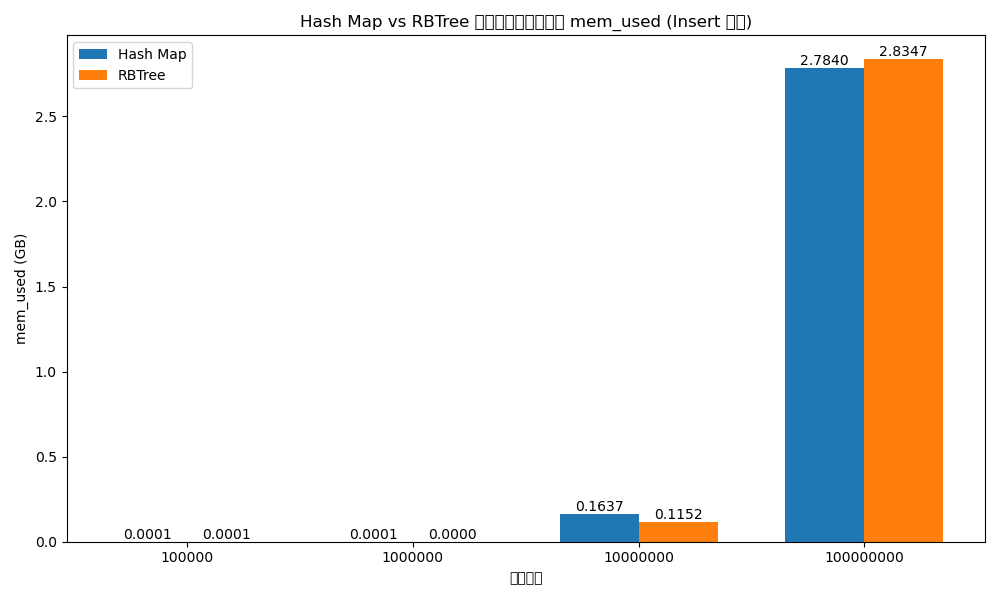
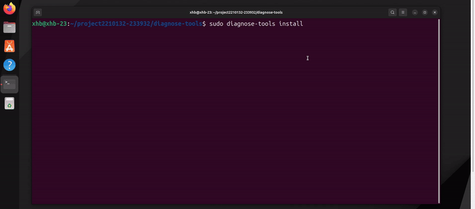

<div align='center'></div>
<div align="center"><h1><b><font size=30>决赛技术报告</font></b></h1></div>
<div align="center"><font size=5>2024 年全国大学生计算机系统能力大赛操作系统设计赛——功能赛道</font></div>
<div align="center"><font size=5>赛题选择：[proj208-performance-and-diagnosis-tool ](https://github.com/oscomp/proj208-performance-and-diagnosis-tool)</font></div>
<div align="center"><font size=5>队伍名称：这次一定队</font></div>
<div align="center"><font size=5>队员姓名：徐晗博、张铭轩、杨月顺</font></div>
<div align="center"><font size=5>指导教师：陈莉君教授、谢瑞莲老师</font></div>
<div align="center"><font size=5>项目导师：谢宝友（国科础石）</font></div>
<div align="center"><font size=5>学校名称：西安邮电大学</font></div>

--- 
[TOC]

## 一、项目描述

### 1.1 项目背景

伴随着现代操作系统的快速发展，计算机系统中的应用负载和系统复杂度不断提高，导致系统在高负载高并发情况下容易出现性能问题和异常状况，造成业务产生卡顿、抖动甚至无法正常运行的问题，这包括一些常见的场景：电商平台的促销高峰期，Web服务器需要处理大量并发请求，数据库服务器需要快速响应大量查询和更新操作，视频流媒体平台在热门直播期间需要维持高带宽数据传输等。在这些场景中，传统的用户态性能分析工具在面对高负载环境时往往表现不佳，难以提供准确的诊断结果，给用户带来不便和潜在风险。此外，金融系统的高频交易环境、科学计算中的大规模并行计算任务、以及企业内部的大型数据分析任务等，都是高负载情况下常见的应用场景，这些场景对系统的性能和稳定性都提出了更高的要求。

因此，开发一种高性能、高可靠性、低系统影响且准确性强的性能分析和异常诊断工具显得尤为重要。本项目旨在开发一款能够在高负载情况下进行性能分析、故障诊断并且可以异常检测的高性能工具。该工具能够对操作系统的各个子系统进行全方位的深入分析，识别和诊断异常情况，提高系统的性能和稳定性。这对于保障系统在高负载环境下的稳定运行具有重要意义，有助于减少系统宕机和性能下降的风险，提升用户体验。

### 1.2 项目目标

#### 1.2.1 项目特性

本项目致力于开发一款能在高负载高并发环境下对系统进行全方位多角度的性能分析、故障诊断工具，该工具应具有高性能、高可靠性、低系统影响、准确性强、稳定性强且易用性好的特点。并在真实的高负载高并发环境下对工具进行全方位的加压测试、针对工具进行真实性测试，以确保该工具的高稳定性、高准确性以及地低系统影响。

| 特征           |                                                              |
| -------------- | :----------------------------------------------------------- |
| **高性能**     | 该工具需要在高负载情况下保持较高的性能，能够实时监控系统的各项指标，并能够对各种异常情况进行快速分析和诊断。 |
| **高可靠性**   | 该工具需要保证在各种复杂的环境下都能够正常工作，而并且能够准确地诊断和分析各种异常情况，提供准确的故障诊断报告。 |
| **低系统影响** | 该工具需要保证在高负载环境下能够正常运行，且在对系统的性能影响尽可能小，不会因本工具的存在而影响到系统的正常运行。 |
| **准确性强**   | 该工具需要保证诊断结果是准确无误、真实可靠的，不会给用户带来误导和风险，并且支持多种异常情况的诊断。 |
| **稳定性强**   | 该工具需要保证能在高负载高并发环境下，依然可以持续稳定运行72h以上 |
| **易用性好**   | 该工具需要提供友好的用户界面，简单易用。用户能够通过界面直观地了解系统的运行情况和异常情况，并能够快速地找到解决问题的方法。 |

#### 1.2.2 预期目标

本项目预期目标是：

- 编写性能工具，采集有关数据，输出火焰图。
- 能够在高负载下进行压力测试，并可靠地完成性能监测和异常分析。
- 在高负载场景下，对工具进行测试，寻找可优化的部分。

### 1.3 工作贡献

我们基于内核模块对谢宝友老师开发的diagnose-tools开源工具进行了二次开发，项目开发主要分为以下五个阶段：

* diagnose-tools工具的在高内核版本上的复现；
* 搭建基于php Yii2框架的开源电商平台用于模拟真实的高负载场景；
* 对原有工具在真实高负载环境下进行性能分析和压力检测并得出性能优化点；
* 对原有工具进行性能优化；
* 针对diagnose-tools原有工具所不能解决的问题进行功能开发；
* 对新开发的功能进行正确性测试、稳定性测试、高负载下进行压力测试；
* 在国产操作系统上部署diagnose-tools工具，并顺利解决其中的问题；


### 1.4 项目框架

该项目总体的框架如下图所示，该框架展示了diagnose-tools如何通过不同模块协同工作，实现全面的性能监控和故障诊断。框架的各个部分包括数据采集、数据处理、数据存储和数据展示，各部分通过统一的接口进行通信，确保数据的准确性和一致性。

<div align='center'></div>

diagnose-tools采用模块化设计，每个工具模块独立开发和维护，以便于扩展和更新。这样的设计使得工具的开发和维护更加灵活，可以根据实际需求添加新的功能模块或更新现有模块，而不会影响整个系统的稳定性和性能。这种模块化设计还允许不同的模块之间进行组合和集成，形成定制化的诊断解决方案，满足各种复杂的应用场景。

### 1.5 项目进度

**赛题要求**：

| 任务编号 | 任务描述                                                     | 完成情况 | 完成细节 |
| -------- | ------------------------------------------------------------ | -------- | -------- |
| 任务1    | 编写性能工具，采集有关数据，输出火焰图 |100%完成|目前diagnose-tools已经开发了28个功能，能采集真实数据并输出火焰图		|
| 任务2    | 能够在高负载下进行压力测试，并可靠地完成性能监测和异常分析   |100%完成|搭建真实高负载场景，模拟本工具在高负载高压环境下对系统进行诊断，可以可靠完成性能监测和异常分析		|
| 任务3    | 在高负载下寻找可优化的部分，要对内核足够熟悉，对性能工具的实现原理足够清楚，有处理高负载情况性能分析的经验，对实际异常、故障比较了解。 |100%完成|对工具在存储方式以及稳定性两个方面进行优化，是工具性能得到显著提升	|

**自主扩展**
| 任务编号 | 任务描述                                                     | 完成情况 | 完成细节 |
| -------- | ------------------------------------------------------------ | -------- | -------- |
| 拓展1    | 开发进程画像系列功能，对进程进行多维度剖析 |100%完成|进程画像系列功能开发完毕，目前可以在高负载环境下找到问题进程，并可以对进程在运行时期的关键行为、资源使用情况、系统调用序列、核间迁移情况进行细粒度的数据抓取与分析|
| 拓展2    | 开发网络相关的系列功能 |100%完成|开发了tcpstates、udp等功能，目前可以在高负载环境下对网络子系统进行细粒度分析|
| 拓展3    | 开发异常时间点确定、负载变化趋势功能|100%完成|对系统进行宏观的数据分析，发现高负载环境下的异常点|
| 拓展5    | 对比内核模块以及eBPF对系统的影响|100%完成|将diagnose-tools中的部分功能通过eBPF实现，并进行了性能对比|
| 拓展4    | 在国产操作系统上移植diagnose-tools，并可以解决该操作系统上的系统故障问题|100%完成|目前已经将diagnose-tools工具完整的移植到龙蜥操作系统上，并能采集其中的数据指标，已经可以解决龙蜥操作系统上的异常故障问题|


## 二、项目资料调研

在本章中，我们将对diagnose-tools所使用到的技术、现存异常诊断工具、高负载高并发场景如何模拟、以及相关实现技术进行调研，通过资料调研最终确定我们的技术路线，并为后期的工作奠定基础。

### 2.1 现存异常诊断工具的横向对比

由于在高负载下进行性能分析和故障诊断是一项复杂而具有挑战性的任务，需要掌握丰富的技术和工具，以便准确地识别系统中的性能瓶颈，并提高系统的运行效率和稳定性，所以**本小节将对不同的诊断工具进行了横向调研，对比这些工具的实现方法以及故障诊断效果，为我们确定技术路线提供资料支持**。

#### 2.1.1 DTrace

DTrace是一种功能强大的跨平台性能分析和故障诊断工具，能够在运行时对应用程序和操作系统进行深入的跟踪和分析，而无需重新编译或重启系统。

DTrace的特点和应用包括：

- 系统活动跟踪：DTrace可以跟踪系统调用、内核事件、用户态应用程序的函数调用、文件系统操作等。
- 数据收集和分析：通过用户自定义脚本，DTrace可以收集和分析各种数据，并提供丰富的数据可视化和分析工具。
- 低开销：DTrace在提供详细跟踪信息的同时，保持了较低的系统开销，适用于高负载环境下的性能分析。

但DTrace依然存在部分缺点，如平台限制、复杂性、潜在的安全性和稳定性问题以及在某些情况下的性能开销过于庞大。

#### 2.1.2 Linux性能工具箱

Linux性能工具箱是一组命令行工具，用于在Linux系统中进行性能分析和调试，帮助开发人员和系统管理员识别性能瓶颈，优化系统和应用程序的性能，诊断和解决各种问题。常见的工具包括：

- top：实时性能监控工具，显示系统的资源使用情况，包括CPU、内存、I/O等。
- vmstat：显示系统的虚拟内存统计信息，通过该命令可以查看系统的负载情况和运行状况。
- strace：跟踪进程的系统调用，查看应用程序和系统之间的交互，以及应用程序的性能瓶颈。
- perf：性能分析工具，用于跟踪进程的CPU使用情况、内存使用情况、锁竞争等性能指标。

但linux性能工具箱中的很多工具仅局限于用户态，不能在高负载场景下的进行性能分析与异常诊断。

### 2.2 技术选择

为了在高负载下可以更深层次性能分析和故障诊断，用户态的异常诊断工具通常不能胜任，必须深入内核拿到实时的内核数据，依靠这些真实可靠的内核数据才能做进一步的问题分析。内核模块和eBPF技术可以作为一个选项来实现对内核数据的抓取，但二者谁更适用于高负载下的性能分析，这需要进行相关资料的调研和比对。

本小节将对可以实现内核数据抓取的内核模块和eBPF技术进行介绍比对，并最终确定我们的技术路线。

#### 2.2.1 内核模块

**内核模块**（Kernel Module）是一种可以动态加载和卸载到内核中的可执行代码，能够扩展和增强操作系统的功能。内核模块通常使用C语言编写，可以访问操作系统内核的数据结构和函数，并在系统启动时加载，以便为系统提供额外的功能和服务。

在性能分析和故障诊断方面，内核模块具有以下优势：

- **系统调用跟踪**：通过内核模块，可以跟踪系统调用，了解应用程序与操作系统之间的交互。
- **内核函数监控**：内核模块可以监控内核函数调用，帮助发现系统性能瓶颈。
- **内核数据结构分析**：通过分析内核数据结构，内核模块可以提供详细的系统状态信息，快速定位问题。

通过使用内核模块，可以动态监测内核状态，了解系统内部的运行机制，并迅速定位和解决问题。

#### 2.2.2 eBPF技术

**eBPF**（extended Berkeley Packet Filter）是一种能够在内核中运行沙箱程序的技术，提供了一种安全注入代码的机制，使非内核开发人员也可以对内核进行控制。eBPF的功能不断扩展，从最初的数据包过滤，逐步覆盖到网络、内核、安全、跟踪等多个领域。

<div align='center'></div>

eBPF技术在性能分析和故障诊断中的应用包括：

- **实时监控**：eBPF可以在内核空间中执行用户自定义代码，以低开销捕获和处理网络数据包、系统调用、内核函数调用等事件。
- **系统事件监测**：eBPF可以监测各种系统事件，如CPU使用率、内存分配、文件系统访问、网络数据包等，提供精准的监测和分析。
- **灵活性**：通过用户自定义的BPF程序，可以灵活地监控和分析系统性能，满足不同的需求。

#### 2.2.3 内核模块和eBPF技术的对比

​	通过对比内核模块与eBPF技术，我们发现内核模块在内核中可以更灵活的拿取数据，且其对系统的开销远低于eBPF技术。

​	内核模块允许在不重新编译内核的情况下加载和卸载功能，从而提供了许多增强和扩展操作系统功能的可能性。内核模块主要使用C语言编写，具有直接访问内核数据结构和函数的能力，这使得它们在性能分析和故障诊断方面具有显著优势。

​	内核模块在性能监控和优化方面有重要应用。通过内核模块，可以实时监控系统性能指标，如CPU使用率、内存消耗、I/O操作等，并对这些数据进行分析，找出性能瓶颈并进行优化。内核模块还可以帮助捕捉和分析内核崩溃和系统错误，提供详细的诊断信息。通过记录内核函数调用堆栈和内核数据结构状态，可以重现错误场景并定位问题根源。此外，内核模块可以用于动态插桩，在运行时注入调试代码，实时分析系统行为。

​	在安全监控和防护方面，内核模块也具有重要作用。它们可以用于监控系统安全状态，检测异常行为和潜在攻击。例如，通过监控系统调用，可以发现和阻止恶意软件的活动。内核模块还可以实现防火墙功能，过滤网络流量，保护系统免受网络攻击。内核模块还提供高级资源管理功能，例如实现自定义的内存管理算法、CPU调度策略等。通过内核模块，可以对特定应用或工作负载进行优化，提升系统资源利用率和性能。

​	在高性能场景中，内核模块通常表现出更高的效率。内核模块直接在内核空间运行，无需进行用户态和内核态之间的上下文切换，因此避免了这些切换带来的开销，显著提升了性能。相比之下，eBPF程序需要通过bpf()系统调用加载和管理，这一过程涉及多次上下文切换，增加了开销。尽管eBPF在内核中执行时不需要频繁切换，但其加载和管理阶段的开销仍然不可忽视。

​	在执行效率方面，内核模块编译成机器码，直接在内核中执行，具备最高的执行效率。eBPF程序则运行在一个虚拟机中，虽然经过多次优化，但仍需进行字节码解释，或在某些情况下进行JIT编译。尽管现代eBPF虚拟机的性能非常高，但解释或编译带来的额外开销在某些高性能场景下依然明显。内核模块由于直接操作内核数据结构，避免了中间层的开销。例如，在网络数据包处理上，内核模块可以直接访问和修改数据包结构，而eBPF需要通过特定的API进行操作，增加了函数调用的开销。即使在使用XDP进行加速时，eBPF的处理效率也无法完全匹敌直接在内核中操作的内核模块。

​	内存使用方面，内核模块的效率通常优于eBPF程序。由于eBPF程序需要在虚拟机中运行，其内存管理涉及更多的抽象层次，增加了内存使用的复杂性和开销。内核模块则直接使用内核的内存管理机制，更加高效。此外，内核模块的内存分配和释放可以根据需求进行高度优化，进一步提升性能。

​	实际应用中的性能比较也进一步展示了内核模块的优势。在高频系统调用监控场景中，内核模块直接嵌入内核，能够以极低的开销捕获和处理系统调用信息，通常实现微秒级的延迟。而eBPF尽管能够有效监控系统调用，但由于其运行在虚拟机中，实际延迟通常在微秒级到毫秒级不等。在高吞吐量网络数据包处理场景中，内核模块在处理每秒数百万个数据包时表现优异，直接操作数据包内存，延迟可控制在数百纳秒到微秒级。虽然XDP大幅提升了eBPF在数据包处理上的性能，但依然存在一些虚拟机解释和函数调用的开销，延迟通常在微秒级。

​	总的来说，内核模块在性能上具备显著优势，特别是在高频系统调用和高吞吐量数据处理场景中。其直接运行在内核空间，无需额外的上下文切换和虚拟机解释，确保了最高的执行效率和最低的延迟。这些特点使内核模块成为对系统性能要求极高的应用场景中的首选工具。

​	同时为了在高负载环境下实现精确的性能分析和故障诊断，我们需要借助一些强大的探测工具和高效的数据结构。这些工具和数据结构能够提供深入的系统行为洞察和高效的数据管理，帮助我们快速定位和解决性能瓶颈和异常。

### 2.3 高负载场景调研

​	为了评估 diagnose-tools 在高负载场景下的性能表现，并找到性能优化点，本小节将针对一些常见的高负载场景进行详细的资料调研和测试工具选择，并预期实现相关的测试环境和工具配置。

#### 2.3.1 高负载场景搭建

​	为了模拟出高负载高并发的业务场景，我们分别调研了电商平台的双十一购物节、促销活动时的业务场景，金融服务中在市场开盘时在线交易平台处理大量订单的场景，社交媒体上突发热门事件时面临大量用户评论、转发等场景、以及视频流媒体中对热门事件的直播活动等。经对比，我们最终把目标放在了电商平台的双十一购物节、促销活动相关场景的模拟上。

​	为了最真实的还原该高负载场景，我们选择真实搭建一个电商项目——Fecshop。模拟一台服务器主机，通过Docker轻量且完整地搭建了一个开源电商项目Fecshop。该项目使用PHP、Mysql、Redis等成熟技术，具备完整的前后端代码和功能。用户端实现了登录注册、商品查询、购物车、购买商品等基本的电商功能，管理员端则可以进行商品和用户管理操作。Fecshop项目较为完整且全面地模拟了企业级的电商平台，为高负载测试提供了理想的环境。

场景搭建详细全过程可参考本仓库的这篇文档：[部署开源电商项目](docs/部署开源电商项目fecmall.md)

#### 2.3.2 高负载场景模拟与测试工具预选

##### 2.3.2.1 场景模拟

​	在搭建好电商平台后，如何模拟促销高峰期这个业务场景是重中之重，我们在分析了该场景的整个流程后，决定使用ApacheBench (ab) 工具来模拟类似高并发高访问请求的场景。

​	ApacheBench是一个用于测试HTTP服务器性能的命令行工具，最初由Apache HTTP Server项目开发。它能够模拟大量并发请求，从而帮助评估Web服务器在高负载条件下的响应能力和稳定性。通过生成大量并发请求，ab可以提供详细的统计数据，如每秒请求数、请求处理时间分布和失败请求数等。

​	通过使用ApacheBench (ab)进行并发测试，预期能够评估diagnose-tools在处理大量并发请求时的稳定性和效率，识别潜在的瓶颈和优化点；分析diagnose-tools在高并发条件下的响应时间分布，确保在不同负载下能够保持合理的响应速度；结合Node Exporter和Prometheus，监测并分析diagnose-tools在高并发测试期间的CPU和内存使用情况，全面了解其资源消耗特性。

##### 2.3.2.2 测试工具预选 <a id="测试工具预选"></a>

​	在测试工具的选择上采用了Node Exporter和Prometheus这两种工具，以确保数据的准确性和全面性。Node Exporter是一个高效的开源工具，用于从系统中收集硬件和操作系统的各种指标。它能够提供详细的CPU、内存、磁盘I/O和网络流量等数据。Node Exporter的优势在于其轻量级和高性能，对被监测系统的负担极小，同时能提供全面的系统状态信息。

​	其中，Prometheus是一款强大的开源监控和告警系统，专为高动态环境设计。它能够存储时序数据，并提供强大的查询语言PromQL来分析和处理这些数据。Prometheus可以与Node Exporter无缝集成，通过拉取Node Exporter提供的数据，进行实时监控和历史数据分析。使用Node Exporter和Prometheus进行评测的原因在于其数据准确性高、实时监控能力强、历史数据分析功能强大、可扩展性好，以及活跃的开源社区支持。这些特点确保了我们能够获得详细且可靠的数据，从而对diagnose-tools的性能影响进行全面和深入的分析。

​	通过使用Node Exporter和Prometheus进行评测，能够精确地捕捉系统各个方面的资源消耗情况并以高分辨率存储和处理这些数据，确保评测结果的精确性。结合Prometheus的实时数据采集和报警功能，能够快速响应系统资源使用的异常变化，及时发现和处理潜在问题。Prometheus提供了强大的数据查询和分析功能，可以回溯和分析系统在不同时间段的性能表现，为长期的性能优化和资源规划提供数据支持。这两种工具都具备很强的可扩展性，可以根据需要轻松扩展监控指标的种类和数量，适应不同规模和复杂度的系统环境。Node Exporter和Prometheus均属于活跃的开源项目，拥有广泛的社区支持和丰富的文档资源，用户可以方便地获取帮助和更新。

​	通过这种预期的评测方法，团队将获得详细且可靠的数据，从而对diagnose-tools的性能影响进行全面和深入的分析。这不仅提高了数据的可信度，也为系统优化和性能提升提供了坚实的依据。

### 2.4 diagnose-tools中相关技术与存储方式调研

本小节将对diagnose-tools中将要使用到的探测工具、存储方式进行调研，内核数据探测工具主要包括kprobe、uprobe、tracepoint等，内核存储方式主要包括hashmap、rbtree、percpu map、radixtree。

#### 2.4.1 探测工具

**kprobe：** kprobe是Linux内核中的一种动态跟踪机制，允许用户在内核函数入口或出口处插入探针，以捕获函数调用时的参数和返回值。kprobe适用于内核级别的调试和性能分析。

**uprobe：** uprobe类似于kprobe，但它用于用户空间的探测。uprobe可以在用户空间应用程序的函数入口或出口处插入探针，捕获函数调用时的参数和返回值，适用于应用程序级别的调试和性能分析。

**tracepoint：** tracepoint是内核中的一种静态跟踪机制，内核开发人员在代码中预先定义的跟踪点。用户可以通过启用这些跟踪点来捕获特定事件的发生，并记录相关信息。tracepoint适用于内核级别的广泛监控和事件分析。

#### 2.4.2 存储方式

**hashmap：** hashmap（哈希表）是一种基于哈希函数的数据结构，支持快速的插入、删除和查找操作。内核中的hashmap通常用于管理内核对象和缓存数据，如路由表、进程表等。hashmap通过哈希函数将键映射到特定的存储位置，实现O(1)时间复杂度的查找和更新操作。

**红黑树：** 红黑树是一种自平衡的二叉搜索树，保证在最坏情况下，基本操作的时间复杂度为O(log n)。内核中的红黑树用于管理需要排序的数据，如文件系统中的inode缓存、内存管理中的VMAs等。红黑树通过旋转和重新着色操作来维持树的平衡性，确保高效的插入、删除和查找操作。

**Radix Tree**：Radix Tree（基数树）是一种高效的查找数据结构，广泛用于存储关联数组，特别适用于字符串或二进制数据。通过路径压缩和前缀合并技术，Radix Tree减少了节点数量，提高了空间利用率和查找效率。它支持高效的插入、查找和删除操作，适合动态更新的应用场景，广泛应用于Linux内核的内存页缓存管理、IP路由表存储以及数据库索引等领域。


## 三、设计思路

通过以上分析和调研，并且确定好了预期目标和开发技术后，接下来会对工具的设计思路做一个完整的规划。本章将从需要解决的实际问题和整体目标出发，具体去阐述每一个设计环节所涉及的详细内容和设计思路。为后期功能开发和技术创新做一个有力的指导。

### 3.1.业界问题与设计目标：

**业界常见的问题**

​	在现代计算环境中，尤其是高负载场景下，系统性能监测和诊断变得至关重要。企业级应用程序，如电商平台和实时数据处理系统，常常面临资源竞争、系统延迟和瓶颈问题。这些问题不仅会影响用户体验，还可能导致系统宕机和业务损失。传统的用户态性能工具在高负载情况下，往往由于资源竞争和延迟增加等问题而失效，难以提供可靠的性能数据和诊断信息。

业界普遍存在的问题包括：

1. 资源竞争和延迟：高负载环境中，资源竞争激烈，导致系统延迟增加，传统工具难以准确捕捉实时性能数据。
2. 非关键进程：系统中若是存在许多非关键进程，并且这些进程占用大量资源，会导致重要业务出现严重问题。
3. 内核态限制：用户态工具受限于内核态数据的访问和操作权限，无法获取全面的系统性能信息。
4. 网络异常：网络故障、性能瓶颈和安全威胁都会对系统的整体性能带来很大的影响。
5. 数据冲突：在高负载情况下，数据的实时性和准确性容易受到干扰，影响性能分析的结果。

​	为了解决这些问题，我们计划开发一种性能检测工具，该工具基于内核模块技术，能够在高负载场景下提供高性能和高可靠性的系统性能监测和诊断。

**设计目标**

我们的目标是在现有工具的基础上，新增和优化一系列功能，以实现更高效和全面的性能检测和问题诊断：

1. 非关键进程检测：在高负载环境中，快速检测出系统中消耗大量资源但非关键的进程。通过本次新增的工具，可以有效识别出这些进程，并为进一步的分析和决策提供有利的指导。
2. 进程深入分析：对检测到的高资源消耗进程进行详细分析，包括CPU调度信息、资源使用量、网络连接情况等。通过这些数据，可以全面了解进程的行为和影响。
3. 网络异常检测：新增网络监测功能，可以发现系统中异常的网络连接情况，及时识别潜在的网络威胁和异常流量。
4. 自动化处理：在确认某个进程对系统整体性能产生不良影响且非关键时，工具能够自动对该进程进行终止操作，以保障系统的稳定性和高效运行。

​	通过这些功能的新增和优化，我们的工具在高负载场景下，能够更加高效、精准地进行系统性能监测和问题诊断，提升整体系统的可靠性和稳定性。

### 3.2.设计开发过程：

​	使用下图来简要表述本次开发的设计思路：
<div align='center'></div>

​	接下来详细对上图进行说明和分析。在功能设计和开发方面，我们遵循以下步骤，以确保新功能的高效集成和高性能运行：

1. 学习diagnose-tools框架：
	- 首先，我们深入学习了diagnose-tools的框架和现有功能，了解其架构和工作原理。
	- 通过对现有代码和文档的研究，我们掌握了工具的模块设计和数据流向。
2. 新增功能的实现：
	- 非关键进程检测：在内核态添加监控逻辑，能够快速检测系统中占用大量资源但非关键的进程。通过对进程的CPU、内存使用情况进行分析，识别出非关键且资源消耗大的进程。
	- CPU调度信息获取：为检测到的非关键进程，新增获取其CPU调度信息的功能，包括进程的调度优先级、运行队列等信息，以便全面了解进程的执行情况。
	- 资源使用量分析：增强工具的资源监控能力，能够详细记录和分析进程的内存使用、I/O操作等资源消耗情况，为进一步优化系统性能提供数据支持。
	- 网络连接监控：实现对进程的网络连接情况的监测，识别进程的网络活动，检测异常连接和潜在威胁，提升系统的网络安全性。
	- 系统资源的检测：对系统的重要资源指标进行提取，以此来了解系统整体的性能情况。
3. 数据传递机制：
	- 在内核态获取到所需数据后，通过高效的数据传递机制，将信息传递到用户态。
	- 利用内核态与用户态的通信手段，确保数据传递的实时性和准确性。
	- 用户态程序接收到数据后，进行进一步处理和展示，使用户能够方便地获取到检测到的数据信息。
4. 性能优化和安全保障：
	- 在实现功能的过程中，我们注重性能优化，确保在高负载场景下工具依然能够高效运行。

​	通过这些设计和实现步骤，我们成功地在diagnose-tools的框架下集成了新的功能，并确保在高负载场景下，工具能够高效、可靠地运行。用户可以通过该工具，实时获取系统性能数据，进行深入分析和诊断，从而提升系统的整体性能和稳定性。

### 3.3设计测试和验证过程：

<div align='center'></div>

**测试目的：**

​	通过测试来分析我们新增的功能是否可用，是否可以解决所提出的问题，是否能在高负载环境下持续运行，并且分析这些功能是否会对系统有较大的性能消耗。

**测试环境：**

- 使用Docker技术在测试机上搭建一个完整的电商项目，以模拟真实的生产环境。
- 电商项目包括Web服务器、数据库、缓存系统等关键组件。
- 使用测试工具对电商项目发出大量的并发请求，模拟高负载环境。
- 确保系统处于高负载运行状态，以测试新增功能在这种情况下的表现。

**测试步骤**：

1. 功能加载：
	- 在高负载环境下，逐步加载我们新增的功能，包括非关键进程检测、CPU调度信息获取、资源使用量分析、网络连接监控和自动化处理。
2. 性能指标收集：
	- 使用系统监控工具（如Glances、top、htop等）实时监控和记录系统的关键性能指标，包括CPU使用率、内存使用情况、网络带宽等。
3. 数据分析：
	- 使用Python进行数据分析，具体步骤包括：
		- 导入性能监控数据，进行预处理和清洗。
		- 生成数据可视化图表，展示各项指标在高负载环境下的变化情况。
		- 分析每个新增功能对系统的具体影响，找出可能的性能瓶颈和资源消耗点。
4. 稳定性测试：
	- 长时间运行新增功能，观察其在高负载环境下的稳定性和持续运行能力。
	- 检查工具是否能正常运行且不会对系统的正常运行产生负面影响。

**测试结果分析**：

1. 可用性分析：
	- 通过测试验证新增功能的可用性，确保其能够正确执行并提供预期的检测和分析结果。
2. 性能消耗分析：
	- 分析各项功能在高负载环境下的性能消耗，重点关注CPU、内存、网络等系统重要指标。
	- 评估新增功能是否对系统性能产生显著影响，确定是否需要进一步优化。
3. 持续运行能力：
	- 验证工具在高负载环境下的持续运行能力，确保其能够长时间稳定运行，不会出现崩溃或严重性能下降的情况。
4. 改进建议：
	- 根据测试结果提出改进建议，进一步优化新增功能的性能和稳定性。

**总结**：

​	通过上述的测试和分析，我们会输出详细的测试报告，并且会将测试数据进行保存。通过详细的测试和输出的测试报告，我们能够全面了解新增功能在高负载环境下的表现和对系统的影响。利用Python强大的数据分析能力，我们可以深入分析各项性能指标，找出潜在的问题和优化方向，确保工具在实际使用中的高效性和可靠性。


## 四、功能开发与测试

本章节将详细介绍我们针对diagnose-tools工具的性能优化、功能开发、以及多维度全面的测试工作，在详细介绍每一条技术创新工作之前，需要对整体设计步骤进行阐述，这更有利于了解每一项工作的目的与实际意义。

* **第一阶段——版本兼容**：为了使diagnose-tools工具能够广泛适用于大多数内核版本、兼容性好、且适应不同的应用场景，我们将对diagnose-tools工具在高版本上进行适配，目前该工具可以在Linux5.19以下的所有内核版本中流畅使用，并帮助用户解决相关系统故障。
* **第二阶段——真实场景搭建**：为了测试前一阶段适配好的工具，我们搭建了一款基于php、Yii2框架开源电商平台，该平台具有高性能、灵活性强和多入口支持等特性，可真实还原大部分电商平台，模拟出促销活动期高负载高并发的真实业务场景，便于对diagnose-tools工具进行初步的性能测试与压力测试；
* **第三阶段——初步性能测试与压测**：为了对diagnose-tools工具的性能与功能有更清晰的认识，我们对diagnose-tools工具在真实的场景下进行了压力测试与性能测试，最终发现该工具在性能层面十分出色，但仍存在一些可优化点；在功能层面，仍有一些扩充空间；
* **第四阶段——性能优化**：为了提升diagnose-tools的性能，我们将从稳定性和存储方式两个方面对工具进行性能优化；
* **第五阶段——功能扩充**：为了使diagnose-tools工具可以适用于大部分的业务场景，更细致的解决高负载下的相关问题，我们针对diagnose-tools工具所不能解决的问题，进行功能扩充，并针对扩充的功能进行正确性验证；
* **第六阶段——再次性能测试与压测**：为了证明性能优化后的diagnose-tools工具、新扩展的功能可以满足高性能、高可靠性、低系统影响、准确性强、稳定性强且易用性好等特点，需要对其在真实的高负载高并发环境下进行测试与分析；

### 4.1版本兼容：

在适应Linux内核版本方面，我们已成功将该工具移植到了Linux 5.10以及Linux 5.19内核版本上。由于高版本内核之间的源码差异不大，因此在高版本间进行移植并不太困难，这极大的推广了这个工具在高版本Linux内核中的使用。

### 4.2 真实场景模拟和初步系统指标采集方案：

为了测试diagnose-tools工具能否在真实的高负载场景下稳定工作，以及该工具对系统性能的影响，我们搭建了一款基于php、Yii2框架开源电商平台，该平台具有高性能、灵活性强和多入口支持等特性，可真实还原大部分电商平台，模拟出促销活动期高负载高并发的真实业务场景；

在此基础上我们对diagnose-tools工具进行了初步的压力测试与性能测试，从而对其性能与功能有清晰的认识；

* 详细的场景搭建过程可参见该文档：[部署开源电商项目](docs/部署开源电商项目fecmall.md)
* 详细的初步工具性能分析可参见该文档：[工具初步性能分析](docs/工具性能分析.md)

#### 4.2.1测试机配置

* 处理器：3th Gen Intel(R) Core(TM) i9-13900HX   2.20 GHz 16核

* 内存：32 G

* 操作系统：Ubuntu 22.04

* 内核：Linux 5.19版本

#### 4.2.2 搭建测试环境

​	我们使用Docker工具轻量且完整地搭建了一个开源的电商项目Fecshop。Fecshop是一款基于PHP、MySQL、Redis、Nginx和MongoDB等流行且成熟技术方案实现的电商平台，具备完整的前后端代码和功能。在用户端，用户可以实现登录注册、商品查询、加入购物车、购买商品等基本的电商功能；在管理员端，管理员可以进行商品管理、用户管理等一系列管理操作。Fecshop通过这些功能全面模拟了企业级电商平台的实际运行情况，使其成为理想的测试对象。

​	为了模拟高负载环境，我们使用负载生成工具（如Apache Bench）对Fecshop发出大量并发请求。这些请求模拟了用户的实际操作，如浏览商品、下单购买、提交评论等，确保测试环境尽可能接近真实使用场景。

<div align='center'></div>

#### 4.2.3 系统指标监控

​	在测试过程中，我们使用Prometheus和Node Exporter等工具实时获取系统性能指标。我们重点监控了CPU使用率、内存使用情况等关键系统指标，以确保对系统性能有全面的了解。关于Prometheus和Node Exporter详尽的介绍可以在该小节了解：[2.3.2 测试工具预选](#测试工具预选)

#### 4.2.4系统初步测试结果

1.在高负载的情况下，diagnose-tools对系统**CPU**影响的分析如下：

首先，在未加载diagnose-tools时，系统的CPU使用率如下图所示：

<div align='center'></div>

在加载了diagnose-tools时，系统的CPU使用率如下图所示：

<div align='center'></div>

通过分析，在高负载的环境下，diagnose-tools对系统的CPU消耗为1.6%左右，这说明该工具对CPU的消耗非常小，不会因为加载了该性能分析工具而导致CPU的开销变大。

2.在高负载的情况下，diagnose-tools对系统**内存**影响的分析如下：

首先，在未加载diagnose-tools时，系统内存的使用率如下图所示：

<div align='center'></div>

在加载了diagnose-tools时，系统内存的使用率如下图所示：

<div align='center'></div>

通过对可视化图表和ApacheBench工具的结果输出进行综合分析，在高负载的环境下，diagnose-tools对系统内存的消耗为4%左右，而本次模拟服务器的内存为16GB，换算下来，相当于消耗了600MB左右的内存，这说明该工具对内存的消耗相比于CPU会高一些。通过阅读并分析该工具的源码，可以发现，本工具在加载监测功能以后，会申请一定的内存空间来进行内核空间和用户空间的数据交互。

### 4.3 工具性能优化

经过对diagnose-tools工具在模拟的高负载场景下进行测试与性能分析后，我们发现diagnose-tools工具在**稳定性**和**存储方式**两个方面存在可优化空间。稳定性方面的优化是指原工具的某些功能在高内核版本中不能长时间运行，且这些工具对于系统的影响稍高，故存在可优化空间；存储方式方面的优化是指原工具在高负载场景下运行时，消耗内存资源较CPU资源稍多，故在内存消耗方面存在优化空间，我们通过更改其存储方式进而使其占用更少的内存资源；

以上两个性能优化点分别通过源码层面的优化和更改存储方式两种方式解决。前者会通过具体分析源码，落实到细节的形式来展示优化过程与结果；后者则是通过对内核模块中的两种存储方式`Hash Map` 以及`RBtree`进行对比，结合原理分析与测试实验设计,对两种存储方式进行系统的对比, 最终选择使用rbtree来优化部分功能，使其在使用过程中占用更少的内存资源。

#### 4.3.1 工具性能优化——更改存储方式

​	在初次对diagnose-tools工具进行真实环境下的高负载测试后，发现diagnose-tools工具对系统内存的消耗为4%左右，当海量数据需要处理时，diagnose-tools工具对内存的需求会激增，并存在使系统崩溃的可能，故对本工具的性能进行提升（尤其是资源消耗方面）显的格外重要。

​	diagnose-tools主要采用hashmap、rbtree、percpu map、radix-tree等方法进行数据的存储与查找。radix-tree在前缀匹配操作上有优势，而在精确查找方面不如hashmap、rbtree，工具的大部分功能会涉及数据的插入和查找，所以使用hashmap和rbtree的频率更高，本次性能分析也主要围绕hashmap和rbtree。

​	本小节将从原理分析、实验设计、性能对比分析等方面对hashmap、rbtree在空间复杂度（内存资源消耗）以及时间复杂度（增删改查速率）进行测试分析。**但由于篇幅有限，对二者详尽的分析（如内核源码层面的对比、实验方案的详细细节以及性能分析的原始数据对比）可参考本仓库的这篇文档**：[diagnose性能优化之存储方式对比](docs/map性能分析.md)

##### 4.3.1.1 map原理分析与对比

​	哈希表（Hash Map）在Linux内核中是实现高效查找和插入操作的重要数据结构。哈希表的核心思想是通过哈希函数将键映射到数组中的某个位置，这样可以快速定位存储的位置。哈希表的查找、插入和删除操作的时间复杂度为O(1)，但在发生哈希冲突时需要额外处理。常见的哈希冲突解决方法有链地址法（使用链表解决冲突）和开放地址法（使用探查方法解决冲突）。

​	红黑树（Red-Black Tree）是一种自平衡二叉搜索树，它在插入和删除操作后通过重新着色和旋转来保持平衡，从而保证了二叉树的高度始终为 O(logn)，其中 n 是节点数。红黑树的实现和维护规则确保了查找、插入和删除操作的时间复杂度都为 O(logn)。在 Linux 内核中，红黑树常用于各种需要高效动态数据结构的场景，比如内存管理、进程调度等。

​	二者在内核中是如何实现的可参考本仓库的这篇文档：[diagnose性能优化之存储方式对比](docs/map性能分析.md)

**时间复杂度对比**

hash map 理想情况下插入、查找、删除的时间复杂度都有是O(1) 级别，可以完成快速查找；rbtree的实现和维护规则确保了查找、插入和删除操作的时间复杂度都为 O(logn)；所以hash map在时间复杂度方面更优；

**空间复杂度对比（占用内存资源）**

空间复杂度层面，除了数据结构最基本的开销，二者还涉及到存储元素的额外开销，内存分配和管理策略以及负载因子和存储效率方面的对比；

【空间复杂度分析】：

- **RBtree**：空间复杂度为O(n)，每个节点都需要存储关键字、指向左右子节点的指针以及一个颜色标记，RBtree的空间复杂度主要由节点的数量决定，因此总体空间复杂度是 O(n)；
- **Hash map**：空间复杂度: O(n + k)，哈希表的空间复杂度取决于两个因素；
	- 存储的元素数量；
	- 哈希表的桶数或槽数，为了保证哈希表的操作效率，通常会设置桶数为大于或等于元素数量的某个值，这样可以减少哈希冲突。由于哈希表在负载因子较低时会分配更多的桶，以确保性能，因此空间复杂度为 O(n + k)。

哈希表的空间复杂度可能会由于桶的数量而稍微增加，因此通常会有一个额外的常数项。红黑树的内存消耗主要取决于节点的数量，而哈希表的内存消耗则会受到桶数量和负载因子的影响。

【存储元素的额外开销】：

- **hash map**：散列表的开销主要在于冲突解决和负载因子管理。理想情况下，每个桶只有一个元素，内存消耗较小；但在冲突严重的情况下，每个桶可能存储多个元素，导致内存消耗增加。
- **RBtree：**由于红黑树保持平衡，每个节点除了存储数据之外，还需要存储额外的指针和颜色信息。这些额外的信息有助于维持树的平衡性，使得查找、插入和删除操作在最坏情况下都是 O(log⁡n)。

【内存分配和管理】：

- **RBtree**：红黑树节点的内存通常是动态分配的，每次插入操作可能导致新的内存分配。内存碎片化可能会影响红黑树的整体内存效率。
- **Hash map**：散列表的内存通常在初始化时分配桶数组，后续元素插入时只需要在桶内链表（或其他结构）中插入元素。这种方式减少了频繁的内存分配操作，提高了内存利用效率，但也可能导致初始内存分配较大。

负载因子和存储效率：

- **RBtree**：红黑树的内存效率较高，因为每个节点直接存储数据，并且只需要额外的三个指针和一个颜色标志。
- **Hash map**：散列表的内存效率受到负载因子的影响。较高的负载因子可以提高内存利用效率，但也会增加冲突率，导致查找、插入和删除操作的性能下降。较低的负载因子则减少冲突，但会增加内存消耗。

综合分析一下，rbtree在增删改查复杂度方面不如hash map快，但对内存消耗偏低，节点结构简单，且内存效率较高，适合频繁的插入和删除操作，但需要保持平衡。

##### 4.3.1.2 实验设计

本实验主要围绕rbtree、hashmap在增删改查效率方面以及内存消耗方面进行实验设计，通过一组测试用例来对比两种map的性能，测试用例涵盖了一下几个方面：

1. **插入性能**：测量大量键值对的插入时间。
2. **查找性能**：测量大量键值对的查找时间。
3. **删除性能**：测量大量键值对的删除时间。
4. **内存使用情况**：比较两种数据结构的内存使用情况。

**测试方案**

1.分别针对hash map 及rbtree 进行性能测试，测试的详细细节包括：

- 在数据集大小为10万、100万、1000万、1亿时，分别执行base（什么都不执行的对比操作）、插入节点操作、查找操作、删除操作；
- 通过性能监测工具glances监测以上操作对系统的影响；
- 绘制图表进行分析；

2.为完成以上操作，需要做以下的准备：

- **【测试用例】**在diagnose-tools框架下设计测试用例，实现根据不同的参数，控制rbtree/hashmap，针对不同大小的样本进行增删改查，并且能及时反馈每一步操作所消耗时间、内存大小；
- **【性能监测工具】**使用glances工具监控整个系统在运行测试用例时的性能情况，包括CPU利用率、内存使用率、负载等数据；
- **【测试脚本】**通过测试脚本，对测试用例在不同参数时进行测试，并及时使用glances进行性能指标采集，将采集到的数据输出到文件中；
- **【对比与分析】**通过python对测试产生的数据进行细致的分析，并绘制图表便于比较rbtree与hashmap的性能；

注：详细的实验设计方案、测试用例、测试脚本以及测试原始数据可参考本仓库的这篇文档：[diagnose性能优化之存储方式对比](docs/map性能分析.md)

##### 4.3.1.3 结果分析

经过前面的数据采集，已经将原始数据文件保存在本地，可在以下几个目录下寻找到：

- [hash_map data](docs/diagnose工具性能分析/map_analysis/hash_map) 、[rbtree](docs/diagnose工具性能分析/map_analysis/rbtree)、[combined_map](docs/diagnose工具性能分析/map_analysis/combined_map)

在对数据进行梳理、比对、并绘制图标后，可以进行如下性能分析：

**1.rbtree和Hash map 进行增删改查时所占用内存情况**：

我们对样本为10万、100万、1000万以及1亿时，两个map在分别进行插入操作时内存使用情况(insert/mem_used)进行分析：

| 样本大小 | hash map  | rbtree    |
| :------- | :-------- | :-------- |
| 10万     | 0.05156M  | 0.02969M  |
| 100万    | 0.05547M  | 0.05390M  |
| 1000万   | 167.625M  | 118.000M  |
| 10000万  | 2850.768M | 2902.757M |

从数据中可以看出，当样本小于等于1000万个节点时，rbtree对内存的消耗显然小于hash map，当样本大小等于1亿时，系统会出现非常严重的卡顿情况，这是由于样本大小过大导致的，此时rbtree相对于hashmap更消耗内存。下面几张图可以明显的看出当数据小于等于1000万时，hash map消耗内存更少一些；

<div align='center'></div>

当研究样本大小聚焦在1000万~1亿之间时，可以通过如下数据得出结论：在向hash map以及rbtree插入节点时，当插入的样本节点小于8000万时，hash map比rbtree更消耗内存资源，这也符合前面的理论分析；

| 样本大小 | hash map | rbtree |
| :------- | :------- | :----- |
| 1000万   | 0.1152   | 0.1637 |
| 2000万   | 0.3826   | 0.4290 |
| 5000万   | 1.3945   | 1.4234 |
| 8000万   | 2.2453   | 2.2382 |

<div align='center'></div>

当两个map执行find和delete操作时，hash map相较于rbtree占用的内存资源稍高，下面图表可以清晰的看出hash map以及rbtree在执行find、delete时占用内存资源情况：

<div align='center'></div>

**2.rbtree和Hash map对系统的整体影响**：

通过实验所得的数据以及下面的图表，可以得到结论：

- **insert操作：**hash map相较于rbtree会消耗更多的内存资源、cpu资源，两种map对系统负载影响不会太高，但hash map 对系统的负载略高于rbtree；下图是样本大小为1000万时，插入操作对比图：

<div align='center'></div>

- **find操作**：hash map相较于rbtree会消耗更多的内存资源、cpu资源，并会对系统带来更高的负载；下图是样本大小为1000万时，find操作对比图：

<div align='center'></div>

- **delete操作**：进行查找操作时，hash map和rbtree对内存资源的占用情况基本相同，但rbtree对cpu资源的使用情况会略高于hash map，负载方面rbtree也较hashmap较高。这是由于rbtree在执行delete操作时，会先通过`rb_erase`将数据擦除，再将数据节点加入新的list中统一删除，而非一次性删除。

<div align='center'></div>

#### 4.3.2 工具稳定性的优化——更改源码

在对diagnose-tools进行高版本内核适配工作时，发现`sys-delay`、`perf `、` uprobe`存在适配不成功、适配成功后在某些内核版本上稳定性不好的问题，遂通过修改工具实现源码的方式进行性能优化。

##### 4.3.2.1 sys-delay源码优化：

在对sys-delay模块进行调试工作时，发现内核卡在了 `JUMP_INSTALL(_cond_resched)`，其调用了 `text_poke_bp` 内核函数，我们可以通过优化`text_poke_bp`来提高系统性能和稳定性。


**优化前的实现方式是**：内核在调用`JUMP_INSTALL(_cond_resched)`时，使用了`text_poke_bp`函数进行指令更新。该函数在使用Near JMP指令优化kprobe时，通过INT3中断形成屏障，确保指令更新过程中CPU不会使用非法值。然而，由于指令更新过程不是原子性的，在x86架构中可能会导致其他CPU读取正在修改的值，从而引发不可预料的错误。

<div align='center'></div>

**优化办法**：通过查阅相关资料得到一个优化方案，即分别利用INT3中断形成屏障，应用kprobe jump optimization的方案，以及采用跳板机制。其中INT3中断形成屏障方法主要是通过修改指令的首地址为INT3确保中断触发，防止中间状态指令被读取；而kprobe jump optimization的方案，是通过Near JMP指令模拟中断处理逻辑，并使用`can_optimize`函数扫描指令，确保适合kprobe优化；跳板机制则是将观测指令替换为跳到跳板代码段的指令，跳板代码执行指令副本并跳回原指令的下一条，确保指令更新的正确性和稳定性。


**优化后的流程**：首先通过调用`can_optimize`函数扫描整个函数，确保所有指令可以安全进行kprobe优化，并将需要观测的指令替换为INT3中断以形成天然屏障，防止其他CPU读取到中间状态的指令。随后由kworker线程触发，调用`text_poke_bp`函数进行三步指令更新：首先将指令首地址的opcode更新为INT3，然后更新指令的后半部分为预期值，最后将指令首地址的opcode更新为预期值。INT3中断触发时，`poke_int3_handler`中断处理逻辑模拟预期行为，在kprobe指令优化场景下调用`int3_emulate_jmp`模拟逻辑，确保指令更新过程中CPU不会使用非法值，保障系统安全和稳定。最终，更新后的指令变为跳到“跳板”代码段的指令，跳板代码执行被观测指令的副本，并跳回到原指令的下一条指令，确保指令更新的正确性和稳定性，跳板代码由`arch_prepare_optimized_kprobe`生成，包含kprobe的pre_handler执行逻辑。

<div align='center'></div>


综上所述，通过使用can_optimize函数对指令进行扫描和判断，确保了kprobe jump optimization方案的安全实施。最终实现了在保证系统性能提升的同时，确保指令更新的安全性和系统的稳定性。新的实现方式避免了原子性不足带来的不可预料错误，确保机器运行状态的安全和代码的稳定性。

该处的性能优化参考了这篇博客：[Fu, Wei: eBPF 动态观测之指令跳板 (fuweid.com)](https://fuweid.com/post/2022-bpf-kprobe-fentry-poke/)

##### 4.3.2.2.perf 源码的优化

在新版本内核中 perf 使用的操作cpu接口发生了变化，通过新旧内核版本源代码使用示例的对比，找到了等价的函数：

在新内核版本（Linux 5.19内核版本）中的 schedule_on_each_cpu 函数中：

```c
int schedule_on_each_cpu(work_func_t func)
{
	//...
    //get_online_cpus(); 3.10
	cpus_read_lock();
	//...
    //put_online_cpus(); 3.10
	cpus_read_unlock();
	//...
}
```

在 `perf` 中将 `get_online_cpus()` 和 `put_online_cpus()` 函数替换为 `cpus_read_lock()` 和 `cpus_read_unlock()` 后成功运行。

##### 4.3.2.3.uprobe 源码的优化

在高版本 Linux 内核中，启动 `uprobe` 工具后会引起死机问题。为了解决这一问题，我们在 `uprobe` 工具的 `hook_uprobe()` 函数中删除了操作野指针的语句，并增加了 `fput` 语句，成功解决了问题。

```c
int hook_uprobe(int fd, loff_t offset, struct diag_uprobe *diag_uprobe)
{
	//...
	if (file && file->f_path.dentry && file->f_path.dentry->d_inode) {
		//...
		if (!ret) {
			//...
#if LINUX_VERSION_CODE >= KERNEL_VERSION(5,11,0)
			fput(file);
#else
			orig_put_files_struct(files);
#endif
			return 0;
		}
	}
```


### 4.4 工具的功能扩充

​	在对diagnose-tools工具进行了初步性能测试分析、并在稳定性与存储方式上做了性能优化后，diagnose-tools工具已经可以在Linux5.19以下的大部分内核环境下顺利解决很多场景中的系统故障问题，并为用户提供较为准确的问题定位，但该工具在某些场景下仍缺乏对应的功能去准确的解决系统故障问题。为了使diagnose-tools工具可以适用于大部分的业务场景，更细致的解决高负载下的相关问题，我们针对diagnose-tools工具所不能解决的问题，进行功能扩充，并针对扩充的功能进行高负载环境下的测试与正确性验证，测试与正确性验证部分会在下一小节中进行详细介绍。

​	目前我们已经为diagnose-tools扩展了10个功能，每一个功能均可以独立解决用户的相关问题，也可以针对特定场景中具体问题将多个功能进行组合，做到`产生问题`——>`发现问题`——>`定位病因`——>`多维度剖析问题`——>`顺利解决问题`。本小节仅对每一个小功能进行详细的介绍，如何将多个功能模块进行组合来共同剖析同一个问题会在第六章中的第一小节进行详细介绍，或阅读本仓库中的以下两篇文档：

[高负载场景下的TCP连接监测方案](docs/高负载场景下的TCP连接监测方案.md)

[高负载电商服务器中的问题进程排查剖析方案](docs/高负载电商服务器中的问题进程排查.md)

#### 4.4.1 TCP STATES

​	该功能可以监听tcp连接中状态的转变，从而可以获取到tcp连接状态的相关信息。
<div align='center'></div>

​	该功能的相关文档：

- 使用文档：[tcpstates使用文档](docs/工具说明/工具使用说明/tcpstates.md)
- 详细介绍文档，从背景、解决问题、原理、使用场景等方面对本功能进行详细介绍：[tcpstates详细介绍文档](docs/工具说明/工具详细介绍/tcpstates详细介绍.md)
- 正确性验证文档，验证本功能采集到的指标是完全正确且可信的：[tcpstates正确性验证](docs/工具说明/工具正确性验证/tcpstates_正确性验证.md)

##### 4.4.1.1 背景

​	在现代互联网环境中，网络性能和安全性面临着越来越多的挑战。除了常见的DDoS（分布式拒绝服务）和DoS（拒绝服务）攻击，网络管理员还需要应对各种网络故障、性能瓶颈和安全威胁，如未授权访问、数据泄露和恶意软件传播。为了保障网络的稳定运行和安全性，管理员需要一种高效、可靠的工具来实时监控和分析网络流量与连接状态。其中，Slow POST攻击是一种特殊的DoS攻击，它通过发送极慢的POST请求，占用服务器资源，使服务器无法响应其他正常请求，从而导致服务中断。为了保障网络的稳定运行和安全性，管理员需要一种高效、可靠的工具来实时监控和分析网络流量与连接状态。

##### 4.4.1.2 主体框架

本工具在diagnose-tools框架的基础上，在其中新建了tcpstates工具，其中主要为内核态代码、用户态代码、公用头文件等，其具体的框架架构如图：

<div align='center'></div>

##### 4.4.1.3 解决的问题

​	我们的工具通过提供详尽的TCP连接状态和实时统计数据，帮助网络管理员全面了解网络流量和连接状态，从而快速检测和响应异常活动。具体来说，工具可以记录和分析每个TCP连接的状态变化，包括源IP、目的IP、端口、状态变化、持续时间、发送和接收的字节数等。这些信息有助于快速检测异常流量，识别潜在的攻击源，之后可以采取相应的防御措施。此外，工具还可以帮助管理员进行网络故障排查，识别性能瓶颈，优化网络配置，确保网络的高效运行。通过这种实时监控和分析，管理员不仅可以提升网络的安全性，还能显著提高网络性能，保障业务的连续性和可靠性。

​	监控异常的网络行为，检测潜在的网络攻击和入侵行为。使用 tcpstates 功能监控系统中所有 TCP 连接的状态变化，识别异常的连接模式，例如大量的 SYN 请求（可能是 SYN Flood 攻击），及时发现并采取安全措施。

​	监控服务器的网络连接状态，确保服务正常运行。持续监控服务器的 TCP 连接状态变化，发现并警告可能影响服务可用性的异常连接状态，例如过多的 TIME_WAIT 状态连接，导致资源耗尽

##### 4.4.1.4 使用场景

该工具可用于高负载下的大部分TCP监测场景，下面以DOS模拟为例进行介绍。

**Slowhttptest**工具，其用于执行慢速拒绝服务（DoS）攻击，通过四种方法消耗目标服务器的并发连接池，

大量消耗目标并发连接池，应用层的连接池一旦建立起来就不占用这个资源，若果许多连接都占在这里，不完全建立，就会占用着资源。缓慢发送不完整的http请求，服务器等待并保持连接

SlowPOST：content-length声明长度，但body部分缓慢发送

```c
slowhttptest -c 1000 -B -g -o my_body_stats -i 110 -r 200 -s 8192 -t FAKEVERB -u http://192.168.0.2 -x 10 -p 3
```

在DOS模拟中，verbose=0，并发数为800

<div align='center'></div>

当使用verbose=1时，并发数为800

<div align='center'></div>

#### 4.4.2 UDP

​	本功能追踪UDP连接中各状态的切换；
<div align='center'></div>

​	该功能的相关文档：

- 使用文档：[ udp使用文档](docs/工具说明/工具使用说明/udp.md)
- 详细介绍文档，从背景、解决问题、原理、使用场景等方面对本功能进行详细介绍：[ udp详细介绍文档](docs/工具说明/工具详细介绍/udp详细介绍.md)
- 正确性验证文档，验证本功能采集到的指标是完全正确且可信的：[ udp正确性验证](docs/工具说明/工具正确性验证/udp_正确性验证.md)

##### 4.4.2.1 背景

​	在现代网络环境中，网络报文的监测和分析是确保网络安全与性能的关键环节。现有的网络往往面临着处理延时过高、由于工具导致的瞬时流量激增及特定IP地址报文频繁等问题。这些问题可能导致网络拥塞、性能下降甚至是潜在的安全威胁。

##### 4.4.2.2 主体框架

本工具在diagnose-tools框架的基础上，在其中新建了udp工具，其中主要为内核态代码、用户态代码、公用头文件等，其具体的框架架构如图：

<div align='center'></div>

##### 4.4.2.3 解决问题

通过diagnose-tools的udp模块工具我们可以实现以下功能

1、可以获取UDP和IP的基本信息，解析具体上层协议如DNS

2、并监测内核在UDP层面的处理延时

3、根据延时和具体报文进行动态阈值监测

​	通过使用kprobe挂载相应函数，我们能够有效解决多种网络问题。首先，我们可以获取UDP和IP的基本信息，如IP地址和端口，从而监控网络流量的基本情况。其次，工具能够解析上层协议，识别具体的应用层协议，例如解析DNS协议中的域名和IP地址，帮助诊断和解决DNS相关问题。此外，我们可以监测内核在UDP层面的处理延时，识别和解决网络性能瓶颈。最重要的是，工具通过动态阈值监测，可以及时检测内核处理延时过高和相同IP组瞬时报文过多等异常情况，从而预防网络拥塞和潜在的安全威胁，提高网络的稳定性和安全性。

#### 4.4.3 Sched_Image

​	该功能可以筛选出长期占用CPU而不被调度下去的进程。
<div align='center'></div>
​	该功能的相关文档：

- 使用文档：[ sched_image使用文档](docs/工具说明/工具使用说明/sched_image.md)
- 详细介绍文档，从背景、解决问题、原理、使用场景等方面对本功能进行详细介绍：[ sched_image详细介绍文档](docs/工具说明/工具详细介绍/sched_image详细介绍.md)
- 正确性验证文档，验证本功能采集到的指标是完全正确且可信的：[sched_image正确性验证](docs/工具说明/工具正确性验证/sched_image_正确性验证.md)

##### 4.4.3.1 功能描述

`sched_image`是一款设计用于识别长时间占用 CPU 而不被调度下去的进程的工具，它能够帮助系统管理员和开发者诊断内核中的其他进程为何得不到调度。通过跟踪和分析系统中CPU调度情况，`sched_image`提供了一种有效的方法来定位和解决系统性能瓶颈和任务抖动延迟高的情况。

其主要功能包括：

- **监控进程调度**：实时监控系统中所有进程的调度情况，及时识别长期占用CPU的进程；
- **通过动态阈值实时识别**：根据不同的运行环境以及需求，`sched_image`会动态的调整阈值大小，识别持续占用 CPU 超过这个动态阈值的进程；
- **问题进程的细粒度分析**：`sched_image`可以将长时间占用CPU的问题进程进行行为分析，并结合其他工具进行更细粒度的分析：
	- 调用栈的分析：拿到进程的函数调用栈，可以看到该进程在生命周期内所调用的函数；
	- 和其他工具的配合：可以通过`keytime_image`工具对进程关键时间点进行行为分析，查看该问题进程在哪些关键时间点发生了异常；结合`suyscall_image`，`syscall_image`等功能，在问题时间点附近的查看该进程更细粒度的行为(包括系统调用、核间迁移、资源使用情况)，通过系统调用序列表，就可以还原该问题进程的问题行为，采取相应措施优化性能、对症下药，以提升系统整体性能。

##### 4.4.3.2 主体框架

本工具在diagnose-tools框架的基础上，在其中新建了sched_image工具，其中主要为内核态代码、用户态代码、公用头文件等，其具体的框架架构如图：

<div align='center'></div>

##### 4.4.3.3 使用场景

 **场景1：高延迟问题排查**

- **问题描述：**在业务运行时，业务系统经常遇到延迟高的问题，如果某个进程陷入内核态执行时间过长，会导致调度延迟，影响其他希望在该核上运行的进程；
- **举例：**在618，双十一或限时购票高峰期的类似**高并发、高负载和海量数据处理**的活动场景中，服务器面临大量并发请求，部分请求响应变慢，会出现某一个或一组业务进程长期占用CPU而得不到调度，造成关键性进程无法及时上CPU去运行，导致系统相应慢甚至瘫痪；
- **解决方案：** 使用 sched_image工具专门跟踪陷入内核态长时间不调度的进程，帮助识别和分析这些进程对系统整体延迟的影响，通过keytime_image、syscall_image、resource_image等工具对该进程进行更细粒度的分析，找到该进程长时间占用CPU的原因，提供指导方向来排查和解决高延迟问题。

#### 4.4.4 keytime_image

​	该功能主要用于对进程进行画像，关注进程在生命周期内所产生的关键行为。
<div align='center'></div>
​	该功能的相关文档：

- 使用文档：[ keytime_image使用文档](docs/工具说明/工具使用说明/keytime-image.md)
- 详细介绍文档，从背景、解决问题、原理、使用场景等方面对本功能进行详细介绍：[ keytime_image详细介绍文档](docs/工具说明/工具详细介绍/keytime_image详细介绍.md)
- 正确性验证文档，验证本功能采集到的指标是完全正确且可信的： [keytime_image正确性验证](docs/工具说明/工具正确性验证/keytime_image_正确性验证.md)

##### 4.4.4.1 功能描述

`keytime_image`是一款用于捕获进程关键时间点的工具，聚焦于进程何时创建子进程（fork，vfork, pthread_create）,何时上CPU，何时下CPU，何时执行execve、何时退出等。通过tracepoint将其挂载在特定的挂载点上，并在进程发生以上几种行为时进行数据收集，并对数据进行处理，可以通过数据描绘出进程在关键时间点上的行为；

- **进程行为画像**：实时监控系统中关键进程的行为，并按照时间对这些进程行为进行输出，实现对进程进行画像；
- **目前可监控到的行为**：通过sched_image工具找到问题进程，通过keytime_image工具对其进行进程画像：
	- 获取到当前进程/线程 创建子进程的时间；
	- 获取到当前进程/线程 上下CPU的时间；
	- 获取到当前进程/线程 执行execve的时间；
	- 获取到当前进程/线程  exit退出的时间；
- **目前正在增加功能**：
	- 获取到当前进程/线程 进行内存分配、内存释放、执行 `mmap` 系统调用、进程执行 `munmap` 系统调用的时间；
	- 获取到当前进程/线程 文件描述符被安装、文件被打开时、文件被读操作、文件被写操作的时间;

##### 4.4.4.2 主体框架

本工具在diagnose-tools框架的基础上，在其中新建了`keytime_image`工具，其中主要为内核态代码、用户态代码、公用头文件等，其具体的框架架构如图：

<div align='center'></div>

##### 4.4.4.3 使用场景

在生产环境中，某些次要进程会长期占用系统资源或出现性能问题，导致主要服务出现抖动、卡顿、甚至是死机现象。为了确保主要业务的主要进程流畅进行，必须迅速排查、分析、解决这些问题，并对次要进程进行性能优化。通过对进程关键行为进行记录分析,可以判定该进程的问题所在，对特定进程的故障排查

**解决的问题**

对目标进程的一些行为进行关键时间点的分析，快速定位并解决故障原因。通过记录和分析进程的关键行为（如创建子进程、上下 CPU、执行 `execve`、进程退出），可以回溯进程的操作历史，找出导致故障的具体操作，从而及时修复问题，保证系统稳定性。

#### 4.4.5 resource_image

​	该功能主要用于对进程进行画像，关注进程在使用过程中对系统资源的实时消耗情况。
<div align='center'></div>
​	该功能的相关文档：

- 使用文档：[ resource_image使用文档](docs/工具说明/工具使用说明/resource-image.md)
- 详细介绍文档，从背景、解决问题、原理、使用场景等方面对本功能进行详细介绍：[ resource_image详细介绍文档](docs/工具说明/工具详细介绍/resource_image详细介绍.md)
- 正确性验证文档，验证本功能采集到的指标是完全正确且可信的： [ resource_image正确性验证](docs/工具说明/工具正确性验证/resource_image_正确性验证.md)

##### 4.4.5.1 功能描述

resource_image:是一款致力于研究进程对试实时系统资源利用情况的监测工具，涉及到当前进程的cpu利用率、mem使用率、读写字节数等。该功能通过使用kprobe钩子函数挂载到`finish_task_switch`内核函数上，旨在追踪任务切换时的资源使用情况；

- **监控进程实时的资源使用情况**：实时监控系统中关键进程的资源使用情况，及时发现和处理性能瓶颈；
- **问题进程的细粒度分析**：通过sched_image工具找到问题进程，通过resource_image工具对其进行资源使用情况方面的细粒度分析：
	- 监测当前进程/线程在指定时间内占用cpu的时间，并计算cpu使用率；
	- 监测当前进程/线程在指定时间内占用内存资源情况；
	- 监测当前进程/线程在指定时间内执行读写操作的字节数；
- **辅助优化进程性能，提高系统整体性能**：通过resource_image工具，采集进程运行时对资源的占用详情，根据数据制定性能优化方法；

##### 4.4.5.2 主体框架

本工具在diagnose-tools框架的基础上，在其中新建了`resource_image`工具，其中主要为内核态代码、用户态代码、公用头文件等，其具体的框架架构如图：

<div align='center'></div>

##### 4.4.5.3 使用场景:

**场景1：特定进程的故障排查**

【场景描述】：在生产环境中，某些次要进程会长期占用系统资源或出现性能问题，导致主要服务出现抖动、卡顿、甚至是死机现象。为了确保主要业务的主要进程流畅进行，必须迅速排查、分析、解决这些问题，并对次要进程进行性能优化。通过详细的资源使用监控和分析，可以有效识别问题根源，并提供解决方案。

【解决的问题】

- 定位性能瓶颈：通过监控特定进程的资源使用情况，识别导致性能问题的瓶颈，如高 CPU 使用率、内存泄漏或 I/O 瓶颈；
- 故障排查：当特定进程出现故障时，通过详细的资源使用数据，分析和确定问题原因，如资源耗尽、死锁等。
- 优化资源使用：通过分析资源使用数据，优化进程的资源管理，减少资源浪费，提升性能。

 **场景2：关键业务进程监控**

【场景描述】：在企业生产环境中，某些关键业务进程（如数据库服务器、Web服务器、应用服务器等）对系统性能和业务连续性至关重要。确保这些关键业务进程的资源使用情况在合理范围内，是保障系统稳定运行和业务正常开展的关键。

【解决的问题】

- 实时监控：监控关键业务进程的 CPU 使用时间、内存使用量、I/O 操作等；及时发现资源消耗异常的情况，防止系统崩溃或业务中断；
- 性能优化：分析资源使用数据，识别潜在的性能瓶颈。根据监控数据，进行针对性的性能调优，确保关键业务进程在高负载下仍能稳定运行。
- 故障预警：通过资源使用数据，提前识别可能的故障点；实施预防性维护，减少系统故障和业务中断的风险；

#### 4.4.6 syscall_image

该功能主要用于对进程进行画像，关注进程在使用过程中的系统调用序列以及延迟。
<div align='center'></div>
​	该功能的相关文档：

- 使用文档：[ syscall_image使用文档](docs/工具说明/工具使用说明/sys-cost.md)
- 详细介绍文档，从背景、解决问题、原理、使用场景等方面对本功能进行详细介绍：[ syscall_image详细介绍文档](docs/工具说明/工具详细介绍/syscall_image详细介绍.md)
- 正确性验证文档，验证本功能采集到的指标是完全正确且可信的： [ syscall_image正确性验证](docs/工具说明/工具正确性验证/syscal_image_正确性验证.md)

##### 4.4.6.1 功能描述

syscall_image是一款专门用于采集进程的系统调用序列。它可以帮助开发人员和系统管理员深入了解进程的系统调用行为，识别潜在的性能瓶颈和安全问题。该工具可以记录每个进程最近 产生的500 条系统调用序列，并输出详细的系统调用行为日志。

主要功能包括**系统调用序列的采集和记录**，可以捕获所有被监控进程的系统调用，包括系统调用号、参数和返回值,并记录最近的500条系统调用序列；

##### 4.4.6.2 主体框架

本工具在diagnose-tools框架的基础上，在其中新建了`syscall_image`工具，其中主要为内核态代码、用户态代码、公用头文件等，其具体的框架架构如图：

<div align='center'></div>

##### 4.4.6.3 使用场景

本功能可用监控高负载环境下的关键进程，发现性能瓶颈，提升系统性能；可用于性能调优，分析进程的系统调用行为，识别频繁调用的系统调用，优化代码逻辑，减少系统调用开销；可用于故障排除，记录系统调用序列，帮助排查进程异常或崩溃的原因，分析系统调用失败的原因，定位系统级错误；可用于安全审计，分析进程的系统调用序列，识别异常或可疑行为，增强系统安全性。

以**Web 服务器性能调优场景**为例，对该功能进行介绍。在大型电子商务平台的 Web 服务器中，长期占用 CPU 的野进程和安全隐患是常见的问题。野进程不仅会导致服务器资源被长时间占用，影响关键业务进程的正常运行，还可能带来安全风险，例如导致拒绝服务攻击或未经授权的系统操作。在高负载环境下，及时识别和处理这些问题至关重要。

`syscall_image` 工具在排查 Web 服务器中长期占用 CPU 的野进程和安全隐患方面，展示了其强大的系统调用监控和分析功能。通过实时捕获和记录系统调用序列，平台能够深入了解进程的系统交互行为，快速定位和解决性能问题，提升系统稳定性和安全性。在高负载环境下，这一工具帮助平台有效应对了长期占用 CPU 的野进程和潜在的安全威胁，确保了业务的顺利进行。

#### 4.4.7 migrate_image

该功能主要用于对进程进行画像，关注进程在使用过程中的核间迁移情况。
<div align='center'></div>

- 使用文档：[ migrate_image使用文档](docs/工具说明/工具使用说明/migrate_image.md)
- 详细介绍文档，从背景、解决问题、原理、使用场景等方面对本功能进行详细介绍：[ migrate_image详细介绍文档](docs/工具说明/工具详细介绍/migrate_image详细介绍.md)
- 正确性验证文档，验证本功能采集到的指标是完全正确且可信的： [ migrate_image正确性验证](docs/工具说明/工具正确性验证/migrate_image_正确性验证.md)

##### 4.4.7.1 功能描述

migrate_image是一款致力于研究进程在核间迁移时负载的监测工具，当进程由于负载均衡、调度策略发生变化、CPU资源使用情况以及节能等原因发生迁移，我们通过tracepoint挂载点`sched_migrate_task`来获取相关数据指标。

主要提供一下功能：

- 进程迁移时负载画像：实时监控系统中关键进程发生核间迁移时，该进程的量化负载以及算力需求，；
- 实时监控任务迁移事件：捕获任务在不同 CPU 核之间的迁移事件，记录详细的迁移信息；
- 负载和资源使用分析：监控和记录被迁移任务的 CPU 负载、内存使用、I/O 活动和上下文切换次数，以及当前进程的优先级，提供全面的资源使用分析。

##### 4.4.7.2 主体框架

本工具在diagnose-tools框架的基础上，在其中新建了`migrate_image`工具，其中主要为内核态代码、用户态代码、公用头文件等，其具体的框架架构如图：

<div align='center'></div>

##### 4.4.7.3 使用场景

本功能可用于双十一促销期间电子商务平台的性能优化，在双十一促销期间，电子商务平台的 Web 服务器承受着巨大的流量压力，数百万用户同时访问网站进行购物。这种高并发环境对服务器的性能提出了严峻的挑战。为了确保用户能够顺畅地浏览商品、下单和支付，平台必须优化服务器的性能，特别是关键进程如订单处理和支付验证的性能。

该功能可以解决高峰期，Web服务器出现的以下问题：

- CPU 负载不均衡：某些 CPU 核承载了过多的进程，导致关键进程运行缓慢，响应时间延长。；
- 资源争用：内存和 I/O 资源争用严重，导致关键进程卡顿，影响用户体验；
- 频繁任务迁移和上下文切换：调度策略不合理，频繁的任务迁移和上下文切换增加了系统开销，降低了整体性能；
- 性能瓶颈难以定位：在高负载环境中，难以快速定位关键进程的性能瓶颈，影响了优化工作的效率；

#### 4.4.8 不同业务的进程画像功能

##### 4.4.8.1 功能描述

在混部系统中，对不同的业务进程进行画像，是很有意义的事情，不同的业务进程可能是CPU密集型/内存访问密集型/IO密集型，这些异常进程都可能会导致系统异常。为了找到这些进程，设定cpu_ratio、mem_ratio、rwfreq阈值进行过滤，打印可能是CPU密集型/IO密集型/内存密集型的进程信息。

- 使用文档：[ task-info使用文档](docs/工具说明/工具使用说明/pupil.md)
##### 4.4.8.2 测试用例

终端1：利用stress-ng模拟CPU密集型进程、内存密集型进程、IO密集型进程的指令：

```shell
stress-ng --cpu 1 --vm 1 --vm-bytes 5g --iomix 1 --iomix-bytes 15g
```

终端2：启动该功能，依次执行如下指令：

```
sudo diagnose-tools task-info --image
sudo diagnose-tools task-info --report_image
```

运行结果：

<div align='center'></div>


#### 4.4.9 负载变化趋势图功能

##### 4.4.9.1 功能描述

使用者可以指定一个时间段，在这个时间段内，每隔5秒采集一次1分钟平均负载值、5分钟平均负载值和15分钟平均负载值，随后，可以将这些采集到的数据绘制成折线图，以便使用者能够直观地观察到负载值的变化趋势。
- 使用文档：[ time-load使用文档](docs/工具说明/工具使用说明/load-monitor.md)
##### 4.4.9.2 测试用例

终端1：启动该功能，执行如下指令：

```
sudo diagnose-tools load-monitor --time=500
```

终端2：利用stress-ng进行加压，执行如下指令：

```
stress-ng --cpu 10
```

终端1：执行`sudo diagnose-tools load-monitor --timeload`指令可以打印出统计的数据，运行结果如下所示：

<div align='center'></div>

#### 4.4.10 异常时间点确定功能

##### 4.4.10.1 功能描述

确定异常时间点可以更好的进行故障排查，在开机后即可将这个功能模块激活（需要指定负载阈值），设置计时器每10ms检查一下一分钟平均负载值，若超过负载阈值，这个工具就会记录：异常时间点（时：分：秒）、1分钟平均负载值、5分钟平均负载值和15分钟平均负载值。
- 使用文档：[ 异常时间点功能使用文档](docs/工具说明/工具使用说明/load-monitor.md)

这些记录信息会随着每次异常发生而覆盖更新，以统计最新一次的异常时间点及其负载信息，实现思想如下：

```
若 load >= loadmax && flag ==0 ,则记录信息并令flag=1;
否则 load < loadmax && flag ==1 ,则令flag=0;
```

##### 4.4.10.2 测试用例

终端1：启动该功能，设置负载阈值为4，运行如下指令：

```
sudo diagnose-tools load-monitor --activate="load=4"
```

终端2：利用stress-ng进行加压，运行如下指令：

```
stress-ng --cpu 10
```

终端1：打开top工具，观察1分钟负载值的变化情况，当load值超过设定负载阈值时，记录异常时间点，执行指令`sudo diagnose-tools load-monitor --report`查看异常时间点信息：

<div align='center'></div>

终端1&2：关闭stress-ng工具使负载值下降到阈值以下，然后重新开启stress-ng工具负载值会再次飙高超过阈值，此时会更新异常时间点，运行结果如下：

<div align='center'></div>


### 4.5 工具的稳定性和对系统影响的测试分析

在本次大赛中，我们团队对如下几个重要的子功能进行了测试和分析，包括了每个工具对系统影响的诸多方面，例如：对CPU的影响，对内存占用的情况，对网络速率的影响等，以及工具在高负载环境下是否能正常运行。通过分析这些工具对系统的资源占用情况，来分析这些工具是否可行，是否真正地具备在高负载的环境下可用。具体测试的工具介绍如下表所示：

| 工具名称       | 工具介绍                                                     |
| -------------- | ------------------------------------------------------------ |
| syscall-image  | 监控进程的系统调用信息，包括系统调用号，系统调用次数，系统调用耗时 |
| tcp-states     | 监控并输出系统中TCP连接的具体信息                            |
| udp-states     | 监控并输出系统中UDP连接具体信息                              |
| resource-image | 监控并输出进程对系统资源实时的使用情况                       |
| migrate-image  | 监控并输出进程的核间迁移过程中的具体信息                     |
| sched-image    | 监控并输出系统中长时间不被调度的进程相关信息                 |
| keytime-image  | 监控进程的关键信息，例如进程的上下CPU、创建子进程、执行exec等过程 |

本次测试的详细文档请参考本仓库的这篇文档：[**工具性能分析报告.md**](docs/工具性能分析报告.md)

##### 4.5.1稳定性测试

首先，先在测试机上部署好上述的高负载环境，并且向测试机发送大量并发请求，这里每次发送并发请求1000次，总共发送150万次请求。接下来将diagnose-tools中的所有实现的功能都打开，并且编写shell脚本定时查看并收集工具输出的指标采集内容。重复上述步骤，在连续监测了300小时后，并未发现工具对系统有较大的性能影响，并且工具的每个功能都可以稳定运行在测试机上。由此可说明本次新增的工具稳定性是不错的。

##### 4.5.2工具对系统的影响

1.每种工具对CPU的消耗情况：

<div align='center'></div>

我们分析了系统CPU总利用率（cpu_total)，CPU在用户空间占用时间占比(cpu_user)和CPU在系统空间占用时间占比(cpu_system)。上图中的蓝色柱子为基准数据，每个柱子上的值为加载某个工具后相关指标的CPU利用率占比，柱子里的数据为加载某工具和未加载某工具前后的CPU指标消耗的差值。可以看出，在高负载的情况下，测试的这七种工具对CPU的消耗都比较低，基本都在百分之2以内。后期我们会再完善每个功能，让工具对CPU的消耗更小。

2.每种工具对内存的消耗情况：

<div align='center'></div>

​	我们分析了内存使用总量（mem_used）、活跃的内存空间大小（mem_active）以及buffers空间大小(mem_buffers)。通过上图可以发现，加载了工具后，确实会造成内存的消耗，这是因为在功能实现中，会申请内存缓冲区空间来存储采集的信息，以实现用户态和内核态之间的数据交互并将采集的信息进行输出。但是可以发现，每种工具对系统内存的消耗并不大，并且我们会在后期对工具申请内存空间的大小再进一步优化。

3.每种工具对网络的消耗情况：

<div align='center'></div>

本次测试中，我们对网络的相关指标也进行了分析，包括每秒钟网卡接收包的速率（network_ens33_rx），网卡发送包的速率（network_ens33_tx），以及网卡的交换字节数（数据包的转发或处理速率network_ens33_cx）。通过上图可以发现，加载了工具后，对系统的网络速率几乎不造成影响。

通过对所有工具的测试分析，发现每个工具并不会大量消耗系统的资源，而且也不会对系统的性能带来严重的影响。因此，在高负载环境下或者是生产环境中，这些工具是稳定可行的，具有一定的健壮性和正确性。

### 4.6 将工具适配龙蜥国产操作系统 <a id="龙蜥操作系统移植"></a>

近年来，国产操作系统在国家政策的推动下取得了显著发展。作为自主可控的重要一环，国产操作系统在安全性、性能优化以及本地化等方面不断进步，逐渐在市场中占据一席之地。龙蜥操作系统作为其中的佼佼者，凭借其稳定性和兼容性，为企业和个人用户提供了强大的平台支持。在此背景下，将diagnose-tools工具适配到龙蜥操作系统具有重要意义。diagnose-tools工具能够深入分析系统性能，检测异常行为，并提供精确的诊断和优化建议。特别是在高负载场景下，它可以帮助用户识别并终止影响系统性能的非关键进程，提升系统的整体稳定性和效率。这一工具的引入，不仅丰富了龙蜥操作系统的生态，还为用户提供了强有力的性能检测和优化手段，有助于国产操作系统的进一步推广和应用。

在完善并优化了diagnose-tools工具后，我们团队将该工具适配并部署到了国产龙蜥操作系统8.9版本中，为该操作系统提供了一个细粒度、可扩展、实用性强的一个性能诊断分析的工具。在将该工具适配到龙蜥（AnolisOS8）国产操作系统过程中，我们遇到了一些问题并找到了解决方案。以下是问题的梳理和解决过程：

1. 依赖库安装问题：

	- 问题：缺少 `epel-release` 依赖。
	- 解决方法：通过 `sudo yum install -y epel-release` 命令安装 `epel-release`。

2. OpenSSL 安装问题：

	- 尝试方法:

		尝试通过源码方式安装 OpenSSL 1.1.1g，步骤如下：

		```makefile
		wget https://www.openssl.org/source/openssl-1.1.1g.tar.gz
		tar -xzf openssl-1.1.1g.tar.gz
		cd openssl-1.1.1g
		./config no-shared
		make
		sudo make install
		```

	- 结果：源码安装方式未成功。

	- 解决方法:

		改为安装 `openssl-devel`，命令如下：

		```makefile
		yum install -y openssl-devel
		```

3. GCC 版本问题：

	- 问题：make 编译时 For 循环不能自定义变量，提示需要升级 GCC 以支持 C99 标准。

	- 解决方法：

		在`SOURCE/MODULE/MAKEFILE`文件头部加入：

		```makefile
		CFLAGS_MODULE := -std=gnu99
		```

		并将`default`部分修改为：

		```makefile
		default: $(MAKE) CFLAGS_MODULE="$(DIAG_EXTRA_CFLAGS) $(CFLAGS_MODULE)" -C $(KERNEL_BUILD_PATH) M=$(MOD_PATH) modules
		```

4. 代码兼容性问题：

	- 问题：`napi_gro_cb` 结构体重命名。

	- 解决方法：将 `napi_gro_cb` 结构体重命名或注释相关代码。

	- 具体修改：

		在`/home/bee/project2210132-233932/diagnose-tools/SOURCE/module/symbol.c`文件的 `lookup_syms(void)`函数中加入以下代码：

		```C
		if (orig___mutex_unlock_slowpath == NULL)
		    orig___mutex_unlock_slowpath = (void *)diag_kallsyms_lookup_name("__mutex_unlock_slowpath.isra.20");
		```

​	

通过上述调整和适配过程，我们团队成功将 `diagnose-tools` 工具适配到了龙蜥8操作系统上。

## 五、内核模块与eBPF的实验对比
为了展示内核模块的优势，我们使用libbpf技术复现了相同的功能。并使用glances来进行系统级别的监测。

​	glances是一款跨平台的系统监控工具，设计用来实时监测和显示系统的各种性能指标。它通过简洁明了的界面，提供系统状态的全面概览，包括CPU、内存、磁盘、网络和进程等关键指标。以此作为工具来进行我们系统级别的监测。
其中具体步骤如下：

1. **工具使用**：首先，我们使用相关工具来营造出对应的高负载场景，之后分别使用bpf工具和内核模块工具进行测试。每次测试中，采用glances工具监测系统状态，包括CPU使用率、内存使用率等关键指标。
2. **数据采集**：在每次测试中，我们记录5分钟内的系统状态平均值。为了确保数据的准确性和可靠性，我们重复五次实验，并取其平均值。
3. **基准计算**：以未使用任何工具时的系统资源消耗作为基准，计算使用bpf工具和内核模块工具所额外占用的系统资源百分比。这样可以更清晰地展示各工具对系统资源的影响。
4. **数据分析**：通过对比三种工具在高负载场景下的系统资源消耗情况，我们可以分析各工具的性能表现，特别是bpf工具和内核模块工具在实际应用中的优势和劣势


CPU

| 工具      | 无   | 内核模块 | ebpf |
| --------- | ---- | -------- | ---- |
| udp       | 2.4% | 2.8%     | 4.2% |
| tcpstates | 45%  | 76%      | 52%  |

内存

| 工具      | 无   | 内核模块 | ebpf |
| --------- | ---- | -------- | ---- |
| udp       | 28%  | 30%      | 45%  |
| tcpstates | 27%  | 28%      | 47%  |

将其整理为图像

<div align='center'></div>
<div align='center'></div>

实验结果表明，bpf工具在系统内存和CPU性能的消耗方面较diagnose-tool更高。这一结论说明，内核模块在实现相关功能时对系统的影响相对较小，表现出优越的性能效率。

## 六、项目成果：

### 6.1 功能汇总与使用
#### 6.1.1 现有功能功能汇总 

​	通过阅读和分析diagnose-tools开发框架并将上述功能进行添加和优化后，经汇总diagnose-tools工具介绍如下所示，一共28个子工具：

| 工具名称        | 功能描述                                                     |
| --------------- | ------------------------------------------------------------ |
| sched-image     | 监控并输出系统中长时间不被调度的进程相关信息                 |
| keytime-image   | 监控进程的关键信息，例如进程的上下CPU、创建子进程、执行exec等过程 |
| migrate-image   | 监控并输出进程的核间迁移过程中的具体信息                     |
| resource-image  | 监控并输出进程对系统资源实时的使用情况                       |
| tcp-states      | 监控并输出系统中TCP连接的具体信息                            |
| udp-states      | 监控并输出系统中UDP连接具体信息                              |
| 实用小工具pupil | 按照tid查询特定线程在主机上的PID/进程名称/进程链/堆栈等等。**基于此工具，我们又扩充了不同业务进程的画像功能** |
| sys-delay       | 监控syscall长时间运行引起调度不及时。间接引起系统Load高、业务RT高 |
| syscall-image   | 监控进程的系统调用信息，包括系统调用号，系统调用次数，系统调用耗时 |
| irq-delay       | 监控中断被延迟的时间                                         |
| irq-stats       | 统计中断/软中断执行次数及时间                                |
| irq-trace       | 跟踪系统中IRQ/定时器的执行                                   |
| load-monitor    | 监控系统Load值。每10ms查看一下系统当前Load，超过特定值时，输出任务堆栈。这个功能多次在线上抓到重大BUG。**基于此工具，我们又扩充了负载变化趋势图象功能和异常时间点的确定功能** |
| run-trace       | 监控进程在某一段时间段内，在用户态/内核态运行情况            |
| perf            | 对线程/进程进行性能采样，抓取用户态/内核态调用链             |
| kprobe          | 在内核任意函数中，利用kprobe监控其执行，并输出火焰图         |
| uprobe          | 在用户态应用程序中使用探针，在应用中挂接钩子                 |
| exit-monitor    | 监控任务退出。在退出时，打印任务的用户态堆栈信息             |
| mutex-monitor   | 监控长时间持有mutex的流程                                    |
| exec-monitor    | 监控进程调用exec系统调用创建新进程                           |
| alloc-top       | 统计内存分配数量，按序输出内存分配多的进程                   |
| high-order      | 监控分配大内存的调用链                                       |
| reboot          | 监控系统重启信息，打印出调用sys_reboot系统调用的进程名称以及进程链 |
| sched-delay     | 监控系统调度延迟。找到引起调度延迟的进程                     |
| utilization     | 监控系统资源利用率，找到CPU被哪些野进程干扰，以及进程对内存的使用情况 |
| drop-packet     | 监控内核TCP/IP各个流程中的丢包                               |
| tcp-retrans     | 统计内核态一段时间内，各个TCP连接上面的重传计数。            |
| ping-delay      | 追踪ping包的时间延迟。                                       |

每个工具的功能说明和具体的使用方法详见：[工具使用说明](docs/工具说明/工具使用说明/)

我们开发的性能检测工具针对现代计算环境中普遍存在的系统性能监测和诊断难题，特别是在高负载场景下。通过引入内核模块技术，我们成功解决了传统用户态工具在资源竞争和延迟问题上的不足。我们的工具实现了对系统中非关键进程的检测和深入分析，能够识别和监控高资源消耗的进程，并提供详尽的CPU调度信息、资源使用情况和网络连接情况。此外，我们还增加了网络异常检测功能，及时发现潜在的网络威胁和异常流量。通过这些功能的实现，工具大幅提升了系统的可靠性和稳定性，为用户提供了高效、精准的性能监测和问题诊断解决方案。因此，接下来列举重点的几个功能的详细说明文档：

| 工具名称       | 功能简介                              | 使用说明 | 工具详细介绍 | 正确性验证 |
| -------------- | ------------------------------------- | -------- | ------------ | ---------- |
| sched-image    | 监控系统中长时间占用CPU的进程相关信息 |[ sched_image使用文档](docs/工具说明/工具使用说明/sched_image.md)          |[ sched_image详细介绍文档](docs/工具说明/工具详细介绍/sched_image详细介绍.md)              |[sched_image正确性验证](docs/工具说明/工具正确性验证/sched_image_正确性验证.md)            |
| keytime-image  | 记录指定进程的关键信息                |[ keytime_image使用文档](docs/工具说明/工具使用说明/keytime-image.md)          |[ keytime_image详细介绍文档](docs/工具说明/工具详细介绍/keytime_image详细介绍.md)              |[keytime_image正确性验证](docs/工具说明/工具正确性验证/keytime_image_正确性验证.md)            |
| migrate-image  | 记录指进程的核间迁移过程              |[ migrate_image使用文档](docs/工具说明/工具使用说明/migrate_image.md)          |[ migrate_image详细介绍文档](docs/工具说明/工具详细介绍/migrate_image详细介绍.md)              |[ migrate_image正确性验证](docs/工具说明/工具正确性验证/migrate_image_正确性验证.md)            |
| resource-image | 记录进程对系统资源实时的使用情况      |[ resource_image使用文档](docs/工具说明/工具使用说明/resource-image.md)          |[ resource_image详细介绍文档](docs/工具说明/工具详细介绍/resource_image详细介绍.md)              |[ resource_image正确性验证](docs/工具说明/工具正确性验证/resource_image_正确性验证.md)            |
| syscall-image  | 监控进程的系统调用信息                |[ syscall_image使用文档](docs/工具说明/工具使用说明/sys-cost.md)          |[ syscall_image详细介绍文档](docs/工具说明/工具详细介绍/syscall_image详细介绍.md)              |[ syscall_image正确性验证](docs/工具说明/工具正确性验证/syscal_image_正确性验证.md)            |
| tcp-states     | 监控并输出系统中TCP连接的具体信息     |[tcpstates使用文档](docs/工具说明/工具使用说明/tcpstates.md)          |[tcpstates详细介绍文档](docs/工具说明/工具详细介绍/tcpstates详细介绍.md)              |[tcpstates正确性验证](docs/工具说明/工具正确性验证/tcpstates_正确性验证.md)            |
| udp-states     | 监控并输出系统中UDP连接具体信息       |[ udp使用文档](docs/工具说明/工具使用说明/udp.md)          |[ udp详细介绍文档](docs/工具说明/工具详细介绍/udp详细介绍.md)              |[ udp正确性验证](docs/工具说明/工具正确性验证/udp_正确性验证.md)            |

#### 6.1.2 多个功能模块的组合使用
针对一些高负载场景下的复杂问题或故障，单个独立的小功能是不能做到全维度的问题剖析，这就需要使用diagnose-tools下的多个相关小功能共同合作对问题进行全面检测。但对于用户来说diagnose-tools工具提供的功能繁多，如何组合才能真正的解决其问题是重点，所以我们计划针对不同场景下的若干个复杂问题进行问题剖析示例，就像是给用户提供一整套的组合拳样板，让用户可以快速解决复杂的问题。
目前我们已经针对高负载高并发场景下的两个问题做了组合拳样板，分别解决高负载下由于次要进程长时间占用CPU资源而不被调度下去导致的关键业务抖动、卡顿问题，以及在高负载高并发场景下由于恶意攻击所导致的大量的TCP连接以至网络拥堵甚至服务器资源耗尽，或是网络拥堵、服务器性能不够或配置有误所导致的异常重传和连接超时，从而影响关键业务运行的问题。还有很多复杂问题需要组合多个功能模块去诊断，我们的组合拳摸版也在探索和撰写中。
这里给出我们的功能模块组合文档：
- [高负载场景下的TCP连接监测方案视频演示](docs/高负载场景下的TCP连接监测方案.md)
- [高负载电商服务器中的问题进程排查](docs/高负载电商服务器中的问题进程排查.md)

案例演示视频：
- [高负载场景下的TCP连接监测方案](slowpast恶意攻击监测及诊断.mp4)
- [高负载高并发场景下问题进程诊断案例演示视频](高负载高并发场景下问题进程诊断案例演示视频.mp4)

**（二）适配龙蜥国产操作系统**

在对整个diagnose-tools进行开发和测试以后，我们重点关注了其在龙蜥操作系统上的稳定性和兼容性。经过一系列测试，包括高负载下的性能表现、资源占用情况以及对各种异常情况的处理能力，我们确认该工具在龙蜥操作系统上的表现非常稳定。它能够较准确地检测系统资源的使用情况，及时发现和报告潜在的性能瓶颈和异常现象，同时在操作过程中保持低资源占用，不会对系统的正常运行造成负面影响。这一结果验证了diagnose-tools工具在龙蜥操作系统上的高效性和可靠性，为其在实际生产环境中的广泛应用提供了坚实的基础。

如下图所示，该图展示了diagnose-tools工具在龙蜥操作系统上顺利运行：

<div align='center'></div>

关于diagose-tools工具在龙蜥操作系统上的移植细节可在[4.6 龙蜥操作系统移植](#龙蜥操作系统移植)查看

## 七、遇到的问题

### 7.1 系统崩溃问题

**增加锁**

在新增程序中，我们需要使用 map 来存储网络连接的状态及基本信息。然而，初步编写的代码会导致系统崩溃。经过核查，发现这是由于数据量过大，导致多线程同时修改共享 map 而未能同步，进而引发崩溃。为了解决这个问题，我们尝试对 map 进行加锁操作：

```c
__maybe_unused static atomic64_t diag_alloc_count = ATOMIC64_INIT(0);
__maybe_unused static DEFINE_SPINLOCK(diag_tcpstates_tree_lock);
```

**减少锁中操作**

尽管进行了加锁操作，系统仍然出现崩溃。进一步排查后发现，问题在于加锁后的操作过多，导致系统阻塞。为此，我们更新了代码，将加锁范围严格限制在对 map 的操作，其他操作则暂时存储，待释放锁后再进行处理。优化后的代码如下：

```c
INIT_LIST_HEAD(&header);
spin_lock_irqsave(&diag_tcpstates_tree_lock, flags);

for (node = rb_first(&diag_tcpstates_tree); node; node = rb_next(node)) {
    struct diag_tcpstates *this = container_of(node, struct diag_tcpstates, rb_node);

    rb_erase(&this->rb_node, &diag_tcpstates_tree);
    INIT_LIST_HEAD(&this->list);
    list_add_tail(&this->list, &header);
}
diag_tcpstates_tree = RB_ROOT;

spin_unlock_irqrestore(&diag_tcpstates_tree_lock, flags);

while (!list_empty(&header)) {
    struct diag_tcpstates *this = list_first_entry(&header, struct diag_tcpstates, list);

    list_del_init(&this->list);
    kfree(this);
}
```

在遍历过程中，我们不直接释放内存，而是将指针暂时关联到一个 list 中，待释放锁后再遍历 list 进行内存释放。经过这一调整，程序终于能够正常运行。

**优化红黑树索引**

由于红黑树索引自定义了 key 值比较，并且频繁触发，导致了大量的系统开销。为此，我们简化了红黑树索引的实现，通过将所有 key 值组合并 hash 成一个值进行比较，从而减少遍历节点时的比较次数，整体提高了效能。

具体优化如下：（示例）

```c
struct connection_key {
    uint32_t src_ip;
    uint32_t dest_ip;
    uint16_t src_port;
    uint16_t dest_port;
    uint8_t state;
};

// 哈希函数
static unsigned long hash_connection_key(const struct connection_key *key) {
    unsigned long hash = 0;
    hash = jhash_1word(key->src_ip, hash);
    hash = jhash_1word(key->dest_ip, hash);
    hash = jhash_1word(key->src_port, hash);
    hash = jhash_1word(key->dest_port, hash);
    hash = jhash_1word(key->state, hash);
    return hash;
}
__maybe_unused static int compare_desc(struct diag_tcpstates *desc, struct diag_tcpstates *this)
{
	if (desc->hash < this->hash)
		return -1;
	if (desc->hash > this->hash)
		return 1;
	return 0;
}
```

在网络中我们也可以使用大结构的地址来进行比较，如skb/sk的地址，但灵活性不如hash，不能将想要的字段灵活加入key值中。

通过优化比较方式，减少了节点遍历时的字段比较次数，从而提高了整体效能。

经过这些改进，工具不仅能够正常实现功能，而且能够长时间稳定运行。

### 7.2 在龙蜥操作系统中进行移植时的问题
在将该工具适配到龙蜥（AnolisOS8）国产操作系统过程中，我们遇到了一些问题并找到了解决方案。以下是问题的梳理和解决过程：

1. 依赖库安装问题：

	- 问题：缺少 `epel-release` 依赖。
	- 解决方法：通过 `sudo yum install -y epel-release` 命令安装 `epel-release`。

2. OpenSSL 安装问题：

	- 尝试方法:

		尝试通过源码方式安装 OpenSSL 1.1.1g，步骤如下：

		```makefile
		wget https://www.openssl.org/source/openssl-1.1.1g.tar.gz
		tar -xzf openssl-1.1.1g.tar.gz
		cd openssl-1.1.1g
		./config no-shared
		make
		sudo make install
		```

	- 结果：源码安装方式未成功。

	- 解决方法:

		改为安装 `openssl-devel`，命令如下：

		```makefile
		yum install -y openssl-devel
		```

3. GCC 版本问题：

	- 问题：make 编译时 For 循环不能自定义变量，提示需要升级 GCC 以支持 C99 标准。

	- 解决方法：

		在`SOURCE/MODULE/MAKEFILE`文件头部加入：

		```makefile
		CFLAGS_MODULE := -std=gnu99
		```

		并将`default`部分修改为：

		```makefile
		default: $(MAKE) CFLAGS_MODULE="$(DIAG_EXTRA_CFLAGS) $(CFLAGS_MODULE)" -C $(KERNEL_BUILD_PATH) M=$(MOD_PATH) modules
		```

4. 代码兼容性问题：

	- 问题：`napi_gro_cb` 结构体重命名。

	- 解决方法：将 `napi_gro_cb` 结构体重命名或注释相关代码。

	- 具体修改：

		在`/home/bee/project2210132-233932/diagnose-tools/SOURCE/module/symbol.c`文件的 `lookup_syms(void)`函数中加入以下代码：

		```C
		if (orig___mutex_unlock_slowpath == NULL)
		    orig___mutex_unlock_slowpath = (void *)diag_kallsyms_lookup_name("__mutex_unlock_slowpath.isra.20");
		```

​	

通过上述调整和适配过程，我们团队成功将 `diagnose-tools` 工具适配到了龙蜥8操作系统上。


## 八、会议记录


| 日期     | 内容                                                         | 会议记录 |
| -------- | ------------------------------------------------------------ | -------- |
| 20240327 | 确定选题                                                     |[20240327会议记录](docs/会议记录/20240327会议记录.md)|
| 20240415 | 确定方向和基本路线                                           |[20240415会议记录](docs/会议记录/20240415会议记录.md)|
| 20240425 | 确定开发技术                                                 |[20240425会议记录](docs/会议记录/20240425会议记录.md)|
| 20240505 | 确定模拟真实高负载环境方案                                   |[20240505会议记录](docs/会议记录/20240505会议记录.md)|
| 20240512 | 确定压测方案                                                 |[20240512会议记录](docs/会议记录/20240512会议记录.md)|
| 20240520 | 确定优化方向                                                 |[20240520会议记录](docs/会议记录/20240520会议记录.md)|
| 20240527 | 梳理进度，撰写阶段性技术报告                                 |[20240527会议记录](docs/会议记录/20240527会议记录.md)|
| 20240530 | 为阶段性技术报告做最后准备                                   |[20240530会议记录](docs/会议记录/20240530会议记录.md)|
| 20240601 | 讨论目前的优化点，丰富README                                 |[20240601会议记录](docs/会议记录/20240601会议记录.md)|
| 20240610 | 梳理初赛定的方向，讨论下一阶段是否需要做出修改               |[20240610会议记录](docs/会议记录/20240610会议记录.md)|
| 20240617 | 明确确定决赛阶段的方向，并做任务分配                         |[20240617会议记录](docs/会议记录/20240617会议记录.md)|
| 20240624 | 将diagnose-nose移植到国产操作系统，把功能扩展的目标放在解决真实的问题上 |[20240624会议记录](docs/会议记录/20240624会议记录.md)|
| 20240701 | 性能优化方案制定                                             |[20240701会议记录](docs/会议记录/20240701会议记录.md)|
| 20240710 | 功能测试方案制定                                             |[20240710会议记录](docs/会议记录/20240710会议记录.md)|
| 20270717 | 丰富功能的文档，将eBPF和内核模块进行对比                     |[20240717会议记录](docs/会议记录/20240717会议记录.md)|
| 20240724 | 决赛文档撰写                                                 |[20240724会议记录](docs/会议记录/20240724会议记录.md)|
| 20240725 | 决赛文档任务分配                                             |[20240725会议记录](docs/会议记录/20240725会议记录.md)|
| 20240729 | 修改README 更改仓库框架                                      |[20240729会议记录](docs/会议记录/20240729会议记录.md)|
